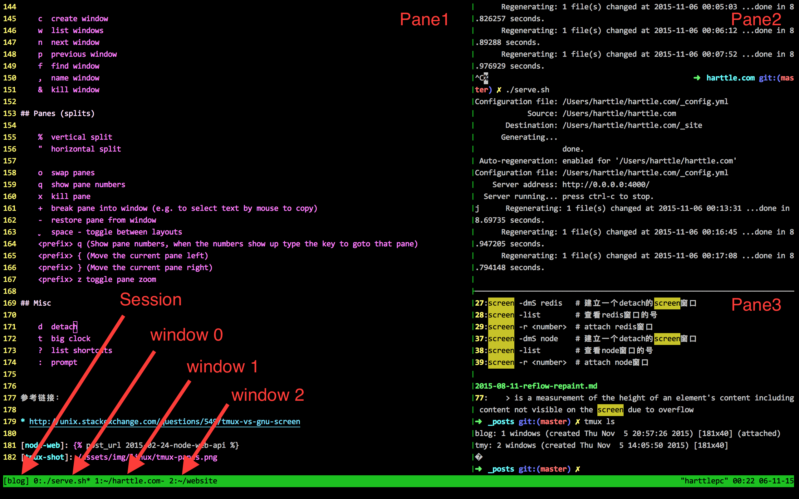

<!-- TOC depthFrom:1 depthTo:6 withLinks:1 updateOnSave:1 orderedList:0 -->

- [tmux](#tmux)
	- [基本概念](#基本概念)
	- [基本使用](#基本使用)
	- [配置](#配置)
		- [修改前缀键](#修改前缀键)
		- [查看配置](#查看配置)
		- [参考配置](#参考配置)
	- [安装](#安装)
		- [在 Mac 上安装](#在-mac-上安装)
- [参考](#参考)

<!-- /TOC -->


# tmux




## 基本概念

- 每个 session 可以有若干个 window, 每个 window 可以有若干个窗格(pane)


## 基本使用

- `<prefix>`: 前缀键，所有 tmux 快捷键都需要先按前缀键，它的默认值是 `ctrl + b`。

session 相关:

- `tmux`: 创建 session, 或者 `tmux new -s myname`(自定义session名), 默认会创建一个 window.
- `<prefix> new`: 在 tmux 中创建 session
- `<prefix> d`: 退出 session, 这个不会删除 session, 退出加删除使用 `exit`
- `<prefix> $`: 重命名 session
- `tmux ls`: 列出 session 列表
- `<prefix> s`: 在 tmux 中列出 session, 通过上下键选择，通过回车切换到 session。
- `tmux a -t myname`: 根据 session 名进入 session(or at, or attach)


窗口相关:

- `<prefix> c`: 创建新的窗口
- `<prefix> <n>`: 切换窗口(n 是窗口编号)
- `<prefix> ,`: 重命名窗口
- `<prefix> &`: 关闭窗口
- `<prefix> p`: 切换至上一窗口
- `<prefix> n`: 切换至下一窗口
- `<prefix> l`: 前后窗口间互相切换
- `<prefix> w`: 通过窗口列表切换窗口


pane 相关:

- `<prefix> %`: 水平分隔窗口(分成左右两个 pane)
- `<prefix> "`: 垂直分割窗口(分成上下两个 pane)
- `<prefix> o`: 切换到下一个 pane
- `<prefix> q`: 查看 pane 的编号
- `<prefix> z`: 将 pane 最大化，再按一次取消最大化
- `<prefix> x`: 关闭当前 pane
- `<prefix> !`: 将当前面板置于新窗口,即新建一个窗口,其中仅包含当前面板
- `<prefix> alt + 方向键`: 以5个单元格为单位移动边缘以调整当前面板大小
- `<prefix> 方向键`: 移动光标选择对应面板
- `<prefix> {`: 向前置换当前面板(和上一个pane调换位置)
- `<prefix> }`: 向后置换当前面板(和下一个pane调换位置)
- `<prefix> page up`: 向上滚动屏幕，q 退出
- `<prefix> page down`: 向下滚动屏幕，q 退出


其他:

- `<prefix> t`: 显示一个时钟
- `<prefix> ?`: 快捷键帮助列表


## 配置

### 修改前缀键

在 `~/.tmux.conf` 中将前缀键改为 `ctrl + a`:

```
unbind ^b
set -g prefix 'C-a'
```


### 查看配置

查看当前配置:

```
tmux show -g
```

保存在文件中:

```
tmux show -g >> current.tmux.conf
```


### 参考配置
- [https://github.com/gpakosz/.tmux](https://github.com/gpakosz/.tmux)


## 安装

### 在 Mac 上安装

```bash
brew install tmux
```


# 参考
- [优雅地使用命令行：Tmux 终端复用](http://harttle.land/2015/11/06/tmux-startup.html)
- [Tmux - Linux从业者必备利器](http://cenalulu.github.io/linux/tmux/)
- [tmux 指南](http://wdxtub.com/2016/03/30/tmux-guide/)
