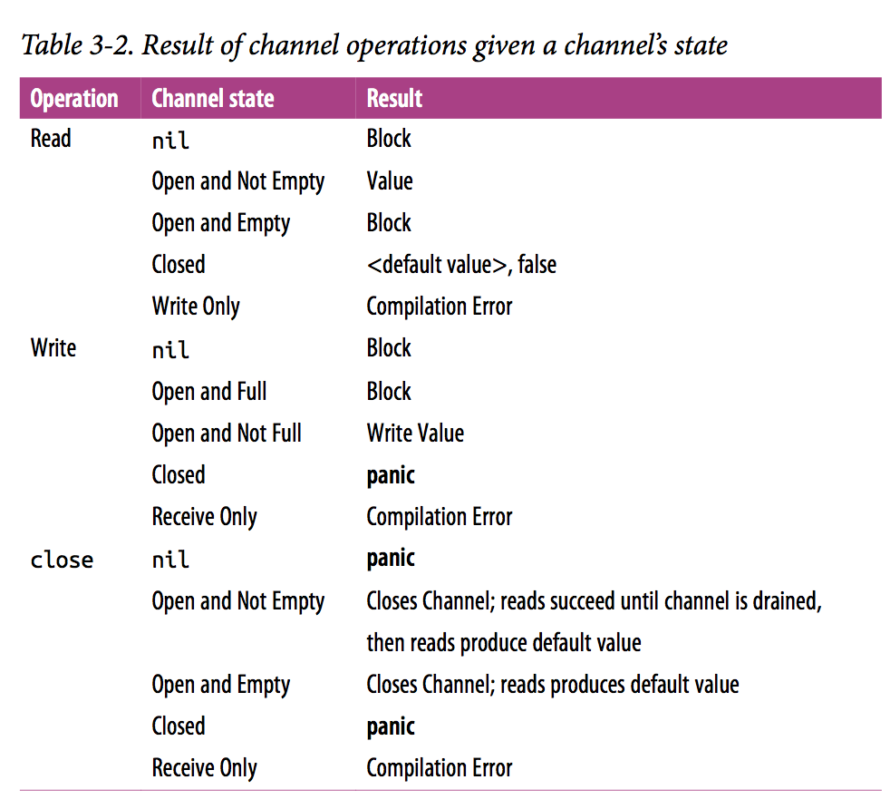

<!-- TOC -->

- [goroutine](#goroutine)
    - [当前goroutine id](#当前goroutine-id)
- [并发通信](#并发通信)
    - [共享数据](#共享数据)
    - [消息机制](#消息机制)
- [channel](#channel)
    - [channel示例](#channel示例)
    - [基本语法](#基本语法)
    - [select](#select)
    - [缓冲机制](#缓冲机制)
        - [有缓冲和无缓冲的区别](#有缓冲和无缓冲的区别)
        - [带缓冲带channel怎样使用](#带缓冲带channel怎样使用)
    - [超时机制](#超时机制)
    - [channel传递](#channel传递)
    - [单向channel](#单向channel)
    - [Why are there nil channels in Go?](#why-are-there-nil-channels-in-go)
    - [操作各种状态的 channel 的结果](#操作各种状态的-channel-的结果)
    - [多个 ch 中有一个返回结果就退出 or channel](#多个-ch-中有一个返回结果就退出-or-channel)
    - [用 bridge channel 简化 channel in channel 的消费代码](#用-bridge-channel-简化-channel-in-channel-的消费代码)
- [锁](#锁)
    - [sync.Mutex 互斥锁](#syncmutex-互斥锁)
    - [sync.RWMutex读写互斥锁](#syncrwmutex读写互斥锁)
    - [golang中sync.RWMutex和sync.Mutex区别](#golang中syncrwmutex和syncmutex区别)
    - [锁的粒度越大执行的机会越多](#锁的粒度越大执行的机会越多)
    - [sync.Cond 条件锁](#synccond-条件锁)
    - [sync.Pool](#syncpool)
- [actomic](#actomic)
    - [actomic.Value](#actomicvalue)
- [WaitGroup](#waitgroup)
- [协程的优劣](#协程的优劣)
    - [公平调度引发的问题](#公平调度引发的问题)
- [参考](#参考)

<!-- /TOC -->


# goroutine

goroutine是Go语言中的轻量级线程实现，由Go运行时（runtime）管理

go关键字:

```go
go fun(1, 2, 3)
```

在一个函数调用前加上go关键字，这次调用就会在一个新的goroutine中并发执行。当被调用的函数返回时，这个goroutine也自动结束了。需要注意的是，如果这个函数有返回值，那么这个返回值会被丢弃

**使用示例**

```go
func Add(x, y int) {
	z := x + y
	fmt.Println(z)
}

func Routine() {
	for i := 0; i < 10; i++ {
		go Add(i, i)
	}
}
```

当调用Routine()时，控制台并没有任何输出。
Go程序从初始化main package并执行main()函数开始，当main()函数返回时，程序退出，且程序并不等待其他goroutine（非主goroutine）结束。

对于上面的例子，主函数启动了10个goroutine，然后返回，这时程序就退出了，而被启动的执行Add(i, i)的goroutine没有来得及执行，所以程序没有任何输出

## 当前goroutine id

<https://github.com/golang/net/blob/master/http2/gotrack.go#L51>

```go
func curGoroutineID() uint64 {
	bp := littleBuf.Get().(*[]byte)
	defer littleBuf.Put(bp)
	b := *bp
	b = b[:runtime.Stack(b, false)]
	// Parse the 4707 out of "goroutine 4707 ["
	b = bytes.TrimPrefix(b, goroutineSpace)
	i := bytes.IndexByte(b, ' ')
	if i < 0 {
		panic(fmt.Sprintf("No space found in %q", b))
	}
	b = b[:i]
	n, err := parseUintBytes(b, 10, 64)
	if err != nil {
		panic(fmt.Sprintf("Failed to parse goroutine ID out of %q: %v", b, err))
	}
	return n
}
```

# 并发通信

## 共享数据

```go
import (
	"fmt"
	"runtime"
	"sync"
)

var count int = 0 // 共享数据

func Count(lock *sync.Mutex) {
	lock.Lock()
	count++
	fmt.Println(count)
	lock.Unlock()
}

func Routine() {
	lock := &sync.Mutex{}

	// 10个并发
	for i := 0; i < 10; i++ {
		go Count(lock)
	}

	// 判断是否都执行完毕
	for {
		lock.Lock()
		c := count
		lock.Unlock()

		runtime.Gosched()
		if c >= 10 {
			break
		}
	}

}
```

输出结果：从1到10

锁的使用：

```go
lock.Lock()
defer lock.Unlock()
// ...
```


## 消息机制

Go语言提供的消息通信机制被称为channel

Go语言社区的著名的口号：

>> 不要通过共享内存来通信，而应该通过通信来共享内存
>> Share memory by communicating,don't communicate by sharing memory

# channel

- channel是Go语言在语言级别提供的goroutine间的通信方式。我们可以使用channel在两个或多个goroutine之间传递消息。
- channel是进程内的通信方式，因此通过channel传递对象的过程和调用函数时的参数传递行为比较一致，比如也可以传递指针等。如果需要跨进程通信，我们建议用分布式系统的方法来解决，比如使用Socket或者HTTP等通信协议
- channel是类型相关的。也就是说，一个channel只能传递一种类型的值，这个类型需要在声明channel时指定

## channel示例

```go
func Counting(ch chan int, index int) {
	ch <- index // 向channel中写数据
	fmt.Println("counting:", index)
}

func Channel() {
	chs := make([]chan int, 5)
	for i := 0; i < 5; i++ {
		chs[i] = make(chan int) // 创建channel
		go Counting(chs[i], i)
	}
	for _, ch := range chs {
		i := <-ch // 从channel中读数据
		// 或者直接 <-ch，这样就是不使用ch中的值
		fmt.Println(i)
	}
}
```

输出：

```
counting: 0
0
1
2
3
4
```

通过ch <- index向channel中写数据，通过<-ch从channel中读取数据，如果没有写入数据，读取channel的操作会堵塞，同样，如果没有读取数据，写入操作会堵塞。

输出结果中只打印了一句counting:0，这是因为当ch<-index后，main()中的读取<-ch立马就执行了，这样当main()输出5个数后程序就结束了，其他的Println()来不及执行，解决办法是将ch<-index放到方法的最后执行：

```go
func Counting(ch chan int, index int) {
	fmt.Println("counting:", index)
	ch <- index // 向channel中写数据
}
```

## 基本语法

**一般channel的声明形式为：**

```go
var chanName chan ElementType
```

与一般的变量声明不同的地方仅仅是在类型之前加了chan关键字。ElementType指定这个channel所能传递的元素类型。

--------------
**声明**

```go
var ch chan int
var m map[string] chan bool // 元素是bool类型的channel
```

--------------

**初始化**

```go
ch := make(chan int, 1)
make(chan<- string) 只写
make(<-chan string) 只读
```

--------------

**写入**

```go
ch <- value
```

向channel写入数据通常会导致程序阻塞，直到有其他goroutine从这个channel中读取数据

**读取**

```go
value := <-ch
value, ok := <-ch
```

如果channel之前没有写入数据，那么从channel中读取数据也会导致程序阻塞，直到channel中被写入数据为止
从一个通道类型的空值(即nil)接收值的表达式将会永远被阻塞。
从一个已被关闭的通道类型接收值会永远成功并返回一个其元素类型的零值。

```go
	waitCh := make(chan struct{})
	go func() {
		time.Sleep(3 * time.Second)
		close(waitCh)
	}()
	select {
	case <-waitCh:
		fmt.Println("hit") // 会输出
	}
```


对于有缓存的channel可使用for读取：

```go
	requests := make(chan int, 5)
	for i := 1; i <= 5; i++ {
		requests <- i
	}
	close(requests)

	for r := range requests {
		fmt.Println(r)
	}
```

-----------------
**关闭**

```go
close(ch)
```

1. 对同一个channel不能关闭两次，否则报错
2. 判断是否已关闭

```go
	ch := make(chan int, 1)

	ch <- 1
	close(ch)

	<-ch // 必须将数据读完，下面再读的时候才会ok=false
	v, ok := <-ch
	if !ok {
		fmt.Println("channel已关闭")
	} else {
		fmt.Println("channel未关闭:", v)
	}
```

3. 关闭已有数据的channel后还是可以读的

```go
	requests := make(chan int, 5)
	for i := 1; i <= 5; i++ {
		requests <- i
	}
	close(requests)

	for r := range requests {
		fmt.Println(r)
	}
```

4. 向已关闭的channel写入数据会报错：

```go
	ch := make(chan int, 1)

	ch <- 1
	close(ch)

	ch <- 2 // 报错
```

  channel不像文件之类的，不需要经常去关闭，只有当你确实没有任何发送数据了，或者你想显式的结束range循环之类的


---------------

**长度**

```go
len(c) // 返回的是 c 中未被读取的元素个数。
cap(c) // 返回的是缓存的长度，比如 c := make(chan bool, 3), 返回的就是 3.
```


## select

```go
select{
	case <-chan1:
	// 如果chan1成功读到数据，则进行该case处理语句
	case chan2 <- 1:
	// 如果成功向chan2写入数据，则进行该case处理语句
	default:
	// 如果上面都没有成功，则进入default处理流程
}
```

第一个case试图从chan1读取一个数据并直接忽略读到的数据，而第二个case则是试图向chan2中写入一个整型数1，如果这两者都没有成功，则到达default语句

每个case语句里必须是一个IO操作
select不像switch，后面并不带判断条件，而是直接去查看case语句

每个case语句都必须是一个面向channel的操作

**随机产生0和1**

```go
	ch := make(chan int, 1) // 如果没有1就会报错???(因为会卡在case的地方)
	for k := 0; k < 10; k++ {
		select {
		case ch <- 0:
		case ch <- 1:
		}
		i := <-ch
		fmt.Println("value received:", i)
	}
```

程序随机生成0和1输出。

**运行机制**

检查每个case语句

如果有任意一个chan是send or recv ready，那么就执行该block

如果多个case是ready的，那么随机找1个并执行该block

如果都没有ready，那么就block and wait

如果有default block，而且其他的case都没有ready，就执行该default block

**select中的default**

```go
	c := make(chan bool)

	select {
	case <-c:
		fmt.Println("不应该的输出.")
	default:
		fmt.Println("应该的输出.")
	}
	close(c)
```

这个可以用来确定c不应该有值的情况。读自sync包下的test文件。

用 `select` 实现无限循环：

```go
select {}
```


## 缓冲机制

之前我们示范创建的都是不带缓冲的channel(make(chan int))，这种做法对于传递单个数据的场景可以接受，但对于需要持续传输大量数据的场景就有些不合适了。接下来我们介绍如何给channel带上缓冲，从而达到消息队列的效果。
要创建一个带缓冲的channel，其实也非常容易：

```go
c := make(chan int, 1024)
```

在调用make()时将缓冲区大小作为第二个参数传入即可，比如上面这个例子就创建了一个大小为1024的int类型channel，即使没有读取方，写入方也可以一直往channel里写入，在缓冲区被填完之前都不会阻塞

从带缓冲的channel中读取数据可以使用与常规非缓冲channel完全一致的方法，但我们也可以使用range关键来实现更为简便的循环读取：

```go
for i := range c {
	fmt.Println("Received:", i)
}
```

Go文档的翻译文是：对于信道，其迭代值产生为在该信道上发送的连续值，直到该信道被关闭。若该信道为 nil，则range表达式将永远阻塞

经过试验，range会阻塞，并且可以通过关闭channel来解除阻塞。

```go
	ch := make(chan int, 1)

	go func() {
		for i := 0; i < 10; i++ {
			ch <- i
		}

	}()

	for w := range ch {
		fmt.Println("读取", w)
		if w == 9 {
			//break // 在这里break循环也可以
			close(ch)
		}
	}
	fmt.Println("after range or close ch!")
```

### 有缓冲和无缓冲的区别

一个是非同步的，一个是同步的

```go
c1 := make(chan int)        无缓冲
c2 := make(chan int, 1)      有缓冲
c1 <- 1
```

无缓冲的不仅仅是向c1通道放1而是一直要有别的携程 <-c1 接手了这个参数，那么c1<-1才会继续下去，要不然就一直阻塞着

而 c2<-1 则不会阻塞，因为缓冲大小是1 只有当放第二个值的时候 第一个还没被人拿走，这时候才会阻塞

```go
	ch := make(chan int) // 无缓冲
	// ch := make(chan int, 1) // 有缓冲

	func() {
		ch <- 1
	}()

	go func() {
		<-ch
	}()
```

程序先向channel写数据，再启动routine读数据。

对于无缓冲chan来说，写数据后没有其他的routine来读，所以一直阻塞在那，也就没有办法执行go func()了，整个程序会发生死锁。

对于有缓冲chan来说，写数据后没有阻塞，继续执行go func()，读取数据，程序正常终止。如果第一个func中连续写入两次：

```go
	func() {
		ch <- 1
		ch <- 2
	}()
```

程序还是会发生死锁。


### 带缓冲带channel怎样使用

带缓冲区的channel可以像信号量一样使用，用来完成诸如吞吐率限制等功能。在以下示例中，到来的请求以参数形式传入handle函数，该函数从channel中读出一个值，然后处理请求，最后再向channel写入以使“信号量”可用，以便响应下一次处理。该channel的缓冲区容量决定了并发调用process函数的上限，因此在channel初始化时，需要传入相应的容量参数。

```go
var sem = make(chan int, MaxOutstanding)

func handle(r *Request) {
    <-sem          // Wait for active queue to drain.
    process(r)     // May take a long time.
    sem <- 1       // Done; enable next request to run.
}

func init() {
    for i := 0; i < MaxOutstanding; i++ {
        sem <- 1
    }
}

func Serve(queue chan *Request) {
    for {
        req := <-queue
        go handle(req)  // Don't wait for handle to finish.
    }
}
```

这样的设计会引入一个问题： Serve会为每个请求创建一个新的Goroutine，尽管在任意时刻只有最多MaxOutstanding个可以执行。如果请求到来的速度过快，将迅速导致系统资源完全消耗。我们可以通过修改Serve的实现来对Goroutine的创建进行限制。以下给出一个简单的实现，请注意其中包含一个BUG，我们会在后续进行修正：

```go
func Serve(queue chan *Request) {
    for req := range queue {
        <-sem
        go func() {
            process(req) // Buggy; see explanation below.
            sem <- 1
        }()
    }
}
```

刚才说的BUG源自Go中for循环的实现，循环的迭代变量会在循环中被重用，因此req变量会在所有Goroutine间共享。这不是我们所乐见的，我们需要保证req变量是每个Goroutine私有的。这里提供一个方法，将req的值以参数形式提供给goroutine对应的闭包：

```go
func Serve(queue chan *Request) {
    for req := range queue {
        <-sem
        go func(req *Request) {
            process(req)
            sem <- 1
        }(req)
    }
}
```

请与之前有BUG的实现进行对比，看看闭包在声明和运行上的不同之处。另一个解决方案是，干脆创建一个新的同名变量，示例如下：

```go
func Serve(queue chan *Request) {
    for req := range queue {
        <-sem
        req := req // Create new instance of req for the goroutine.
        go func() {
            process(req)
            sem <- 1
        }()
    }
}
```

这样写可能看起来怪怪的

```go
req := req
```

但它确实是合法的并且在Go中是一种惯用的方法。你可以如法泡制一个新的同名变量，用来为每个Goroutine创建循环变量的私有拷贝


## 超时机制

使用channel时需要小心，比如对于以下这个用法：

```go
i := <-ch
```

不出问题的话一切都正常运行。但如果出现了一个错误情况，即永远都没有人往ch里写数据，那么上述这个读取动作也将永远无法从ch中读取到数据，导致的结果就是整个goroutine永远阻塞并没有挽回的机会。如果channel只是被同一个开发者使用，那样出问题的可能性还低一些。但如果一旦对外公开，就必须考虑到最差的情况并对程序进行保护。

Go语言没有提供直接的超时处理机制，但我们可以利用select机制。虽然select机制不是专为超时而设计的，却能很方便地解决超时问题。因为select的特点是只要其中一个case已经完成，程序就会继续往下执行，而不会考虑其他case的情况。

```go
	// 首先，我们实现并执行一个匿名的超时等待函数
	timeout := make(chan bool, 1)
	go func() {
		time.Sleep(1e9) // 等待1秒钟，可以用 1 * time.Second表示1秒
		timeout <- true
	}()

	// 然后我们把timeout这个channel利用起来
	ch := make(chan int)
	select {
	case <-ch:
		fmt.Println("从ch中读取到数据")
	case <-timeout:
		fmt.Println("一直没有从ch中读取到数据，但从timeout中读取到了数据")
	}
```

这样使用select机制可以避免永久等待的问题，因为程序会在timeout中获取到一个数据后继续执行，无论对ch的读取是否还处于等待状态，从而达成1秒超时的效果

另一种实现：

```go
	c := make(chan int)
	o := make(chan bool)
	go func() {
		for {
			select {
			case v := <-c:
				fmt.Println(v)
			case <-time.After(5 * time.Second):
				fmt.Println("timeout")
				o <- true
				break
			}
		}
	}()
	<-o
```

## channel传递

需要注意的是，在Go语言中channel本身也是一个原生类型，与map之类的类型地位一样，因此channel本身在定义后也可以通过channel来传递。

我们可以使用这个特性来实现*nix上非常常见的管道（pipe）特性。管道也是使用非常广泛的一种设计模式，比如在处理数据时，我们可以采用管道设计，这样可以比较容易以插件的方式增加数据的处理流程。

下面我们利用channel可被传递的特性来实现我们的管道。为了简化表达，我们假设在管道中传递的数据只是一个整型数，在实际的应用场景中这通常会是一个数据块。

首先限定基本的数据结构：

```go
type PipeData struct{
	value int
	handler func(int) int
	next chan int
}
```

然后我们写一个常规的处理函数。我们只要定义一系列PipeData的数据结构并一起传递给这个函数，就可以达到流式处理数据的目的：

```go
func handle(queue chan *PipeData) {
	for data := range queue {
		data.next <- data.handler(data.value)
	}
}
```

这里我们只给出了大概的样子，限于篇幅不再展开。同理，利用channel的这个可传递特性，我们可以实现非常强大、灵活的系统架构。相比之下，在C++、Java、C#中，要达成这样的效果，通常就意味着要设计一系列接口。

与Go语言接口的非侵入式类似，channel的这些特性也可以大大降低开发者的心智成本，用一些比较简单却实用的方式来达成在其他语言中需要使用众多技巧才能达成的效果

## 单向channel

channel本身必然是同时支持读写的，否则根本没法用。假如一个channel真的只能读，那么肯定只会是空的，因为你没机会往里面写数据

所谓的单向channel概念，其实只是对channel的一种使用限制

**单向channel的声明**

```go
var ch1 chan int  // ch1是一个正常的channel，不是单向的
var ch2 chan<- float64// ch2是单向channel，只用于写float64数据
var ch3 <-chan int  // ch3是单向channel，只用于读取int数据
```

**单向channel的初始化（类型转换）**

```go
ch4 := make(chan int)
ch5 := <-chan int(ch4) // ch5就是一个单向的读取channel
ch6 := chan<- int(ch4) // ch6 是一个单向的写入channel
```

**用法**

```go
func Parse(ch <-chan int) {
	for value := range ch {
		fmt.Println("Parsing value", value)
	}
}
```

除非这个函数的实现者无耻地使用了类型转换，否则这个函数就不会因为各种原因而对ch进行写，避免在ch中出现非期望的数据，从而很好地实践最小权限原则

有些类似于C++中的const的作用


## Why are there nil channels in Go?

翻译自 https://medium.com/justforfunc/why-are-there-nil-channels-in-go-9877cc0b2308


## 操作各种状态的 channel 的结果




## 多个 ch 中有一个返回结果就退出 or channel

```go
	var or func(chs ...chan interface{}) chan interface{}
	or = func(chs ...chan interface{}) chan interface{} {
		if len(chs) == 0 {
			return nil
		}

		if len(chs) == 1 {
			return chs[0]
		}

		orDone := make(chan interface{})

		go func() {
			defer close(orDone)
			switch len(chs) {
			case 2:
				select {
				case <-chs[0]:
				case <-chs[1]:
				}
			default: // len(chs) > 2
				select {
				case <-chs[0]:
				case <-chs[1]:
				case <-chs[2]:
				case <-or(append(chs[3:], orDone)...):
				}
			}
		}()

		return orDone
	}

	start := time.Now()

	sig := func(after time.Duration) chan interface{} {
		ch := make(chan interface{})

		go func() {
			defer close(ch)
			time.Sleep(after)
		}()

		return ch
	}
	<-or(
		sig(time.Second),
		sig(time.Second*2),
		sig(time.Minute),
	)
	fmt.Println(time.Since(start))
```


## 用 bridge channel 简化 channel in channel 的消费代码

```go
	orDone := func(done, c <-chan interface{}) <-chan interface{} {
		valStream := make(chan interface{})
		go func() {
			defer close(valStream)
			for {
				select {
				case <-done:
					return
				case v, ok := <-c:
					if ok == false {
						return
					}
					select {
					case valStream <- v:
					case <-done:
					}
				}
			}
		}()
		return valStream
	}
	bridge := func(
		done <-chan interface{},
		chanStream <-chan <-chan interface{},
	) <-chan interface{} {
		valStream := make(chan interface{}) // <1>
		go func() {
			defer close(valStream)
			for { // <2>
				var stream <-chan interface{}
				select {
				case maybeStream, ok := <-chanStream:
					if ok == false {
						return
					}
					stream = maybeStream
				case <-done:
					return
				}
				for val := range orDone(done, stream) { // <3>
					select {
					case valStream <- val:
					case <-done:
					}
				}
			}
		}()
		return valStream
	}
	genVals := func() <-chan <-chan interface{} {
		chanStream := make(chan (<-chan interface{}))
		go func() {
			defer close(chanStream)
			for i := 0; i < 10; i++ {
				stream := make(chan interface{}, 1)
				stream <- i
				close(stream)
				chanStream <- stream
			}
		}()
		return chanStream
	}

	for v := range bridge(nil, genVals()) {
		fmt.Printf("%v ", v)
	}
```


------------------------------
# 锁

## sync.Mutex 互斥锁

使用值变量：

```go
func main() {
	c := &Class{}
	c.SetName("chen")
	fmt.Println(c.name)
}

type Class struct {
	mu   sync.Mutex
	name string
}

func (c *Class) SetName(n string) {
	c.mu.Lock()
	defer c.mu.Unlock()
	c.name = n
}
```

使用指针变量：

```go
func main() {
	c := &Class{
		mu: new(sync.Mutex),
	}
	c.SetName("chen")
	fmt.Println(c.name)
}

type Class struct {
	mu   *sync.Mutex
	name string
}

func (c *Class) SetName(n string) {
	c.mu.Lock()
	defer c.mu.Unlock()
	c.name = n
}
```

## sync.RWMutex读写互斥锁

## golang中sync.RWMutex和sync.Mutex区别

golang中sync包实现了两种锁Mutex（互斥锁）和RWMutex（读写锁），其中RWMutex是基于Mutex实现的，只读锁的实现使用类似引用计数器的功能．

```go
type Mutex
	func (m *Mutex) Lock()
	func (m *Mutex) Unlock()
type RWMutex
	func (rw *RWMutex) Lock()
	func (rw *RWMutex) RLock()
	func (rw *RWMutex) RLocker() Locker
	func (rw *RWMutex) RUnlock()
	func (rw *RWMutex) Unlock()
```

其中Mutex为互斥锁，Lock()加锁，Unlock()解锁，**使用Lock()加锁后，便不能再次对其进行加锁**，直到利用Unlock()解锁对其解锁后，才能再次加锁．适用于读写不确定场景，即读写次数没有明显的区别，并且只允许只有一个读或者写的场景，所以该锁也叫做全局锁．

`func (m *Mutex) Unlock()` 用于解锁m，<span style="color:red;">如果在使用Unlock()前未加锁，就会引起一个运行错误</span>

已经锁定的Mutex并不与特定的goroutine相关联，这样可以利用一个goroutine对其加锁，再利用其他goroutine对其解锁．

正常运行例子：

```go
package main

import (
	"fmt"
	"sync"
)

func main() {
	var l *sync.Mutex
	l = new(sync.Mutex)
	l.Lock()
	defer l.Unlock()
	fmt.Println("1")
}
```

结果输出：１ ．

当Unlock()在Lock()之前使用时，便会报错

```go
var l *sync.Mutex
l = new(sync.Mutex)
l.Unlock()
fmt.Println("1")
l.Lock()
```

运行结果： panic: sync: unlock of unlocked mutex

当在解锁之前再次进行加锁，便会死锁状态

```go
var l *sync.Mutex
l = new(sync.Mutex)
l.Lock()
fmt.Println("1")
l.Lock()
```

运行结果
```
1
fatal error: all goroutines are asleep - deadlock!
```

RWMutex是一个读写锁，该锁可以加多个读锁或者一个写锁，其经常用于读次数远远多于写次数的场景．

```go
func (rw *RWMutex) Lock()
```

写锁，如果在添加写锁之前已经有其他的读锁和写锁，则lock就会阻塞直到该锁可用，为确保该锁最终可用，已阻塞的 Lock调用会从获得的锁中排除新的读取器，即<span style="color:red;">写锁权限高于读锁，有写锁时优先进行写锁定</span>

```go
func (rw *RWMutex) Unlock()　
```

写锁解锁，<span style="color:red;">如果没有进行写锁定，则就会引起一个运行时错误．</span>

```go
var l *sync.RWMutex
l = new(sync.RWMutex)
l.Unlock()
fmt.Println("1")
l.Lock()
```

运行结果：panic: sync: unlock of unlocked mutex
​    
```go
func (rw *RWMutex) RLock()
```

读锁，当有写锁时，无法加载读锁，当只有读锁或者没有锁时，可以加载读锁，读锁可以加载多个，所以适用于＂读多写少＂的场景

```go
func (rw *RWMutex)RUnlock()　
```

读锁解锁，RUnlock 撤销单次 RLock调用，它对于其它同时存在的读取器则没有效果。若 rw 并没有为读取而锁定，调用 RUnlock 就会引发一个运行时错误(注：这种说法在go1.3版本中是不对的，例如下面这个例子)。

```go
var l *sync.RWMutex
l = new(sync.RWMutex)
l.RUnlock()　　　　//１个RUnLock
fmt.Println("1")
l.RLock()              
```

运行结果：１

但是程序中先尝试 解锁读锁，然后才加读锁，但是没有报错，并且能够正常输出．

分析：go1.3版本中出现这种情况的原因分析，通过阅读源码可以很清晰的得到结果

```go
    func (rw *RWMutex) RUnlock() {
    	if raceenabled {
    		_ = rw.w.state
    		raceReleaseMerge(unsafe.Pointer(&rw.writerSem))
    		raceDisable()
    	}
    	if atomic.AddInt32(&rw.readerCount, -1) < 0 {　//readercounter初始值为０,调用RUnLock之后变为-1，继续往下执行
    		// A writer is pending.
    		if atomic.AddInt32(&rw.readerWait, -1) == 0 {　//此时readerwaiter变为１，1-1之后变为０,可以继续以后的操作．
    			// The last reader unblocks the writer.
    			runtime_Semrelease(&rw.writerSem)
    		}
    	}
    	if raceenabled {
    		raceEnable()
    	}
    }
```

当RUnlock多于RLock多个时，便会报错，进入死锁．实例如下：

```go   
type s struct {
	readerCount int32
}

func main() {
	l := new(sync.RWMutex)
	l.RUnlock()
	l.RUnlock()　　　　　　　　//此处出现死锁
	fmt.Println("1")
	l.RLock()
}
```

运行结果：
```
1
fatal error: all goroutines are asleep - deadlock!
```

总结：

所以在go1.3版本中，运行过程中允许RUnLock早于RLock一个，也只能早于１个（注：虽然代码允许，但是强烈不推荐使用），并且在早于之后必须利用RLock进行加锁才可以继续使用．


## 锁的粒度越大执行的机会越多

```go
package main

import (
	"fmt"
	"sync"
	"time"
)

func main() {
	var wg sync.WaitGroup
	var sharedLock sync.Mutex
	const runtime = 1 * time.Second

	greedyWorker := func() {
		defer wg.Done()

		var count int
		for begin := time.Now(); time.Since(begin) <= runtime; {
			sharedLock.Lock()
			time.Sleep(3 * time.Nanosecond)
			sharedLock.Unlock()
			count++
		}

		fmt.Printf("Greedy worker was able to execute %v work loops\n", count)
	}

	politeWorker := func() {
		defer wg.Done()

		var count int
		for begin := time.Now(); time.Since(begin) <= runtime; {
			sharedLock.Lock()
			time.Sleep(1 * time.Nanosecond)
			sharedLock.Unlock()

			sharedLock.Lock()
			time.Sleep(1 * time.Nanosecond)
			sharedLock.Unlock()

			sharedLock.Lock()
			time.Sleep(1 * time.Nanosecond)
			sharedLock.Unlock()

			count++
		}

		fmt.Printf("Polite worker was able to execute %v work loops.\n", count)
	}

	wg.Add(2)
	go greedyWorker()
	go politeWorker()

	wg.Wait()
}
```

可能得到以下结果：

```
Greedy worker was able to execute 507672 work loops
Polite worker was able to execute 297669 work loops.
```

锁的粒度大，会得到更多的运行时间，而导致其它 goroutine 获得的执行机会变少。


## sync.Cond 条件锁

```go
	condition := false // 条件不满足
	var mu sync.Mutex
	cond := sync.NewCond(&mu)
	// 让例程去创造条件
	go func() {
		mu.Lock()
		condition = true // 更改条件
		cond.Signal()    // 发送通知：条件已经满足，随机唤醒一个 goroutine.
		mu.Unlock()
	}()
	mu.Lock()
	// 检查条件是否满足，避免虚假通知，同时避免 Signal 提前于 Wait 执行。
	for !condition {
		// 等待条件满足的通知，如果收到虚假通知，则循环继续等待。
		cond.Wait() // 等待时 mu 处于解锁状态，唤醒时重新锁定。
	}
	fmt.Println("条件满足，开始后续动作...")
	mu.Unlock()
```

```go
	gidExited := make(chan int, 1)
	m := &sync.Mutex{}
	c := sync.NewCond(m)
	gidToExit := -1 // 需要退出的 goroutine id.
	for i := 0; i < 10; i++ {
		go func(i int) {
			m.Lock()
			for gidToExit != i {
				c.Wait()
			}
			m.Unlock()
			fmt.Printf("G%d exit.\n", i)
			gidExited <- i
		}(i)
	}

	for i := 0; i < 10; i++ {
		m.Lock()
		gidToExit = i
		c.Broadcast() // 唤醒所有的 goroutine, 如果用 Signal 会导致死锁。
		m.Unlock()
		gid := <-gidExited
		fmt.Printf("goroutine %d exits.", gid)
	}
```


## sync.Pool

为什么 sync.Pool 的性能高？sync.Pool 提供 runtime 级别的绑定到 Processor 的对象池，每个 P 都有自己的池，在调度时不会和其他 P 发生竞争，而用户自己实现的则会在多个 P 之间发生竞争关系。


# actomic

## actomic.Value

```go
type storeStruct struct {
	name string
}

func main() {
	var v atomic.Value

	go func() {
		for {
			time.Sleep(time.Second)
			v.Store(storeStruct{time.Now().Format("2006/01/02 15:04:05")})
		}
	}()

	for i := 0; i < 10; i++ {
		time.Sleep(500 * time.Millisecond)
		t := v.Load()
		fmt.Println(t)
	}
}
```

Output:

```
<nil>
{2016/01/07 14:29:04}
{2016/01/07 14:29:04}
{2016/01/07 14:29:06}
{2016/01/07 14:29:06}
{2016/01/07 14:29:07}
{2016/01/07 14:29:07}
{2016/01/07 14:29:08}
{2016/01/07 14:29:08}
{2016/01/07 14:29:09}
```


# WaitGroup

```go
func main() {
	var wg sync.WaitGroup
	done := make(chan struct{})
	workerCount := 2
	for i := 0; i < workerCount; i++ {
		wg.Add(1)
		go doit(i, done, wg)
	}
	close(done)
	wg.Wait()
	fmt.Println("all done!")
}

func doit(workerId int, done <-chan struct{}, wg sync.WaitGroup) {
	fmt.Printf("[%v] is running\n", workerId)
	defer wg.Done()
	<-done
	fmt.Printf("[%v] is done\n", workerId)
}
```

上面程序会得到下面的结果：

```
[1] is running
[1] is done
[0] is running
[0] is done
fatal error: all goroutines are asleep - deadlock!

goroutine 1 [semacquire]:
sync.runtime_Semacquire(0xc82000a3bc)
        /home/chen/go/go1.5.1/src/runtime/sema.go:43 +0x26
sync.(*WaitGroup).Wait(0xc82000a3b0)
        /home/chen/go/go1.5.1/src/sync/waitgroup.go:126 +0xb4
main.main()
        /home/chen/go/code/go_pro/test/src/test/test.go:17 +0x104
```

死锁的原因是doit拿到的是WaitGroup结构体的拷贝，所以执行Done()会main()中的wg不生效。

```go
func main() {
	var wg sync.WaitGroup
	done := make(chan struct{})
	wq := make(chan interface{})
	workerCount := 2
	for i := 0; i < workerCount; i++ {
		wg.Add(1)
		go doit(i, wq, done, &wg)
	}
	for i := 0; i < workerCount; i++ {
		wq <- i
	}
	close(done)
	wg.Wait()
	fmt.Println("all done!")
}

func doit(workerId int, wq <-chan interface{}, done <-chan struct{}, wg *sync.WaitGroup) {
	fmt.Printf("[%v] is running\n", workerId)
	defer wg.Done()
	for {
		select {
		case m := <-wq:
			fmt.Printf("[%v] m => %v\n", workerId, m)
		case <-done:
			fmt.Printf("[%v] is done\n", workerId)
			return
		}
	}
}
```

上面的例子wq是没有缓存的，如果有缓存的话，很可能会在wq中值没取完之前所有goroutine就退出了。


下面的例子使用<-chan的第二个参数来控制消费者的退出：

```go
func main() {
	wg := &sync.WaitGroup{}
	c := make(chan string, 10)
	// readers
	for i := 0; i < 10; i++ {
		wg.Add(1)
		go func(id int) {
			defer wg.Done()
			for {
				if v, ok := <-c; ok {
					fmt.Println(id, "get", v)
				} else {
					break
				}
				time.Sleep(10 * time.Millisecond)
			}
			fmt.Println(id, "stoped")
		}(i)
	}

	for i := 0; i < 20; i++ {
		c <- "hello" + strconv.Itoa(i)
		time.Sleep(time.Second)
	}
	close(c)
	wg.Wait()
	fmt.Println("main goroutine finish")
}
```


# 协程的优劣

## 公平调度引发的问题

协程被调度时是需要尽量公平的，这意味着协程没有优先级的概念，不可以抢占。如果某个 goroutine 比其他 goroutine 重要，当这个 goroutine 准备好执行时，可能 CPU 正被其他 goroutine 占用，这是重要的 goroutine 就只能等着，什么时候被调用是不确定的。当其他 goroutine 依赖这个重要的 goroutine 时，就会造成延迟。


# 参考
- [记一次latency问题排查：谈Go的公平调度的缺陷](http://www.zenlife.tk/go-scheduler-pitfall.md)
- [concurrency in go 读书笔记](http://xargin.com/concurrency-in-go-notes/)
- [通过插图学习Go的并发](http://szpzs.oschina.io/2018/06/23/learning-gos-concurrency-through-illustrations/)