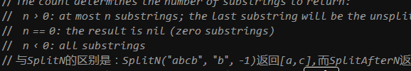
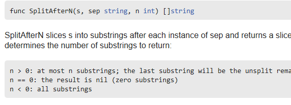

<!-- TOC -->

- [文档godoc](#文档godoc)
- [注释](#注释)
    - [包注释](#包注释)

<!-- /TOC -->

# 文档godoc

```bash
godoc -http=:8080
```

在浏览器中 `localhost:8080`

如果设置了`GOPATH`，如 `D:\Go\src\pkg`，则可以看到修改过的注释。

**godoc package** 获取包的文档注释，例如：`go doc fmt` 会显示使用 godoc 生成的 fmt 包的文档注释。

**godoc package/subpackage** 获取子包的文档注释，例如：`go doc container/list`。

**godoc package function** 获取某个函数在某个包中的文档注释，例如：`go doc fmt Printf` 会显示有关 `fmt.Printf()` 的使用说明查看函数的源码：

**godoc -src fmt Printf** 这个工具只能获取在 Go 安装目录下 `.../go/src/pkg` 中的注释内容

更多详见http://golang.org/cmd/godoc/


# 注释
注释采用的是markdown语法。

## 包注释
每一个包应该有相关注释，在 package 语句之前的块注释将被默认认为是这个包的文档说明，其中应该提供一些相关信息并对整体功能做简要的介绍。一个包可以分散在多个文件中，但是只需要在其中一个进行注释说明即可。当开发人员需要了解包的一些情况时，自然会用 godoc 来显示包的文档说明，在首行的简要注释之后可以用成段的注释来进行更详细的说明，而不必拥挤在一起。另外，在多段注释之间应以空行分隔加以区分。
示例：

```go
// Package superman implements methods for saving the world.
//
// Experience has shown that a small number of procedures can prove
// helpful when attempting to save the world.package superman
```

`package superman` 上面不能有空行。

代码开头有两个空格




注释中的换行

```go
// 注释1
//
// 注释2
```


