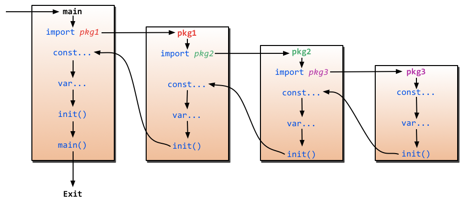

<!-- TOC depthFrom:1 depthTo:6 withLinks:1 updateOnSave:1 orderedList:0 -->

- [包](#包)
	- [标准库](#标准库)
	- [编译](#编译)
	- [import](#import)
		- [import多个包：](#import多个包)
		- [import使用说明](#import使用说明)
	- [权威导入路径(import paths)](#权威导入路径import-paths)
	- [初始化](#初始化)
	- [命名规范](#命名规范)

<!-- /TOC -->

# 包

一个应用程序可以包含不同的包，而且即使你只使用 main 包也不必把所有的代码都写在一个巨大的文件里：你可以用一些较小的文件，并且在每个文件非注释的第一行都使用 package main 来指明这些文件都属于 main 包。

如果你打算编译包名不是为 main 的源文件，如 pack1，编译后产生的对象文件将会是 pack1.a 而不是可执行程序。

另外要注意的是，所有的包名都应该使用小写字母。

每个目录都只包含一个包。

如果对一个包进行更改或重新编译，所有引用了这个包的客户端程序都必须全部重新编译。

## 标准库

一般情况下，标准包会存放在 `$GOROOT/pkg/$GOOS_$GOARCH/` 目录下。如：`pkg\windows_386，pkg\linux_amd64`。

## 编译

Go 中的包模型采用了显式依赖关系的机制来达到快速编译的目的，编译器会从后缀名为 .o 的对象文件（需要且只需要这个文件）中提取传递依赖类型的信息。

如果 A.go 依赖 B.go，而 B.go 又依赖 C.go：

编译 C.go, B.go, 然后是 A.go.

为了编译 A.go, 编译器读取的是 B.o 而不是 C.o.

这种机制对于编译大型的项目时可以显著地提升编译速度。


## import

同一包内的go文件中的package要一样

import的时候从src下开始到go文件的父目录即可

相同package的文件类似于处于同一个类中，函数是类方法，struct是内部类，同一个包的文件相互访问不需要import

### import多个包：

```go
import "fmt"
import "os"
```

或：

```go
import (
    "fmt"
    "os"
)
```

### import使用说明

Go的import支持如下两种方式来加载自己写的模块

1. 相对路径

	```go
	import "./model" //当前文件同一目录的model目录，但是不建议这种方式来import
	```

2. 绝对路径

  ```go
  import “shorturl/model” //加载gopath/src/shorturl/model模块
  ```
上面展示了一些import常用的几种方式，但是还有一些特殊的import，让很多新手很费解，下面我们来一一讲解一下到底是怎么一回事


**点操作**

我们有时候会看到如下的方式导入包

```go
import(
	. "fmt"
)
```

这个点操作的含义就是这个包导入之后在你调用这个包的函数时，你可以省略前缀的包名，也就是前面你调用的 `fmt.Println("hello world")` 可以省略的写成 `Println("hello world")`


**别名操作**

别名操作顾名思义我们可以把包命名成另一个我们用起来容易记忆的名字

```go
import(
	f "fmt"
)
```

别名操作的话调用包函数时前缀变成了我们的前缀，即 `f.Println("hello world")`


**_操作**

这个操作经常是让很多人费解的一个操作符，请看下面这个import

```go
import (
	"database/sql"
	_ "github.com/ziutek/mymysql/godrv"
)
```

`_` 操作其实是引入该包，而不直接使用包里面的函数，而是调用了该包里面的init函数，要理解这个问题，需要看下面这个图，理解包是怎么按照顺序加载的：

程序的初始化和执行都起始于main包。如果main包还导入了其它的包，那么就会在编译时将它们依次导入。有时一个包会被多个包同时导入，那么它只会被导入一次（例如很多包可能都会用到fmt包，但它只会被导入一次，因为没有必要导入多次）。当一个包被导入时，如果该包还导入了其它的包，那么会先将其它包导入进来，然后再对这些包中的包级常量和变量进行初始化，接着执行init函数（如果有的话），依次类推。等所有被导入的包都加载完毕了，就会开始对main包中的包级常量和变量进行初始化，然后执行main包中的init函数（如果存在的话），最后执行main函数。下图详细地解释了整个执行过程：



通过上面的介绍我们了解了import的时候其实是执行了该包里面的init函数，初始化了里面的变量，`_` 操作只是说该包引入了，我只初始化里面的init函数和一些变量，但是往往这些init函数里面是注册自己包里面的引擎，让外部可以方便的使用，就很多实现database/sql的引起，在init函数里面都是调用了sql.Register(name string, driver driver.Driver)注册自己，然后外部就可以使用了。


## 权威导入路径(import paths)

我们经常使用托管在公共代码托管服务中的代码，诸如github.com，这意味着包导入路径包含托管服务名，比如github.com/rsc /pdf。一些场景下为了不破坏用户代码，我们用rsc.io/pdf，屏蔽底层具体哪家托管服务，比如rso.io/pdf的背后可能是 github.com也可能是bitbucket。但这样会引入一个问题，那就是不经意间我们为一个包生成了两个合法的导入路径。如果一个程序中 使用了这两个合法路径，一旦某个路径没有被识别出有更新，或者将包迁移到另外一个不同的托管公共服务下去时，使用旧导入路径包的程序就会报错。

Go 1.4引入一个包字句的注释，用于标识这个包的权威导入路径。如果使用的导入的路径不是权威路径，go命令会拒绝编译。语法很简单：

```go
package pdf // import "rsc.io/pdf"
```

如果pdf包使用了权威导入路径注释，那么那些尝试使用github.com/rsc/pdf导入路径的程序将会被go编译器拒绝编译。

这个权威导入路径检查是在编译期进行的，而不是下载阶段。

我们举个例子：

我们的包foo以前是放在github.com/bigwhite/foo下面的，后来主托管站换成了tonybai.com/foo，最新的 foo包的代码：

```go
package foo // import "tonybai.com/foo"

import "fmt"

func Echo(a string) {
        fmt.Println("Foo:", a)
}
```

某个应用通过旧路径github.com/bigwhite/foo导入了该包：

```go
//testcanonicalimportpath.go
package main

import "github.com/bigwhite/foo"

func main() {
        foo.Echo("Hello!")
}
```

我们编译该go文件，得到以下结果：

```
code in directory /home/tonybai/Test/Go/src/github.com/bigwhite/foo expects import "tonybai.com/foo"
```

## 初始化

包的初始化首先是解决包级变量的依赖顺序, 然后按照包级变量声明出现的顺序依次初始化:

```go
var a = b + c // a第三个初始化,为3
var b = f()    // b第二个初始化,为2,通过调用f (依赖c)
var c = 1      // c第一个初始化,为1

func f() int { return c + 1 }
```

如果包中含有多个.go 文件, 它们按照发给编译器的顺序进行初始化, Go的构建工具首先将.go 文件根据文件名排序, 然后依次调用编译器编译.


## 命名规范
- [The Go Blog Package names](https://blog.golang.org/package-names)

好的包名是简单而清晰的。包名是不包含下划线或驼峰式命名的小写字母。它们通常是简单的名词，比如：
- `time`(提供测量和显示时间的功能)
- `list`(实现双向链表)
- `http`(提供 HTTP 客户端和服务端实现)

其他语言典型的命名方式可能并不适合 go 语言。下面显示了两个在其他语言中是好样例但在go语言中不是的例子：
- `computeServiceClient`
- `priority_queue`

一个 go 包可能导出数个类型和函数。例如，一个 `compute` 包可能导出一个 `Client` 类型，它包含使用 service 的方法，也包含通过数个客户端分摊一个计算任务的函数。

**果断使用缩写**。如果程序员熟悉缩写名，那就使用缩写。 广泛使用缩写的包名：
- `strconv` (string conversion)
- `syscall` (system call)
- `fmt`     (formatted I/O)

另一方面，如果缩写会引起歧义和不清晰，那就不要使用缩写。

**不要使用对用户来说是好名字的名字**。 应该避免使用客户端常用的名字作为包名。 例如缓冲 I/O 包命名为 `bufio` 而不是 `buf`, 因为 `buf` 通常作为变量名。

包名和包内成员的名字是紧连在一起的， 他们在客户端代码中是一起使用的。 设计一个包名时应从使用者的角度来设计。

**避免口吃**。使用包内成员时，包名通常作为前缀，所以包内成员的名字中就不要带上包名了。 比如 `http` 包内表示服务的类型叫 `Server` 而不是 `HTTPServer`。 客户端使用 `http.Server` 来引用它， 这不会造成模棱两可的含义。

**简化函数名**。 如果 `pkg` 包内的一个函数返回的是 `pkg.Pkg` 或 `*pkg.Pkg` 类型， 那么函数名通常会省略类型名：

```go
start := time.Now()                                  // start is a time.Time
t, err := time.Parse(time.Kitchen, "6:06PM")         // t is a time.Time

ctx = context.WithTimeout(ctx, 10*time.Millisecond)  // ctx is a context.Context
ip, ok := userip.FromContext(ctx)                    // ip is a net.IP
```

`pkg` 包内名为 `New` 的函数返回一个类型是 `pkg.Pkg` 的值。 在客户端代码中，这是标准的入口点：

```go
q := list.New()  // q is a *list.List
```

如果函数返回的类型不是 `pkg.Pkg` 而是 `pkg.T`， 那么函数名可以包含 `T` 以使代码更容易理解。 通常在一个包内使用多个 `New-like` 函数的场景：

```go
d, err := time.ParseDuration("10s")  // d is a time.Duration
elapsed := time.Since(start)         // elapsed is a time.Duration
ticker := time.NewTicker(d)          // ticker is a *time.Ticker
timer := time.NewTimer(d)            // timer is a *time.Timer
```

不同包中的类型可以同名， 因为包名可以区分他们。 例如，标准库中包含多个名为 `Reader` 的类型， 包括 `jpeg.Reader`, `bufio.Reader`, `csv.Reader`。


**避免无意义的包名**。 从 `util`, `common`, `misc` 这样的包名无法得知其中包含的内容。 这样的包名无法让包专注于特定的焦点。 这样的包名太通用了， 容易和其他导入的包相冲突， 客户端只好再发明一个名字来区分他们。

为了避免这样的包名， 你可以将包含相同名称的类型和方法提取到其他包内， 例如：

```go
package util
func NewStringSet(...string) map[string]bool {...}
func SortStringSet(map[string]bool) []string {...}
```

客户端代码看起来像这样：

```go
set := util.NewStringSet("c", "a", "b")
fmt.Println(util.SortStringSet(set))
```

把这些函数提取到一个新的包内， 选择一个适合的名字：

```go
package stringset
func New(...string) map[string]bool {...}
func Sort(map[string]bool) []string {...}
```

然后客户端代码就变成这样：

```go
set := stringset.New("c", "a", "b")
fmt.Println(stringset.Sort(set))
```

一旦你这样做了， 改善新的包就比较容易了：

```go
package stringset
type Set map[string]bool
func New(...string) Set {...}
func (s Set) Sort() []string {...}
```

这样就能获得更简洁的客户端代码：

```go
set := stringset.New("c", "a", "b")
fmt.Println(set.Sort())
```


**不用在同一个包内包含所有的API**。 有些程序员会把所有的接口放到一个命名为 `api`, `types`, 或 `interfaces` 的包内， 以为这样能方便的查找入口点。这样做是错误的。 这和使用 `util` 或 `common` 这样的名字有同样的问题。 随着代码的增长， 会造成依赖累积， 导入冲突等。 将他们分开， 使用目录的形式分离。

**避免不必要的包冲突**。 不同目录下的包可以有相同的名字， 经常在一起使用的包应该有可以相互区分的名字。 这样可以减少冲突和本地重命名。 同样地， 也应该避免和标准库的包重名， 比如 `io` 或 `http`。
