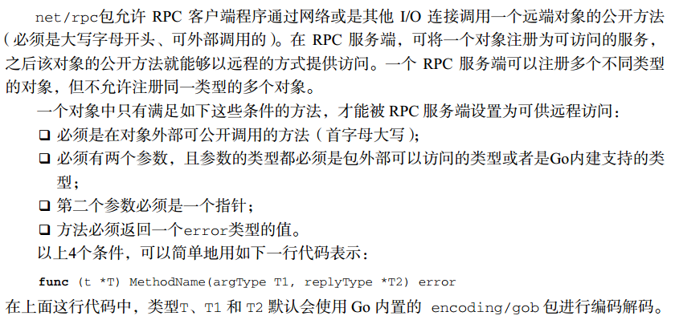
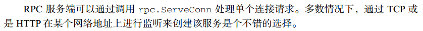
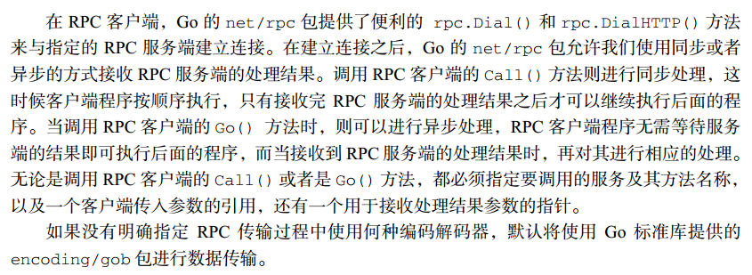
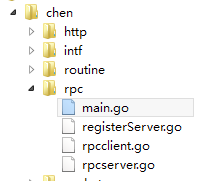

<!-- TOC -->

- [简介](#简介)
- [示例](#示例)
    - [rpcserver.go](#rpcservergo)
    - [registerServer.go](#registerservergo)
    - [rpcclient.go](#rpcclientgo)
    - [main.go](#maingo)
    - [输出结果](#输出结果)

<!-- /TOC -->


# 简介

RPC（Remote Procedure Call，远程过程调用）

RPC 采用客户端—服务器（Client/Server）的工作模式。请求程序就是一个客户端（Client），而服务提供程序就是一个服务器（Server）。当执行一个远程过程调用时，客户端程序首先发送一个带有参数的调用信息到服务端，然后等待服务端响应。在服务端，服务进程保持睡眠状态直到客户端的调用信息到达为止。当一个调用信息到达时，服务端获得进程参数，计算出结果，并向客户端发送应答信息，然后等待下一个调用。最后，客户端接收来自服务端的应答信息，获得进程结果，然后调用执行并继续进行








# 示例

服务端提供两个数相乘和相乘的功能

工程目录：



## rpcserver.go

定义参数和及负责计算的类

```go
package rpc

import (
    "errors"
)

type Args struct {
    A, B int
}

// 商
type Quotient struct {
    Quo, Rem int // 商，余数
}

type Arith int

func (this *Arith) Multiply(args *Args, reply *int) error {
    *reply = args.A * args.B
    return nil
}

func (this *Arith) Divide(args *Args, quo *Quotient) error {
    if args.B == 0 {
        return errors.New("divide by zero.")
    }
    quo.Quo = args.A / args.B
    quo.Rem = args.A % args.B
    return nil
}
```


## registerServer.go

注册服务对象并开启RPC服务

```go
package rpc

import (
    "fmt"
    "net"
    "net/http"
    "net/rpc"
)

func Register() {
    arith := new(Arith)
    rpc.Register(arith)
    rpc.HandleHTTP()
    l, err := net.Listen("tcp", ":1234")
    if err != nil {
        fmt.Println("listen error:", err)
        return
    }
    go http.Serve(l, nil)
}
```

## rpcclient.go

客户端，连接服务端并获取计算结果

```go
package rpc

import (
	"fmt"
	"net/rpc"
)

func ClientRun() {
	client, err := rpc.DialHTTP("tcp", "127.0.0.1:1234")
	if err != nil {
		fmt.Println("client dial error :", err)
		return
	}

	// 同步
	args := &Args{7, 8}
	var reply int
	err = client.Call("Arith.Multiply", args, &reply)
	if err != nil {
		fmt.Println("client.Call error :", err)
		return
	}
	fmt.Printf("Arith: %d * %d = %d \n", args.A, args.B, reply)

	// 异步
	quotient := new(Quotient)
	divCall := client.Go("Arith.Divide", args, &quotient, nil)
	replyCall := <-divCall.Done
	fmt.Printf("Arith: %d / %d = %d, %d %% %d = %d \n", args.A, args.B, quotient.Quo, args.A, args.B, quotient.Rem)
	fmt.Println(replyCall)
}
```

## main.go

```go
package rpc

func Main() {
	Register()
	ClientRun()
}
```

## 输出结果

```
Arith: 7 * 8 = 56 
Arith: 7 / 8 = 0, 7 % 8 = 7 
&{Arith.Divide 0xc082000870 0xc0820386c0 <nil> 0xc0820709a0}
```


