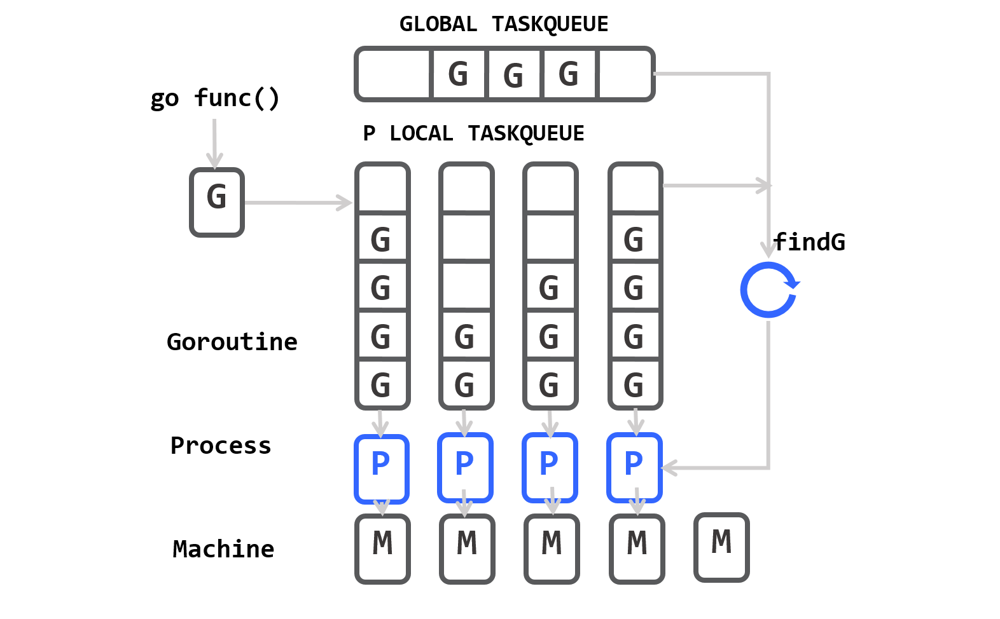
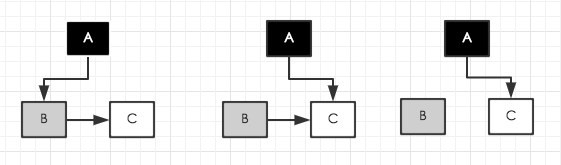
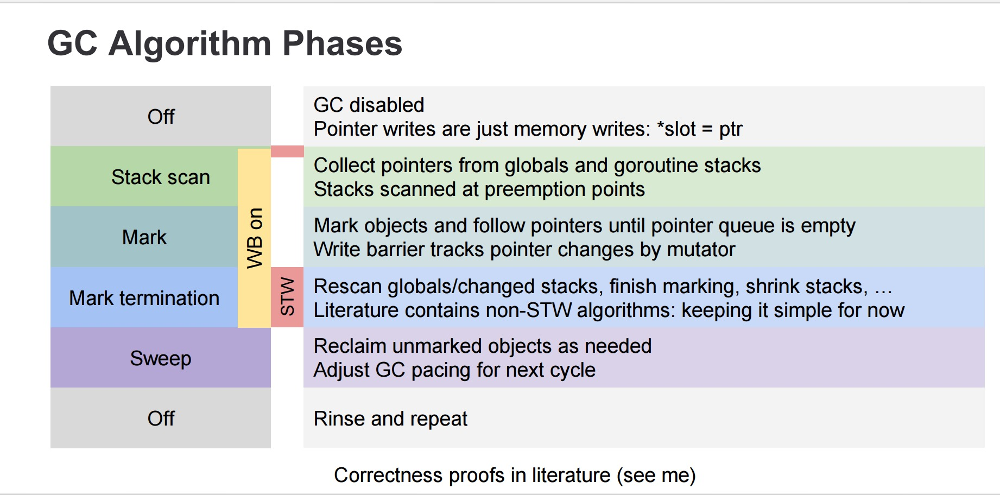
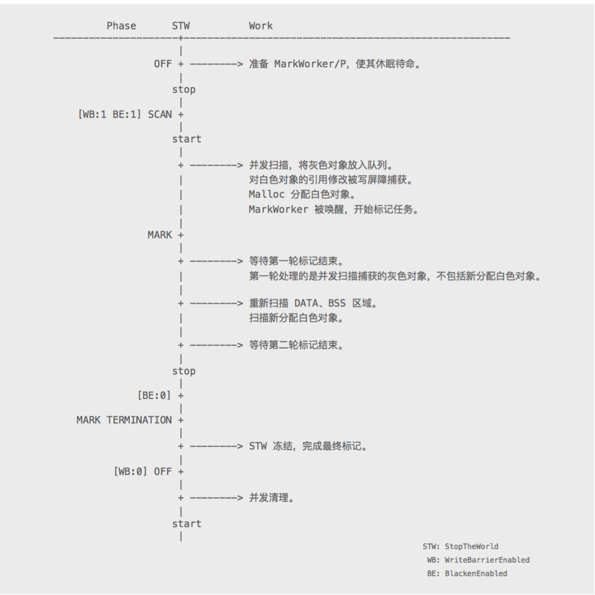

<!-- TOC -->

- [Gosched()](#gosched)
- [运行时希望多少个goroutine来同时地运行代码](#运行时希望多少个goroutine来同时地运行代码)
- [gc](#gc)
    - [disable gc](#disable-gc)
    - [运行gc](#运行gc)
    - [查看gc信息](#查看gc信息)
- [方法调用栈](#方法调用栈)
    - [堆栈信息](#堆栈信息)
    - [runtime.Caller 的用法](#runtimecaller-的用法)
    - [runtime.Callers 的用法](#runtimecallers-的用法)
    - [runtime.Callers 和 runtime.Caller 的异同](#runtimecallers-和-runtimecaller-的异同)
    - [runtime.FuncForPC 的用途](#runtimefuncforpc-的用途)
    - [定制的 CallerName 函数](#定制的-callername-函数)
    - [Go语言中函数的类型](#go语言中函数的类型)
    - [改进的 CallerName 函数](#改进的-callername-函数)
    - [CallerName 函数的不足之处](#callername-函数的不足之处)
    - [不同Go程序启动流程](#不同go程序启动流程)
- [内存使用情况](#内存使用情况)
    - [堆内存](#堆内存)
- [在web页面展示debug信息](#在web页面展示debug信息)
- [环境变量](#环境变量)
- [协程调度](#协程调度)
- [垃圾回收](#垃圾回收)
    - [三色标记法](#三色标记法)
        - [写屏障 write-barrier](#写屏障-write-barrier)
        - [如何并发的 gc](#如何并发的-gc)
        - [触发 gc](#触发-gc)
        - [垃圾产生的速度比回收的速度快](#垃圾产生的速度比回收的速度快)
        - [标记位](#标记位)
        - [GC 各个阶段](#gc-各个阶段)
    - [gc 调优](#gc-调优)
- [内存分配](#内存分配)

<!-- /TOC -->


# Gosched()

runtime.Gosched()表示让CPU把时间片让给别人,下次某个时候继续恢复执行该goroutine

```go
import (
	"fmt"
	"runtime"
)

func main() {
	go say("world")
	say("hello")
}

func say(s string) {
	for i := 0; i < 5; i++ {
		runtime.Gosched()
		fmt.Println(s)
	}
}
```

输出：

```
hello
world
hello
world
hello
world
hello
world
hello
```


# 运行时希望多少个goroutine来同时地运行代码

查看

```go
println(runtime.Version())      // go1.4.1
println(runtime.NumGoroutine()) // 2
println(runtime.NumCPU())       // 4
println(runtime.GOMAXPROCS(-1)) // 1
```

```go
func init() {
    numcpu := runtime.NumCPU()
    runtime.GOMAXPROCS(numcpu) // 尝试使用所有可用的CPU
}
```

# gc

## disable gc

```go
defer debug.SetGCPercent(debug.SetGCPercent(-1))
```

## 运行gc

```go
runtime.GC()
```

## 查看gc信息

```bash
GODEBUG=gctrace=1 ./test_server
```

将gc信息保存到文件：

```bash
GODEBUG=gctrace=1 go run main.go 2> gctrace.log
```


可视化信息 `https://github.com/davecheney/gcvis`

```bash
GODEBUG=gctrace=1 ./test_server 2>&1 | gcvis
```


# 方法调用栈

## 堆栈信息

```go
go func() {
	fmt.Println("i am a goroutine")
	time.Sleep(time.Second)
}()

time.Sleep(500 * time.Millisecond)

buf := make([]byte, 1024)
n := runtime.Stack(buf, false)
fmt.Println(string(buf[:n]))

fmt.Println("===================")

n = runtime.Stack(buf, true)
fmt.Println(string(buf[:n]))
```

第一个输出：

```
goroutine 1 [running]:
main.main()
	/项目路径/src/Test/Test.go:18 +0xa5
```

第二个输出：

```
goroutine 1 [running]:
main.main()
	/项目路径/src/Test/Test.go:23 +0x2c2

goroutine 17 [sleep]:
time.Sleep(0x3b9aca00)
	/usr/local/go/src/runtime/time.go:59 +0xf9
main.main.func1()
	/项目路径/src/Test/Test.go:12 +0xd9
created by main.main
	/项目路径/src/Test/Test.go:13 +0x37
```

--------------------------

```go
data := debug.Stack()
```

输出：

```
/项目路径/src/test/test.go:17 (0x400c49)
        main: data := debug.Stack()
/go安装路径/src/runtime/proc.go:111 (0x42846f)
        main: main_main()
/go安装路径/src/runtime/asm_amd64.s:1696 (0x454471)
        goexit: BYTE    $0x90   // NOP
```


## runtime.Caller 的用法

函数的签名如下:

```go
func runtime.Caller(skip int) (pc uintptr, file string, line int, ok bool)
```

runtime.Caller 返回当前 goroutine 的栈上的函数调用信息. 主要有当前的 pc 值和调用的文件和行号等信息. 若无法获得信息, 返回的 ok 值为 false.

其输入参数 skip 为要跳过的栈帧数, 若为 0 则表示 runtime.Caller 的调用者.

注意:由于历史原因, runtime.Caller 和 runtime.Callers 中的 skip 含义并不相同, 后面会讲到.

下面是一个简单的例子, 打印函数调用的栈帧信息:

```go
package main

import (
	"fmt"
	"runtime"
)

func main() {
	fun1()
}

func fun1() {
	for skip := 0; ; skip++ {
		pc, file, line, ok := runtime.Caller(skip)
		if !ok {
			break
		}
		fmt.Printf("skip = %v, pc = %v, file = %v, line = %v\n", skip, pc, file, line)
	}
}
```

输出结果：

```
skip = 0, pc = 8274, file = /项目路径/src/test/main.go, line = 14
skip = 1, pc = 8219, file = /项目路径/src/test/main.go, line = 9
skip = 2, pc = 77123, file = /usr/local/go/src/runtime/proc.go, line = 63
skip = 3, pc = 227809, file = /usr/local/go/src/runtime/asm_amd64.s, line = 2232
```

其中 skip = 0 为当前文件的 main.main 函数, 以及对应的行号.

另外的 skip = 1 和 skip = 2 也分别对应2个函数调用. 通过查阅 runtime/proc.c 文件的代码, 我们可以知道对应的函数分别为 runtime.main 和 runtime.goexit.

整理之后可以知道, Go的普通程序的启动顺序如下:

1. runtime.goexit 为真正的函数入口(并不是main.main)
2. 然后 runtime.goexit 调用 runtime.main 函数
3. 最终 runtime.main 调用用户编写的 main.main 函数


## runtime.Callers 的用法

函数的签名如下:

```go
func runtime.Callers(skip int, pc []uintptr) int
```

runtime.Callers 函数和 runtime.Caller 函数虽然名字相似(多一个后缀s), 但是函数的参数/返回值和参数的意义都有很大的差异.

runtime.Callers 把调用它的函数Go程栈上的程序计数器填入切片 pc 中. 参数 skip 为开始在 pc 中记录之前所要跳过的栈帧数, **若为0则表示 runtime.Callers 自身的栈帧**, 若为1则表示调用者的栈帧. 该函数返回写入到 pc 切片中的项数(受切片的容量限制).

下面是 runtime.Callers 的例子, 用于输出每个栈帧的 pc 信息:

```go
func main() {
	fun1()
}

func fun1() {
	pc := make([]uintptr, 1024)
	for skip := 0; ; skip++ {
		n := runtime.Callers(skip, pc)
		if n <= 0 {
			break
		}
		fmt.Printf("skip = %v, pc = %v\n", skip, pc[:n])
	}
}
```

输出：

```
skip = 0, pc = [28854 8368 8219 77155 227841]
skip = 1, pc = [8368 8219 77155 227841]
skip = 2, pc = [8219 77155 227841]
skip = 3, pc = [77155 227841]
skip = 4, pc = [227841]
```

输出新的 pc 长度和 skip 大小有逆相关性. skip = 0 为 runtime.Callers 自身的信息.

这个例子比前一个例子多输出了一个栈帧, 就是因为多了一个runtime.Callers栈帧的信息(前一个例子是没有runtime.Caller信息的(注意:没有s后缀)).

那么 runtime.Callers 和 runtime.Caller 有哪些关联和差异?


## runtime.Callers 和 runtime.Caller 的异同

因为前面2个例子为不同的程序, 输出的 pc 值并不具备参考性. 现在我们看看在同一个例子的输出结果如何:

```go
package main

import (
	"fmt"
	"runtime"
)

func main() {
	fun1()
}

func fun1() {
	for skip := 0; ; skip++ {
		pc, file, line, ok := runtime.Caller(skip)
		if !ok {
			break
		}
		fmt.Printf("skip = %v, pc = %v, file = %v, line = %v\n", skip, pc, file, line)
	}

	pc := make([]uintptr, 1024)
	for skip := 0; ; skip++ {
		n := runtime.Callers(skip, pc)
		if n <= 0 {
			break
		}
		fmt.Printf("skip = %v, pc = %v\n", skip, pc[:n])
	}
}
```

输出：

```
skip = 0, pc = 8277, file = /项目路径/src/test/main.go, line = 14
skip = 1, pc = 8219, file = /项目路径/src/test/main.go, line = 9
skip = 2, pc = 78179, file = /usr/local/go/src/runtime/proc.go, line = 63
skip = 3, pc = 228865, file = /usr/local/go/src/runtime/asm_amd64.s, line = 2232
skip = 0, pc = [29878 8449 8219 78179 228865]
skip = 1, pc = [8449 8219 78179 228865]
skip = 2, pc = [8219 78179 228865]
skip = 3, pc = [78179 228865]
skip = 4, pc = [228865]
```

比如输出结果可以发现, 8219 78179 228865 这个 pc 值是相同的. 它们分别对应 main.main, runtime.main 和 runtime.goexit 函数.

runtime.Caller 输出的 8277 和 runtime.Callers 输出的 8449 并不相同. 这是因为, 这两个函数的调用位置并不相同, 因此导致了 pc 值也不完全相同.

最后就是 runtime.Callers 多输出一个 29878 值, 对应runtime.Callers内部的调用位置.

由于Go语言(Go1.2)采用分段堆栈, 因此不同的 pc 之间的大小关系并不明显.


## runtime.FuncForPC 的用途

函数的签名如下:

```go
func runtime.FuncForPC(pc uintptr) *runtime.Func
func (f *runtime.Func) FileLine(pc uintptr) (file string, line int)
func (f *runtime.Func) Entry() uintptr
func (f *runtime.Func) Name() string
```

其中 runtime.FuncForPC 返回包含给定 pc 地址的函数, 如果是无效 pc 则返回 nil .

runtime.Func.FileLine 返回与 pc 对应的源码文件名和行号. 安装文档的说明, 如果pc不在函数帧范围内, 则结果是不确定的.

runtime.Func.Entry 对应函数的地址. runtime.Func.Name 返回该函数的名称.

下面是 runtime.FuncForPC 的例子:

```go
package main

import (
	"fmt"
	"runtime"
)

func main() {
	fun1()
}

func fun1() {
	for skip := 0; ; skip++ {
		pc, _, _, ok := runtime.Caller(skip)
		if !ok {
			break
		}
		p := runtime.FuncForPC(pc)
		file, line := p.FileLine(0)

		fmt.Printf("skip = %v, pc = %v\n", skip, pc)
		fmt.Printf("  file = %v, line = %d\n", file, line)
		fmt.Printf("  entry = %v\n", p.Entry())
		fmt.Printf("  name = %v\n", p.Name())
	}

	fmt.Println("-------------------------")

	pc := make([]uintptr, 1024)
	for skip := 0; ; skip++ {
		n := runtime.Callers(skip, pc)
		if n <= 0 {
			break
		}
		fmt.Printf("skip = %v, pc = %v\n", skip, pc[:n])
		for j := 0; j < n; j++ {
			p := runtime.FuncForPC(pc[j])
			file, line := p.FileLine(0)

			fmt.Printf("  skip = %v, pc = %v\n", skip, pc[j])
			fmt.Printf("    file = %v, line = %d\n", file, line)
			fmt.Printf("    entry = %v\n", p.Entry())
			fmt.Printf("    name = %v\n", p.Name())
		}
		break
	}
}
```

输出：

```
skip = 0, pc = 8277
  file = /项目路径/src/test/main.go, line = 12
  entry = 8224
  name = main.fun1
skip = 1, pc = 8219
  file = /项目路径/src/test/main.go, line = 8
  entry = 8192
  name = main.main
skip = 2, pc = 80579
  file = /usr/local/go/src/runtime/proc.go, line = 16
  entry = 80336
  name = runtime.main
skip = 3, pc = 231265
  file = /usr/local/go/src/runtime/asm_amd64.s, line = 2232
  entry = 231264
  name = runtime.goexit
-------------------------
skip = 0, pc = [32278 8634 8219 80579 231265]
  skip = 0, pc = 32278
    file = /usr/local/go/src/runtime/extern.go, line = 134
    entry = 32192
    name = runtime.Callers
  skip = 0, pc = 8634
    file = /项目路径/src/test/main.go, line = 12
    entry = 8224
    name = main.fun1
  skip = 0, pc = 8219
    file = /项目路径/src/test/main.go, line = 8
    entry = 8192
    name = main.main
  skip = 0, pc = 80579
    file = /usr/local/go/src/runtime/proc.go, line = 16
    entry = 80336
    name = runtime.main
  skip = 0, pc = 231265
    file = /usr/local/go/src/runtime/asm_amd64.s, line = 2232
    entry = 231264
    name = runtime.goexit
```

根据测试, 如果是无效 pc (比如0), runtime.Func.FileLine 一般会输出当前函数的开始行号. 不过在实践中, 一般会用 runtime.Caller 获取文件名和行号信息, runtime.Func.FileLine 很少用到(如何独立获取pc参数?).

## 定制的 CallerName 函数

基于前面的几个函数, 我们可以方便的定制一个 CallerName 函数. 函数 CallerName 返回调用者的函数名/文件名/行号等用户友好的信息.

函数实现如下:

```go
package main

import (
	"fmt"
	"runtime"
)

func main() {
	for skip := 0; ; skip++ {
		name, file, line, ok := CallerName(skip)
		if !ok {
			break
		}
		fmt.Printf("skip = %v\n", skip)
		fmt.Printf("  file = %v, line = %d\n", file, line)
		fmt.Printf("  name = %v\n", name)
	}
}

func CallerName(skip int) (name, file string, line int, ok bool) {
	var pc uintptr
	if pc, file, line, ok = runtime.Caller(skip + 1); !ok {
		return
	}
	name = runtime.FuncForPC(pc).Name()
	return
}
```

输出：

```
skip = 0
  file = /Users/zhangyuchen/go/pro/src/test/main.go, line = 10
  name = main.main
skip = 1
  file = /usr/local/go/src/runtime/proc.go, line = 63
  name = runtime.main
skip = 2
  file = /usr/local/go/src/runtime/asm_amd64.s, line = 2232
  name = runtime.goexit
```

其中在执行 runtime.Caller 调用时, 参数 skip + 1 用于抵消 CallerName 函数自身的调用.

## Go语言中函数的类型

在Go语言中, 除了语言定义的普通函数调用外, 还有闭包函数/init函数/全局变量初始化等不同的函数调用类型.

为了便于测试不同类型的函数调用, 我们包装一个 PrintCallerName 函数. 该函数用于输出调用者的信息.

```go
package main

import (
	"fmt"
	"runtime"
)

var a = PrintCallerName(0, "main.a")
var b = PrintCallerName(0, "main.b")

func init() {
	a = PrintCallerName(0, "main.init.a")
}

func init() {
	b = PrintCallerName(0, "main.init.b")
	func() {
		b = PrintCallerName(0, "main.init.b[1]")
	}()
}

func main() {
	a = PrintCallerName(0, "main.main.a")
	b = PrintCallerName(0, "main.main.b")
	func() {
		b = PrintCallerName(0, "main.main.b[1]")
		func() {
			b = PrintCallerName(0, "main.main.b[1][1]")
		}()
		b = PrintCallerName(0, "main.main.b[2]")
	}()
}

func PrintCallerName(skip int, comment string) bool {
	name, file, line, ok := CallerName(skip + 1)
	if !ok {
		return false
	}
	fmt.Printf("skip = %v, comment = %s\n", skip, comment)
	fmt.Printf("  file = %v, line = %d\n", file, line)
	fmt.Printf("  name = %v\n", name)
	return true
}

func CallerName(skip int) (name, file string, line int, ok bool) {
	var pc uintptr
	if pc, file, line, ok = runtime.Caller(skip + 1); !ok {
		return
	}
	name = runtime.FuncForPC(pc).Name()
	return
}
```

输出：

```
skip = 0, comment = main.a
  file = /Users/zhangyuchen/go/pro/src/test/main.go, line = 8
  name = main.init
skip = 0, comment = main.b
  file = /Users/zhangyuchen/go/pro/src/test/main.go, line = 9
  name = main.init
skip = 0, comment = main.init.a
  file = /Users/zhangyuchen/go/pro/src/test/main.go, line = 12
  name = main.init·1
skip = 0, comment = main.init.b
  file = /Users/zhangyuchen/go/pro/src/test/main.go, line = 16
  name = main.init·2
skip = 0, comment = main.init.b[1]
  file = /Users/zhangyuchen/go/pro/src/test/main.go, line = 18
  name = main.func·001
skip = 0, comment = main.main.a
  file = /Users/zhangyuchen/go/pro/src/test/main.go, line = 23
  name = main.main
skip = 0, comment = main.main.b
  file = /Users/zhangyuchen/go/pro/src/test/main.go, line = 24
  name = main.main
skip = 0, comment = main.main.b[1]
  file = /Users/zhangyuchen/go/pro/src/test/main.go, line = 26
  name = main.func·003
skip = 0, comment = main.main.b[1][1]
  file = /Users/zhangyuchen/go/pro/src/test/main.go, line = 28
  name = main.func·002
skip = 0, comment = main.main.b[2]
  file = /Users/zhangyuchen/go/pro/src/test/main.go, line = 30
  name = main.func·003
```

观察输出结果, 可以发现以下几个规律:

1. 全局变量的初始化调用者为 main.init 函数
2. 自定义的 init 函数有一个数字后缀, 根据出现的顺序进编号. 比如 main.init·1 和 main.init·2 等.
3. 闭包函数采用 main.func·001 格式命名, *安装闭包定义结束的位置顺序进编号*.

比如以下全局变量的初始化调用者为 main.init 函数:

```go
var a = PrintCallerName(0, "main.a")
var b = PrintCallerName(0, "main.b")
```

以下两个 init 函数根据出现顺序分别对应 main.init·1 和 main.init·2 :

```go
func init() { // main.init·1
    //
}
func init() { // main.init·2
    //
}
```

以下三个闭包根据定义结束顺序分别为 001 / 002 / 003 :

```go
func init() {
    func(){
        //
    }() // main.func·001
}

func main() {
    func() {
        func(){
            //
        }() // main.func·002
    }() // main.func·003
}
```

因为, 这些特殊函数调用方式的存在, 我们需要进一步完善 CallerName 函数.


## 改进的 CallerName 函数

两类特殊的调用是 init 类函数调用 和 闭包函数调用.

改进后的 CallerName 函数对 init 类函数调用者统一处理为 init 函数. 将闭包函数调用这处理为调用者的函数名.

```go
func CallerName(skip int) (name, file string, line int, ok bool) {
	var (
		reInit    = regexp.MustCompile(`init·\d+$`) // main.init·1
		reClosure = regexp.MustCompile(`func·\d+$`) // main.func·001
	)
	for {
		var pc uintptr
		if pc, file, line, ok = runtime.Caller(skip + 1); !ok {
			return
		}
		name = runtime.FuncForPC(pc).Name()
		if reInit.MatchString(name) {
			name = reInit.ReplaceAllString(name, "init")
			return
		}
		if reClosure.MatchString(name) {
			skip++
			continue
		}
		return
	}
	return
}
```

输出：

```
skip = 0, comment = main.a
  file = /Users/zhangyuchen/go/pro/src/test/main.go, line = 9
  name = main.init
skip = 0, comment = main.b
  file = /Users/zhangyuchen/go/pro/src/test/main.go, line = 10
  name = main.init
skip = 0, comment = main.init.a
  file = /Users/zhangyuchen/go/pro/src/test/main.go, line = 13
  name = main.init
skip = 0, comment = main.init.b
  file = /Users/zhangyuchen/go/pro/src/test/main.go, line = 17
  name = main.init
skip = 0, comment = main.init.b[1]
  file = /Users/zhangyuchen/go/pro/src/test/main.go, line = 20
  name = main.init
skip = 0, comment = main.main.a
  file = /Users/zhangyuchen/go/pro/src/test/main.go, line = 24
  name = main.main
skip = 0, comment = main.main.b
  file = /Users/zhangyuchen/go/pro/src/test/main.go, line = 25
  name = main.main
skip = 0, comment = main.main.b[1]
  file = /Users/zhangyuchen/go/pro/src/test/main.go, line = 32
  name = main.main
skip = 0, comment = main.main.b[1][1]
  file = /Users/zhangyuchen/go/pro/src/test/main.go, line = 32
  name = main.main
skip = 0, comment = main.main.b[2]
  file = /Users/zhangyuchen/go/pro/src/test/main.go, line = 32
  name = main.main
```

## CallerName 函数的不足之处

有以下的代码:

```go
func init() {
	myInit("1")
}
func main() {
	myInit("2")
}

var myInit = func(name string) {
	PrintCallerName(0, name+":main.myInit.b")
}
```

输出：

```
skip = 0, comment = 1:main.myInit.b
  file = /Users/zhangyuchen/go/pro/src/test/main.go, line = 10
  name = main.init
skip = 0, comment = 2:main.myInit.b
  file = /Users/zhangyuchen/go/pro/src/test/main.go, line = 13
  name = main.main
```

从直观上看, myInit闭包函数在执行时, 最好输出 main.myInit 函数名. 但是 main.myInit 只是一个绑定到闭包函数的变量, 而闭包的真正名字是 main.func·???(这里如果用改进之前的CallerName的话，输出是main.func·001). 在运行时是无法得到 main.myInit 这个名字的.


## 不同Go程序启动流程

基于函数调用者信息可以很容易的验证各种环境的程序启动流程.

test:

```go
package main

import (
	"fmt"
	"testing"
)

func TestPrintCallerName(t *testing.T) {
	for skip := 0; ; skip++ {
		name, file, line, ok := CallerName(skip)
		if !ok {
			break
		}
		fmt.Printf("skip = %v, name = %v, file = %v, line = %v\n", skip, name, file, line)
	}
	t.Fail()
}
```

example:

```go
package main

import (
	myMain "."
	"fmt"
)

func Example() {
	for skip := 0; ; skip++ {
		name, file, line, ok := myMain.CallerName(skip)
		if !ok {
			break
		}
		fmt.Printf("skip = %v, name = %v, file = %v, line = %v\n", skip, name, file, line)
	}
	// Output: ?
}
```

运行 go test , 得到的输出：

```
=== RUN TestPrintCallerName
skip = 0, name = test.TestPrintCallerName, file = /Users/zhangyuchen/go/pro/src/test/main_test.go, line = 10
skip = 1, name = testing.tRunner, file = /usr/local/go/src/testing/testing.go, line = 447
skip = 2, name = runtime.goexit, file = /usr/local/go/src/runtime/asm_amd64.s, line = 2232
--- FAIL: TestPrintCallerName (0.00s)
=== RUN: Example
--- FAIL: Example (0.00s)
got:
skip = 0, name = test.Example, file = /Users/zhangyuchen/go/pro/src/test/example_test.go, line = 10
skip = 1, name = testing.runExample, file = /usr/local/go/src/testing/example.go, line = 98
skip = 2, name = testing.RunExamples, file = /usr/local/go/src/testing/example.go, line = 36
skip = 3, name = testing.(*M).Run, file = /usr/local/go/src/testing/testing.go, line = 486
skip = 4, name = main.main, file = test/_test/_testmain.go, line = 54
skip = 5, name = runtime.main, file = /usr/local/go/src/runtime/proc.go, line = 63
skip = 6, name = runtime.goexit, file = /usr/local/go/src/runtime/asm_amd64.s, line = 2232
want:
?
FAIL
exit status 1
FAIL	test	0.008s
```

分析输出数据我们可以发现, 测试代码和例子代码的启动流程和普通的程序流程都不太一样.

测试代码的启动流程:

1. runtime.goexit 还是入口
2. 但是 runtime.goexit 不在调用 runtime.main 函数, 而是调用 testing.tRunner 函数
3. testing.tRunner 函数由 go test 命令生成, 用于执行各个测试函数

例子代码的启动流程:

1. runtime.goexit 还是入口
2. 然后 runtime.goexit 调用 runtime.main 函数
3. 最终 runtime.main 调用go test 命令生成的 main.main 函数, 在 `_test/_testmain.go` 文件
4. 然后调用 testing.Main, 改函数执行各个例子函数

另外, 从这个例子我们可以发现, 我们自己写的 main.main 函数所在的 main 包也可以被其他包导入. 但是其他包导入之后的 main 包里的 main 函数就不再是main.main 函数了. 因此, 程序的入口也就不是自己写的 main.main 函数了.


# 内存使用情况

## 堆内存

```go
	var m runtime.MemStats
	runtime.ReadMemStats(&m)

	format := "%-40s : %d bytes\n"
	fmt.Printf(format, "bytes allocated and still in use", m.HeapAlloc)
	fmt.Printf(format, "bytes obtained from system", m.HeapSys)
	fmt.Printf(format, "bytes in idle spans", m.HeapIdle)
	fmt.Printf(format, "bytes in non-idle span", m.HeapInuse)
	fmt.Printf(format, "bytes released to the OS", m.HeapReleased)
	fmt.Printf(format, "total number of allocated objects", m.HeapObjects)
```

输出：

```
bytes allocated and still in use         : 38928 bytes
bytes obtained from system               : 851968 bytes
bytes in idle spans                      : 696320 bytes
bytes in non-idle span                   : 155648 bytes
bytes released to the OS                 : 0 bytes
total number of allocated objects        : 113 bytes
```

# 在web页面展示debug信息

```go
	router := httprouter.New()
	router.HandlerFunc("GET", "/debug/pprof", pprof.Index)
	router.Handler("GET", "/debug/heap", pprof.Handler("heap"))
	router.Handler("GET", "/debug/goroutine", pprof.Handler("goroutine"))
	router.Handler("GET", "/debug/block", pprof.Handler("block"))
	router.Handler("GET", "/debug/threadcreate", pprof.Handler("threadcreate"))
	// 启动时的命令,比如 bin/debug -a=1
	router.HandlerFunc("GET", "/debug/pprof/cmdline", pprof.Cmdline)
	router.HandlerFunc("GET", "/debug/pprof/symbol", pprof.Symbol)
	router.HandlerFunc("GET", "/debug/pprof/profile", pprof.Profile)
	router.HandlerFunc("GET", "/debug/pprof/trace", pprof.Trace)
	http.ListenAndServe(":8080", router)
```

# 环境变量

`GOGC` 用于初始化垃圾回收目标比率？？默认`GOGC=100`, `GOGC=off`禁用垃圾回收。动态修改该值见`runtime/debug`包的`SetGCPercent`.

`GODEBUG` 控制运行时的调试变量，值是用逗号分隔的name=val列表。可以设置的值如下:

  allocfreetrace=1: 每次分配都会记录，每个对象的分配和回收都会打印堆栈。
  cgocheck: ...
  efence=1: 每个对象被分配在唯一的页上，并且不会回收。
  gccheckmark: ...
  gcpacertrace: ...
  gcshrinkstackoff=1: 禁止移动goroutine到最小的栈上，goroutine的栈会一直增加。
  gcstackbarrieroff: ...
  gcstackbarrierall: ...
  gcstoptheworld=1: 禁用异步垃圾回收，每次垃圾回收都会stop-the-world，gcstoptheworld=2在垃圾回收结束时禁用异步sweeping。
  gctrace: =1记录每次回收时内存收集的数量和暂停的时长。=2会记录相同的统计但是会重复每次回收?? 统计的格式如下:
    gc # @#s #%: #+#+# ms clock, #+#/#/#+# ms cpu, #->#-># MB, # MB goal, # P
    例如：gc 1 @17.471s 0%: 0.22+4.4+0.19 ms clock, 0.66+0/1.8/10+0.57 ms cpu, 4->4->2 MB, 5 MB goal, 4 P
    各字段如下:
    gc #:gc数，每次gc都会增加
    @#s: 从程序启动到现在的秒数
    #%: 从程序启动开始gc花费的时间所占的比例
    #+...+#: gc阶段时钟/CPU时间？
    #->#-># MB: 堆大小(gc开始、结束、存活堆live heap)
    # MB goal: 全局堆大小
    # P: 使用的处理器processors数。
    ...
  memprofilerate=X: 更新`runtime.MemProfileRate`的值。
  ...


mark phase: where the GC determines which memory allocations are still in use.

sweep phase: where the unused memory is prepared for reuse.


# 协程调度



G 代表 goroutine, 保存了栈信息，任务函数等，创建后会被保存在 P 本地队列或全局队列中。初始栈空间 2KB。

P 表示 processor, 维护了本地 G 队列，并为 M 的执行提供内存资源 mCache。通常为 CPU 核数。本地队列是有长度限制的(256?)。

M 表示 machine, 代表了内核线程，M 做的事情是从 P 的 G 队列或全局 G 队列中获取 G，然后切换到 G 的栈内存，执行 G 的函数。M 的个数是不限的，默认上限 1w 个。

调度流程： M 从 P 的 G 队列中获取 G，切换到 G 的堆栈并执行。当 P 的 G 队列中没有 G 时，会从全局队列中获取 G 来执行（加锁，获取一批 G 来执行），如果全局队列中也没有 G，则从其他 P 窃取 G 来执行。如果都没有可执行的 G 了，则与 P 解绑然后进入休眠状态。

抢占式调度：如果某个 G 执行超过 10ms, 监控线程 sysmon 会为该 G 设置抢占标记，当 G 执行某些函数时会检查这个标记，然后以 `runtime.Gosched()` 的方式暂停，放入全局队列中。

阻塞：
* 如果 G 进入了阻塞的系统调度中，M 将一起阻塞，此时 M 会和 P 分离，如果 P 中还有 G 需要执行，P 会寻找其他空闲 M 或创建新的 M 来执行，如果没有 G 要执行，那么就放入全局空闲列表中，当有新的 G 到来时会唤醒这个空闲的 P。 当系统调用结束，G 会尝试获取一个空闲的 P 来恢复执行，如果没有空闲的 P，则放入全局队列中。
* 当 G 阻塞在 channel 上，G 会被放入 channel 的等待队列，M 会继续执行下一个 G。当 channel 可读或可写时，阻塞的 G 会被唤醒，会依次尝试放入 P 的 runnext, P 的 Local 队列，全局队列。
* netpoll 优化：netpoll 是针对网络 IO 的优化。某个 G 执行网络 IO 操作，如果网络 IO 还没就绪，则 G 会放到等待队列中，M 不会被阻塞。后台有个 poller 会不停地检查 IO 是否就绪，就绪时会唤醒之前被阻塞的 G。


# 垃圾回收

## 三色标记法


过程：
1. 最开始所有对象都是白色。
2. 从 root 区开始扫描所有可达对象，标记成灰色放入队列，自身标记成黑色。
3. 从队列中取出灰色对象，将其可达对象标记成灰色放入队列，自身标记成黑色。
4. 写屏障检查对象内存修改，重新标色或者放入队列。
5. 收集所有白色对象。

root 区是当前栈和全局数据区域。


### 写屏障 write-barrier

回收时需要满足的约束条件： 黑色对象不能引用白色对象。

并发会导致的问题：



1. gc 时检测到 A -> B, 将 A 标记成黑色，B 标记成灰色。
2. 用户协程将 A -> C, 并删除 B->C。
3. gc 扫描 B，发现没有引用，B 被标记为黑色。C 是白色的，被当做垃圾回收了。

写屏障是在每一处内存写操作前执行一段代码来完成的。 当发现 A 是黑色的，A 的引用变了，那么 C 会被标记成灰色放入队列中。B 会在下次扫描时标记为垃圾。

### 如何并发的 gc

扫描不是递归进行的，而是几个 gc worker 并发地从队列中拿取对象，然后检查引用，将未标记的对象标记为灰色入队。


### 触发 gc 

* 申请内存的时候发现已分配的内存大于上次GC后的内存的2倍。
* 监控线程发现距离上次GC已经超过2分钟。


### 垃圾产生的速度比回收的速度快

这时会让用户线程参与后台标记回收，在为对象分配内存的时候，通过一定的策略去执行一定限度的回收操作，平衡分配和回收操作。

### 标记位

堆区有一个 bitmap, 通过它可以获知对象是否被标记过，已标记或不是指针都不入队列。


### GC 各个阶段




* Off: 关闭状态。
* Stack scan: 扫描阶段。开启写屏障，扫描全局和协程栈的指针。
* Mark: 标记阶段。并发从队列中拿灰色对象，扫描引用对象，标记为灰色入队，自身标记为黑色。
* Mark termination: 标记结束阶段。重新扫描 root 区。
* Sweep: 清扫阶段。

还是有两个 STW 的阶段。


## gc 调优

* 控制 gc 频率。
* 使用对象池。


# 内存分配

多级分配： mcache -> mcentral -> mheap -> 操作系统。

* 基本单位是 mspan, 大小是 page 的整数倍。
* mcache 是每个 P 的 cache。包含 67 中规格的 mspan, 大小从 0 到 32K。申请时不需要加锁。
* mcentral 定义在 mheap 中，也是包含 67 个 mspan. 申请时需要加锁。
* mheap 堆内存，申请时需要加锁。


给对象 object 分配内存的主要流程：

* object size > 32K，则使用 mheap 直接分配。
* object size < 16 byte，使用 mcache 的小对象分配器 tiny 直接分配。 
* object size > 16 byte && size <= 32K byte 时，先使用 mcache 中对应的 size class 分配；如果 mcache 对应的 size class 的 span 已经没有可用的块，则向 mcentral 请求；如果 mcentral 也没有可用的块，则向 mheap 申请，并切分；如果 mheap 也没有合适的 span，则想操作系统申请。