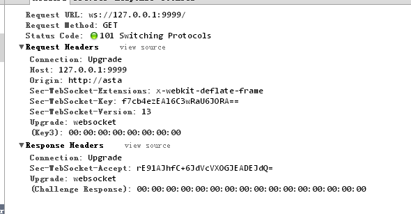

<!-- TOC -->

- [SOCKET](#socket)
    - [基础知识](#基础知识)
    - [IP IN GO](#ip-in-go)
    - [TCP SOCKET](#tcp-socket)
        - [TCP client](#tcp-client)
        - [TCP server](#tcp-server)
        - [控制TCP连接](#控制tcp连接)
        - [TCP连接网站示例](#tcp连接网站示例)
    - [UDP SOCKET](#udp-socket)
    - [DIAL](#dial)
    - [WebSocket](#websocket)
        - [WebSocket原理](#websocket原理)
        - [GO中的WebSocket](#go中的websocket)
    - [更丰富的网络通信](#更丰富的网络通信)
    - [工具函数](#工具函数)
        - [验证IP地址有效性](#验证ip地址有效性)
        - [创建子网掩码](#创建子网掩码)
        - [IP地址的默认子网掩码](#ip地址的默认子网掩码)
        - [根据域名获得IP地址](#根据域名获得ip地址)
        - [获取本机地址](#获取本机地址)

<!-- /TOC -->


# SOCKET
## 基础知识

  Socket有两种：TCP Socket和UDP Socket，TCP和UDP是协议。确定一个进程需要三元组，IP地址、协议和端口。

  IPv4的地址位数为32位，地址格式类似这样：127.0.0.1 172.122.121.111。

  IPv6采用128位地址长度，地址格式类似这样：2002:c0e8:82e7:0:0:0:c0e8:82e7。

## IP IN GO

  IP类型的定义在`net`包中。

  使用下面的语句获取一个ip类型：

```go
var ip net.IP = net.ParseIP("127.0.0.1")
```

## TCP SOCKET

  net.TCPConn可作为客户端和服务器端交互的通道，利用它的Read()和Write()可以读写数据。

  net.TCPAddr表示一个TCP的地址信息:

```go
  type TCPAddr struct {
    IP IP
    Port int
  }
```

  获得TCPAddr: 

```go
func ResolveTCPAddr(net, addr string) (*TCPAddr, os.Error)
```

### TCP client

  Go语言中通过`net`包中的`DialTCP`函数来建立一个TCP连接，并返回一个`TCPConn`类型的对象，当连接建立时服务器端也创建一个同类型的对象，此时客户端和服务器段通过各自拥有的TCPConn对象来进行数据交换。一般而言，客户端通过TCPConn对象将请求信息发送到服务器端，读取服务器端响应的信息。服务器端读取并解析来自客户端的请求，并返回应答信息，这个连接只有当任一端关闭了连接之后才失效，不然这连接可以一直在使用。建立连接的函数定义如下：

```go
func DialTCP(net string, laddr, raddr *TCPAddr) (c *TCPConn, err os.Error)
```

-   net参数是"tcp4"、"tcp6"、"tcp"中的任意一个，分别表示TCP(IPv4-only)、TCP(IPv6-only)或者TCP(IPv4,IPv6的任意一个)
-   laddr表示本机地址，一般设置为nil
    - raddr表示远程的服务地址

    示例：

```go
package main

import (
    "fmt"
    "io/ioutil"
    "net"
    "os"
)

func main() {
    if len(os.Args) != 2 {
        fmt.Fprintf(os.Stderr, "Usage: %s host:port ", os.Args[0])
        os.Exit(1)
    }
    service := os.Args[1]
    tcpAddr, err := net.ResolveTCPAddr("tcp4", service)
    checkError(err)
    conn, err := net.DialTCP("tcp", nil, tcpAddr)
    checkError(err)
    _, err = conn.Write([]byte("HEAD / HTTP/1.0\r\n\r\n"))
    checkError(err)
    result, err := ioutil.ReadAll(conn)
    checkError(err)
    fmt.Println(string(result))
    os.Exit(0)
}
func checkError(err error) {
    if err != nil {
        fmt.Fprintf(os.Stderr, "Fatal error: %s", err.Error())
        os.Exit(1)
    }
}
```

从conn中读取数据时最好不要直接用 conn.Read()，建议用:

```go
reader := bufio.NewReader(sender.tcpConn)
respStr, err := reader.ReadString('\n')
```


### TCP server

  在服务器端我们需要绑定服务到指定的非激活端口，并监听此端口，当有客户端请求到达的时候可以接收到来自客户端连接的请求。net包中有相应功能的函数，函数定义如下：

```go
func ListenTCP(net string, laddr *TCPAddr) (l *TCPListener, err os.Error)
func (l *TCPListener) Accept() (c Conn, err os.Error)
```

- **示例：下面实现一个简单的时间同步服务，监听7777端口**

```go
package main

import (
    "fmt"
    "net"
    "os"
    "time"
)

func main() {
    service := ":1200"
    tcpAddr, err := net.ResolveTCPAddr("tcp4", service)
    checkError(err)
    listener, err := net.ListenTCP("tcp", tcpAddr)
    checkError(err)
    for {
        conn, err := listener.Accept()
        if err != nil {
            continue
        }
        go handleClient(conn)
    }
}

func handleClient(conn net.Conn) {
    defer conn.Close()
    daytime := time.Now().String()
    conn.Write([]byte(daytime)) // don't care about return value
    // we're finished with this client
}
func checkError(err error) {
    if err != nil {
        fmt.Fprintf(os.Stderr, "Fatal error: %s", err.Error())
        os.Exit(1)
    }
}
```

- **示例：通过读取客户端的数据来返回不同的时间格式，并保持一个长连接**
> 这里只写了handleClient()，其他代码参考上面

```go
func handleClient(conn net.Conn) {
    conn.SetReadDeadline(time.Now().Add(2 * time.Minute)) // set 2 minutes timeout
    request := make([]byte, 128) // set maxium request length to 128KB to prevent flood attack
    defer conn.Close()  // close connection before exit
    for {
        read_len, err := conn.Read(request)

        if err != nil {
            fmt.Println(err)
            break
        }

        if read_len == 0 {
            break // connection already closed by client
        } else if string(request) == "timestamp" {
            daytime := strconv.FormatInt(time.Now().Unix(), 10)
            conn.Write([]byte(daytime))
        } else {
            daytime := time.Now().String()
            conn.Write([]byte(daytime)) 
        }

        request = make([]byte, 128) // clear last read content
    }
}
```

> conn.SetReadDeadline()设置了超时，当一定时间内客户端无请求发送，conn便会自动关闭，下面的for循环即会因为连接已关闭而跳出。需要注意的是，request在创建时需要指定一个最大长度以防止flood attack；每次读取到请求处理完毕后，需要清理request，因为conn.Read()会将新读取到的内容append到原内容之后。

### 控制TCP连接

TCP有很多连接控制函数，我们平常用到比较多的有如下几个函数：

`func DialTimeout(net, addr string, timeout time.Duration) (Conn, error)`

设置建立连接的超时时间，客户端和服务器端都适用，当超过设置时间时，连接自动关闭。

`func (c *TCPConn) SetReadDeadline(t time.Time) error`   
`func (c *TCPConn) SetWriteDeadline(t time.Time) error`

用来设置写入/读取一个连接的超时时间。当超过设置时间时，连接自动关闭。

`func (c *TCPConn) SetKeepAlive(keepalive bool) os.Error`

设置客户端是否和服务器端保持长连接，可以降低建立TCP连接时的握手开销，对于一些需要频繁交换数据的应用场景比较适用。

tcp设置超时：

```go
	conn.SetDeadline(time.Now().Add(timeout))
	defer func() {
		var zero time.Time
		conn.SetDeadline(zero) // 重置
	}()
```

tcp超时检测：

```go
if neterr, ok := err.(net.Error); ok && neterr.Timeout()
```

测试链接是否能连通：

```go
	if _, err := sender.tcpConn.Read(empty); err == io.EOF {
		fmt.Println("%s closed, reconnection now.")
		sender.Close()
		sender.Init()
	}
```

> <http://stackoverflow.com/questions/12741386/how-to-know-tcp-connection-is-closed-in-golang-net-package>


### TCP连接网站示例

```go
import (
	"bytes"
	"fmt"
	"io"
	"net"
	"os"
)

func Tcptest() {
	service := "www.csdn.net:80" // 后面要跟端口号
	conn, err := net.Dial("tcp", service)
	checkError2(err)

	_, err = conn.Write([]byte("HEAR / HTTP/1.0\r\n\r\n"))
	checkError2(err)

	result, err := readFully2(conn)
	checkError2(err)

	fmt.Println(string(result))
	os.Exit(0)
}

func checkError2(err error) {
	if err != nil {
		fmt.Fprint(os.Stderr, "Fatal error: %s", err.Error())
		os.Exit(1)
	}
}

func readFully2(conn net.Conn) ([]byte, error) {
	defer conn.Close()

	result := bytes.NewBuffer(nil)
	var buf [512]byte
	for {
		n, err := conn.Read(buf[0:])
		result.Write(buf[0:n])
		if err != nil {
			if err == io.EOF {
				break
			}
			return nil, err
		}
	}
	return result.Bytes(), nil
}
```

结果示例：
```
HTTP/1.1 404 Not Found
Server: ngx_openresty
Date: Sat, 20 Sep 2014 07:49:31 GMT
Content-Type: text/html; charset=utf-8
Content-Length: 162
Connection: close

<html>
<head><title>404 Not Found</title></head>
<body bgcolor="white">
\<center><h1>404 Not Found</h1></center>
\<hr><center>nginx</center>
</body>
</html>
```
上面的两个斜杠只是为了可以在页面上显示。


## UDP SOCKET

Go语言包中处理UDP Socket和TCP Socket不同的地方就是在服务器端处理多个客户端请求数据包的方式不同,UDP缺少了对客户端连接请求的Accept函数。其他基本几乎一模一样，只有TCP换成了UDP而已。UDP的几个主要函数如下所示：

```go
func ResolveUDPAddr(net, addr string) (*UDPAddr, os.Error)
func DialUDP(net string, laddr, raddr *UDPAddr) (c *UDPConn, err os.Error)
func ListenUDP(net string, laddr *UDPAddr) (c *UDPConn, err os.Error)
func (c *UDPConn) ReadFromUDP(b []byte) (n int, addr *UDPAddr, err os.Error
func (c *UDPConn) WriteToUDP(b []byte, addr *UDPAddr) (n int, err os.Error)
```

一个UDP的客户端代码如下所示,我们可以看到不同的就是TCP换成了UDP而已：

```go
package main

import (
    "fmt"
    "net"
    "os"
)

func main() {
    if len(os.Args) != 2 {
        fmt.Fprintf(os.Stderr, "Usage: %s host:port", os.Args[0])
        os.Exit(1)
    }
    service := os.Args[1]
    udpAddr, err := net.ResolveUDPAddr("udp4", service)
    checkError(err)
    conn, err := net.DialUDP("udp", nil, udpAddr)
    checkError(err)
    _, err = conn.Write([]byte("anything"))
    checkError(err)
    var buf [512]byte
    n, err := conn.Read(buf[0:])
    checkError(err)
    fmt.Println(string(buf[0:n]))
    os.Exit(0)
}
func checkError(err error) {
    if err != nil {
        fmt.Fprintf(os.Stderr, "Fatal error ", err.Error())
        os.Exit(1)
    }
}
```

我们来看一下UDP服务器端如何来处理：

```go
package main

import (
    "fmt"
    "net"
    "os"
    "time"
)

func main() {
    service := ":1200"
    udpAddr, err := net.ResolveUDPAddr("udp4", service)
    checkError(err)
    conn, err := net.ListenUDP("udp", udpAddr)
    checkError(err)
    for {
        handleClient(conn)
    }
}
func handleClient(conn *net.UDPConn) {
    var buf [512]byte
    _, addr, err := conn.ReadFromUDP(buf[0:])
    if err != nil {
        return
    }
    daytime := time.Now().String()
    conn.WriteToUDP([]byte(daytime), addr)
}
func checkError(err error) {
    if err != nil {
        fmt.Fprintf(os.Stderr, "Fatal error ", err.Error())
        os.Exit(1)
    }
}
```

## DIAL

Dial()函数的原型如下：

```go
func Dial(net, addr string) (Conn, error) 
```

其中net参数是网络协议的名字，addr参数是IP地址或域名，而端口号以“:”的形式跟随在地址或域名的后面，端口号可选。如果连接成功，返回连接对象，否则返回error。
我们来看一下几种常见协议的调用方式。
**TCP链接：**
```go
conn, err := net.Dial("tcp", "192.168.0.10:2100") 
```
**UDP链接：**
```go
conn, err := net.Dial("udp", "192.168.0.12:975") 
```
**ICMP链接（使用协议名称）：**
```go
conn, err := net.Dial("ip4:icmp", "www.baidu.com") 
```
**ICMP链接（使用协议编号）：**
```go
conn, err := net.Dial("ip4:1", "10.0.0.3") 
```
目前，Dial()函数支持如下几种网络协议："tcp"、"tcp4"（仅限IPv4）、"tcp6"（仅限IPv6）、"udp"、"udp4"（仅限IPv4）、"udp6"（仅限IPv6）、"ip"、"ip4"（仅限IPv4）和"ip6" （仅限IPv6）。

在成功建立连接后，我们就可以进行数据的发送和接收。发送数据时，使用conn的Write()成员方法，接收数据时使用Read()方法


## WebSocket

  WebSocket采用了一些特殊的报头，使得浏览器和服务器只需要做一个握手的动作，就可以在浏览器和服务器之间建立一条连接通道。且此连接会保持在活动状态，你可以使用JavaScript来向连接写入或从中接收数据，就像在使用一个常规的TCP Socket一样。它解决了Web实时化的问题，相比传统HTTP有如下好处：

- 一个Web客户端只建立一个TCP连接
- Websocket服务端可以推送(push)数据到web客户端.
- 有更加轻量级的头，减少数据传送量

WebSocket URL的起始输入是ws://或是wss://（在SSL上）。

### WebSocket原理

WebSocket的协议颇为简单，在第一次handshake通过以后，连接便建立成功，其后的通讯数据都是以”\x00″开头，以”\xFF”结尾。在客户端，这个是透明的，WebSocket组件会自动将原始数据“掐头去尾”。

浏览器发出WebSocket连接请求，然后服务器发出回应，然后连接建立成功，这个过程通常称为“握手” (handshaking)。请看下面的请求和反馈信息：



在请求中的"Sec-WebSocket-Key"是随机的，对于整天跟编码打交到的程序员，一眼就可以看出来：这个是一个经过base64编码后的数据。服务器端接收到这个请求之后需要把这个字符串连接上一个固定的字符串：

`258EAFA5-E914-47DA-95CA-C5AB0DC85B11`

即：`f7cb4ezEAl6C3wRaU6JORA==`连接上那一串固定字符串，生成一个这样的字符串：

`f7cb4ezEAl6C3wRaU6JORA==258EAFA5-E914-47DA-95CA-C5AB0DC85B11`

对该字符串先用 sha1安全散列算法计算出二进制的值，然后用base64对其进行编码，即可以得到握手后的字符串：

`rE91AJhfC+6JdVcVXOGJEADEJdQ=`

将之作为响应头Sec-WebSocket-Accept的值反馈给客户端。

### GO中的WebSocket

Go语言标准包里面没有提供对WebSocket的支持，但是在由官方维护的go.net子包中有对这个的支持，你可以通过如下的命令获取该包：

```
go get code.google.com/p/go.net/websocket
```

## 更丰富的网络通信

实际上，Dial()函数是对DialTCP()、DialUDP()、DialIP()和DialUnix()的封装。我们也可以直接调用这些函数，它们的功能是一致的。这些函数的原型如下：

```go
func DialTCP(net string, laddr, raddr *TCPAddr) (c *TCPConn, err error) 
func DialUDP(net string, laddr, raddr *UDPAddr) (c *UDPConn, err error) 
func DialIP(netProto string, laddr, raddr *IPAddr) (*IPConn, error) 
func DialUnix(net string, laddr, raddr *UnixAddr) (c *UnixConn, err error)
```

上面TCP示例也可以使用下面的代码来实现：
```go
import (
	"fmt"
	"io/ioutil"
	"net"
)
	service := "www.csdn.net:80"
	tcpAddr, err := net.ResolveTCPAddr("tcp4", service) // 解析地址和端口
	checkError2(err)

	conn, err := net.DialTCP("tcp", nil, tcpAddr) // 建立连接，参2表示本地地址，参3表示远程地址
	checkError2(err)

	_, err = conn.Write([]byte("HEAR / HTTP/1.0\r\n\r\n")) // 写数据
	checkError2(err)

	result, err := ioutil.ReadAll(conn) // 调用工具类，用Buffer来读
	checkError2(err)

	fmt.Println(string(result))
```

## 工具函数

### 验证IP地址有效性

```go
import (
	"fmt"
	"net"
)

func Othertest_main() {
	ip := net.ParseIP("127.0.0.1")
	fmt.Println(ip.String()) // 127.0.0.1

	ip = net.ParseIP("123")
	fmt.Println(ip) // <nil>
}
```

### 创建子网掩码

```go
mask := net.IPv4Mask(255, 255, 0, 0)
fmt.Println(mask) // ffff0000
```

### IP地址的默认子网掩码

```go
ip := net.ParseIP("127.0.0.1")
mask := ip.DefaultMask()
fmt.Println(mask) // ff000000
```

### 根据域名获得IP地址

```go
addr := "www.baidu.com"
ipaddr, err := net.ResolveIPAddr("ip", addr)
if err != nil {
	fmt.Println(err)
} else {
	fmt.Println(ipaddr) // 61.135.169.121
}

addrs, err := net.LookupHost("www.baidu.com")
if err != nil {
	fmt.Println(err)
	return
}
for i, v := range addrs {
	fmt.Println(i, "=>", v)
}
//0 => 61.135.169.121
//1 => 61.135.169.125
```

### 获取本机地址

```go
	conn, err := net.Dial("udp", "baidu.com:80")
	if err != nil {
		fmt.Println(err)
		return ""
	}
	defer conn.Close()
	ipPort := conn.LocalAddr().String()
	return strings.Split(ipPort, ":")[0]
```

