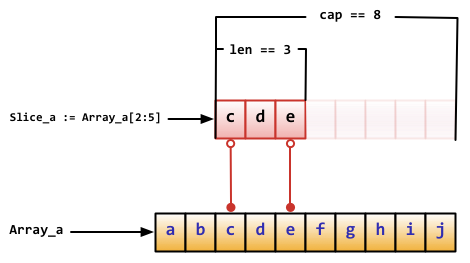
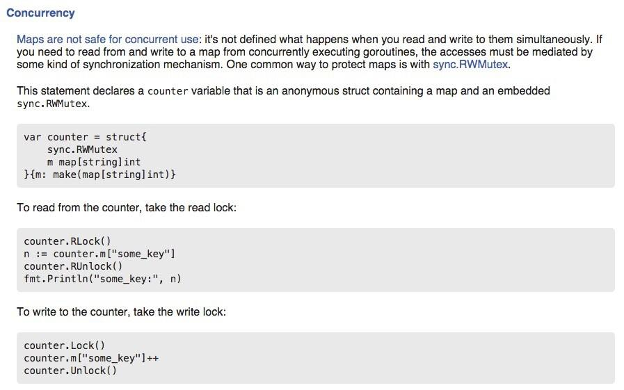
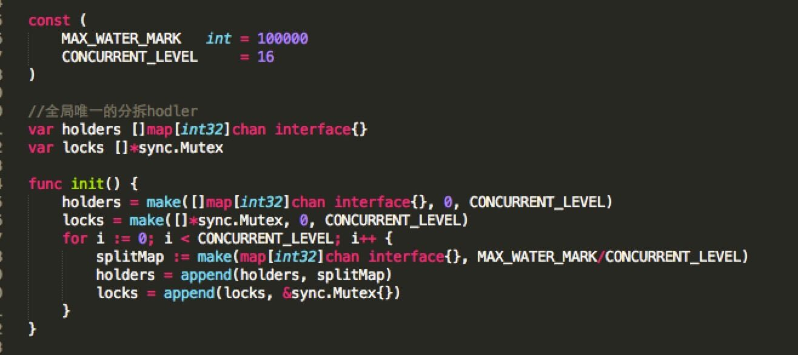
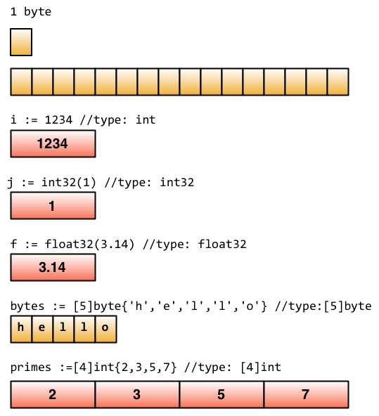

<!-- TOC -->

- [类型](#类型)
    - [布尔类型](#布尔类型)
    - [整型](#整型)
    - [位运算](#位运算)
    - [浮点型](#浮点型)
        - [浮点数比较](#浮点数比较)
        - [四舍五入](#四舍五入)
    - [复数类型](#复数类型)
        - [复数表示](#复数表示)
        - [实部和虚部](#实部和虚部)
        - [运算](#运算)
    - [字符串](#字符串)
    - [bytes包](#bytes包)
    - [字符类型](#字符类型)
    - [数组](#数组)
        - [优化](#优化)
    - [多维数组](#多维数组)
    - [数组切片](#数组切片)
    - [数组是nil时依然可以append](#数组是nil时依然可以append)
    - [二维切片](#二维切片)
    - [map](#map)
    - [Go数据底层的存储](#go数据底层的存储)
    - [指针](#指针)
    - [类型别名](#类型别名)
- [参考](#参考)

<!-- /TOC -->

# 类型

Go语言内置以下这些基础类型：

- 布尔类型：bool，占1字节
- 整型：int8、byte（uint8）、int16、int、uint、uintptr等。
- 浮点类型：float32、float64。   
- 复数类型：complex64、complex128。   
- 字符串：string。   
- 字符类型：rune（int32）。   
- 错误类型：error。   


此外，Go语言也支持以下这些复合类型：

- 指针（pointer）   
- 数组（array）   
- 切片（slice）   
- 字典（map）   
- 通道（chan）   
- 结构体（struct）   
- 接口（interface）   

golang中，nil只能赋值给指针、channel、func、interface、map或slice类型的变量.

Go 也有基于架构的类型，例如：int、uint 和 uintptr。这些类型的长度都是根据运行程序所在的操作系统类型所决定的：

- int 和 uint 在 32 位操作系统上，它们均使用 32 位（4 个字节），在 64 位操作系统上，它们均使用 64 位（8 个字节）。
- uintptr 的长度被设定为足够存放一个指针即可。

Go 语言中没有 float 类型。

与操作系统架构无关的类型都有固定的大小，并在类型的名称中就可以看出来：

整数：

- int8（-128 -> 127）
- int16（-32768 -> 32767）
- int32（-2,147,483,648 -> 2,147,483,647）
- int64（-9,223,372,036,854,775,808 -> 9,223,372,036,854,775,807）

无符号整数：

- uint8（0 -> 255）
- uint16（0 -> 65,535）
- uint32（0 -> 4,294,967,295）
- uint64（0 -> 18,446,744,073,709,551,615）

浮点型（IEEE-754 标准）：

- float32（+- 1e-45 -> +- 3.4 * 1e38）
- float64（+- 5 * 1e-324 -> 107 * 1e308）

int 型是计算最快的一种类型。

float32 精确到小数点后 7 位，float64 精确到小数点后 15 位。由于精确度的缘故，你在使用 == 或者 != 来比较浮点数时应当非常小心.

你应该尽可能地使用 float64，因为 math 包中所有有关数学运算的函数都会要求接收这个类型。

各类型的最大值最小值在`math`包中定义。

类型声明可在`builtin`包中查看。

## 布尔类型

true、false

```go
var v1 bool
v1 = true
v2 := (1 == 2) // v2也会被推导为bool类型
```

布尔类型不能接受其他类型的赋值，不支持自动或强制的类型转换。以下的示例是一些错误的用法，会导致编译错误：

```go
var b bool
b = 1 // 编译错误
b = bool(1) // 编译错误
```

以下的用法才是正确的：

```go
var b bool
b = (1!=0) // 编译正确
fmt.Println("Result:", b) // 打印结果为Result: true
```

## 整型

【注意1】int和int32在Go语言里被认为是两种不同的类型，编译器也不会帮你自动做类型转换，比如以下的例子会有编译错误：

```go
var value2 int32
value1 := 64  // value1将会被自动推导为int类型
value2 = value1 // 编译错误
```

编译错误类似于：

```
cannot use value1 (type int) as type int32 in assignment。
```

使用强制类型转换可以解决这个编译错误：

```go
value2 = int32(value1) // 编译通过
```

当然，开发者在做强制类型转换时，需要注意数据长度被截短而发生的数据精度损失（比如将浮点数强制转为整数）和值溢出（值超过转换的目标类型的值范围时）问题

-------

【注意2】两个不同类型的整型数不能直接比较，比如int8类型的数和int类型的数不能直接比较，但各种类型的整型变量都可以直接与字面常量（literal）进行比较，比如：

```go
var i int32
var j int64
i, j = 1, 2 
if i == j { // 编译错误
	fmt.Println("i and j are equal.") 
} 
if i == 1 || j == 2 { // 编译通过
	fmt.Println("i and j are equal.") 
} 
```

-----------

进制

```go
fmt.Println(0x10) // 十六进制 16
fmt.Println(010)  // 八进制 8
```

e

```go
2e3表示2*10^3=2000
```

前70个已经被缓存起来，可在math.Pow()中查看。

2e3或者2.0e3默认都是float64类型：

```go
var i = 2e3 
reflect.TypeOf(i) == float64
var i int = 2e3
reflect.TypeOf(i) == int
```

------------------------

**int64 和 uint64 的最大位赋值**

```go
var big int64 = 1 << 63
fmt.Printf("%b\n", big)
```

报错：`constant 9223372036854775808 overflows int64`

```go
var big uint64 = 1 << 63
fmt.Printf("%b\n", big)
```

输出： `1000000000000000000000000000000000000000000000000000000000000000`

这可能是因为 int64 中符号位也要占一个 bit。

-------------------------------

**int占多少位二进制**

在 atoi.go 文件中：

```go
const intSize = 32 << (^uint(0) >> 63)
```


## 位运算

* `x << y` 左移
* `x >> y` 右移
* `x ^ y` 异或
* `x & y` 与
* `x | y` 或
* `^x` 取反

位运算只能用于整数类型的变量，且需当它们拥有等长位模式时。

`%b` 是用于表示位的格式化标识符。

--------

【&^】

位清除 &^：将指定位置上的值设置为 0

```go
n1, n2 := 7, 3
fmt.Printf("%b &^ %b = %b\n", n1, n2, n1&^n2) // 111 &^ 11 = 100 末尾1,2位置零

n1, n2 := 7, 2
fmt.Printf("%b &^ %b = %b\n", n1, n2, n1&^n2) // 111 &^ 10 = 101 末尾2位置零
```

-------

【^x】

单独使用取反，结合使用异或。

该运算符与异或运算符一同使用，即 m^x，对于无符号 x 使用“全部位设置为 1”，对于有符号 x 时使用 m=-1.

```go
var n uint8 = 2
fmt.Printf("^%b = %b\n", n, ^n) // ^10 = 11111101 即 253
var nn uint8 = 0xFF
fmt.Printf("%b ^ %b = %b\n", nn, n, nn^n) // 11111111 ^ 10 = 11111101

var n2 int8 = 2
fmt.Printf("^%b = %b\n", n2, ^n2) // ^10 = -11 即 -3
var nn2 int8 = -1
fmt.Printf("%b ^ %b = %b\n", nn2, n2, nn2^n2) // -1 ^ 10 = -11
```

对于无符号整型，取反相当于与 0xFF 异或

对于有符号整型，取反相当于与 -1 异或。

上面的操作都是以补码的形式进行的，正数的补码还是自身。

取反相当于补码和 11111111 异或，然后求补码。

-------

【<<】

```go
3<<2 => 11 << 2 = 1100
-3<<1 => -11 << 1 = -6(不求补码好像也可以)
```

-----------

【>>】

```go
var n1 uint8 = 7
var c uint8 = 2
fmt.Printf("%b >> %d = %b\n", n1, c, n1>>c) // 111 >> 2 = 1
	
var n2 int8 = 7
fmt.Printf("%b >> %d = %b\n", n2, c, n2>>c) // 111 >> 2 = 1
	
var n3 int8 = -7
fmt.Printf("%b >> %d = %b\n", n3, c, n3>>c) // -111 >> 2 = -2
```

对于正数，右移时左边补0.

对于负数，以-7(-0111)为例，求补码(1 1001，第一位为1表示负数，其余位取反+1，或者从右开始遇到第一个1，这个1之前的取反)，将补码右移2位，左边补1，变成1 1110，再求补码变成1 0010，即-2。

另外需要注意的是：`-1 >> 1 == -1`, 避免陷入死循环。

------------

【位左移常见实现存储单位的用例】

使用位左移与 iota 计数配合可优雅地实现存储单位的常量枚举：

```go
type ByteSize float64
const (
    _ = iota // 通过赋值给空白标识符来忽略值
    KB ByteSize = 1<<(10*iota)
    MB
    GB
    TB
    PB
    EB
    ZB
    YB
)
```

------------

【在通讯中使用位左移表示标识的用例】

```go
type BitFlag int
const (
    Active BitFlag = 1 << iota // 1 << 0 == 1
    Send // 1 << 1 == 2
    Receive // 1 << 2 == 4
)

flag := Active | Send // == 3
```
----------------------

**标志位操作**

```go
a := 0
a |= 1 << 2       // 0000100: 在bit2设置标志位
a |= 1 << 6       // 1000100: 在bit6设置标志位
a = a &^ (1 << 6) // 0000100: 清除bit6标志位
```

------------------------

**移位操作右边的数不能是有符号数**

```go
bit := 2
a := 3 << bit
fmt.Printf("%b\n", a)
```

报错：`invalid operation: 3 << bit (shift count type int, must be unsigned integer)`

这样使用：

```go
var bit uint = 2
a := 3 << bit
fmt.Printf("%b\n", a) // 1100
```


## 浮点型

Go语言定义了两个类型float32和float64，其中float32等价于C语言的float类型，float64等价于C语言的double类型

```go
var fvalue1 float32
fvalue1 = 12 
fvalue2 := 12.0 // 如果不加小数点，fvalue2会被推导为整型而不是浮点型
```

注意！fvalue2默认被推导为float64

```go
var val float32
val = 3.0
val2 := 12.4 // val2被自动推导为float64
val = val2 // 错误，不能将float64赋给float32
val = float32(val2) // 使用强制转换
```

### 浮点数比较

浮点数不是一种精确的表达方式，所以像整型那样直接用==来判断两个浮点数是否相等是不可行的，这可能会导致不稳定的结果。

下面是一种推荐的替代方案：

```go
import "math" 
// p为用户自定义的比较精度，比如0.00001 
func IsEqual(f1, f2, p float64) bool{ 
	return math.Fdim(f1, f2) < p 
} 
```

通常应该优先使用float64类型，因为float32类型的累计计算误差很容易扩散，并且float32能精确表示的正整数并不是很大（译注：因为float32的有效bit位只有23个，其它的bit位用于指数和符号；当整数大于23bit能表达的范围时，float32的表示将出现误差）

```go
var f float32 = 16777216 // 1 << 24
fmt.Println(f == f+1)    // "true"!
```

小数点前面或后面的数字都可能被省略（例如.707或1.）。 很小或很大的数最好用科学计数法书写，通过e或E来指定指数部分：

```go
const Avogadro = 6.02214129e23  // 阿伏伽德罗常数
const Planck   = 6.62606957e-34 // 普朗克常数
```


### 四舍五入

```go
	for _, n := range []float64{1.4, 1.5, 1.6, 2.0} {
		fmt.Println(n, "=>", int(n+0.5))
	}
	// 1
	// 2
	// 2
	// 2
```


## 复数类型

复数类型有complex64和complex128

### 复数表示

```go
	var value1 complex64 // 由2个float32构成的复数类型
	value1 = 3.2 + 12i
	value2 := 3.2 + 12i        // value2是complex128类型
	value3 := complex(3.2, 12) // value3结果同value2
	var value4 complex128 = 3.2 + 12i
```

### 实部和虚部

```go
real(value1), imag(value1)
```

### 运算

复数的一些运算可在math/cmplx包中找到。

使用==或!=进行比较时注意精度。


## 字符串

- Go 中的字符串根据需要占用 1 至 4 个字节
- 和 C/C++ 一样，Go 中的字符串是根据长度限定，而非特殊字符。
- 获取字符串中某个字节的地址的行为是非法的，例如：&str[i]。
- str[i]的方式只对纯 ASCII 码的字符串有效。
- 和字符串有关的包：strings, strconv, unicode

```go
	var str string      // 声明一个字符串变量
	str = "Hello world" // 字符串赋值
	ch := str[0]        // 取字符串的第一个字符
	fmt.Printf("The length of \"%s\" is %d \n", str, len(str))
	fmt.Printf("The first character of \"%s\" is %c.\n", str, ch)
```

输出结果为：

```go
The length of "Hello world" is 11 
The first character of "Hello world" is H.
```

【字符串嵌套】

```go
var s = "ni 'hao'. "
var s = `ni "hao" .`
```

【字符串修改】

字符串初始化后不能被改变

```go
str := "Hello world" // 字符串也支持声明时进行初始化的做法
str[0] = 'X'  // 编译错误
```

可以先将其转换成[]rune或[]byte，完成后再转换成string，无论哪种方式，都会重新分配内存，并复制字节数组。

```go
s := "abc"
bs := []byte(s)
bs[1] = 'B'

println(s, string(bs))

u := "电脑"
us := []rune(u)
us[1] = '话'

println(u, string(us))
```

输出：

```
abc aBc
电脑 电话
```


【字符串连接】

```go
s := "hello" + " world"
s := "hello" + " world " + 3 // 错误
s := "hello" + " world " + string(31) // 正确，但不会输出31
```

+的并不是最高效的做法，使用strings.Join()和bytes.Buffer更好些。

【字符串遍历】

方式一：

```go
	str := "hello,世界"
	for i, n := 0, len(str); i < n; i++ {
		var ch2 uint8 = str[i] // 类型是byte，即uint8
		fmt.Printf("%d = '%c' , ", i, ch2)
	}
```

输出：

`0 = 'h' , 1 = 'e' , 2 = 'l' , 3 = 'l' , 4 = 'o' , 5 = ',' , 6 = 'ä' , 7 = '¸' , 8 = '–' , 9 = 'ç' , 10 = '•' , 11 = 'Œ' ,`

长度为12，每个中文字符在UTF-8中占3个字节。

方式二：

```go
	str := "hello,世界"
	for i, ch := range str {
		fmt.Print(i, "= ")
		fmt.Print(ch, " ,") // ch的类型是rune
		fmt.Printf("'%c' .", ch)
	}
```

输出：

`0= 104 ,'h' .1= 101 ,'e' .2= 108 ,'l' .3= 108 ,'l' .4= 111 ,'o' .5= 44 ,',' .6= 19990 ,'世' .9= 30028 ,'界' .`

【中文字符截取】

```go
	strEn := "abcdef"
	strCn := "中文测试"
	fmt.Println(strEn[0:3])                 // abc
	fmt.Println(strCn[0:3])                 // 中
	fmt.Println(string([]rune(strCn)[0:3])) // 中文测

func SubString(str string, begin, length int) (substr string) {
	// 将字符串的转换成[]rune
	rs := []rune(str)
	lth := len(rs)
	// 简单的越界判断
	if begin < 0 {
		begin = 0
	}
	if begin >= lth {
		begin = lth
	}
	end := begin + length
	if end > lth {
		end = lth
	}
	// 返回子串
	return string(rs[begin:end])
}
	fmt.Println(SubString("中文测试", 1, 3)) // 文测试
	fmt.Println(SubString("abcd", 1, 3)) // bcd
```

【中文字符串定位】

```go
// 思路：首先通过strings库中的Index函数获得子串的字节位置，再通过这个位置获得子串之前的字节数组pre，
// 再将pre转换成[]rune，获得[]rune的长度，便是子串之前字符串的长度，也就是子串在字符串中的字符位置
// 这里用的是string.Index函数，类似的，也可以写中文字符串的类似strings中的IndexAny,LastIndex等函数
func UnicodeIndex(str, substr string) int {
	// 子串在字符串的字节位置
	result := strings.Index(str, substr)
	if result >= 0 {
		// 获得子串之前的字符串并转换成[]byte
		prefix := []byte(str)[0:result]
		// 将子串之前的字符串转换成[]rune
		rs := []rune(string(prefix))
		// 获得子串之前的字符串的长度，便是子串在字符串的字符位置
		result = len(rs)
	}

	return result
}
	fmt.Println(UnicodeIndex("中文测试", "文")) // 1
	fmt.Println(UnicodeIndex("abcd", "c")) // 2
```

【使用"`"定义不做转义处理的原始字符串，支持跨行】

```go
	s := `a
b\r\n\x00
	c`
	println(s)
```

输出

```
a
b\r\n\x00
	c
```

注意上面第二行是顶行写的，不然缩进也是会如实反映的。

------------------

**连接跨行字符串时，"+" 必须在上一行末尾，否则导致编译错误**

```go
	s := "hello, " +
		"world!"
	s2 := "hello, "
	+"World." // invalid operation: + untyped string
```


【字符串和其他类型的转换】

strconv包。

---------------------------

- 不能用序号获取字节元素指针，&s[i]非法
- 不可变类型，无法修改字节数组
- 字节数组尾部不包含NULL

runtime.h

```go
	struct String
	{
		byte* str;
		intgo len;
	};
```

---------------------

中文字符串长度

`unicode/utf8` 包中有一个`RuneCountInString()`


## bytes包

- bytes 包和字符串包十分类似，而且它还包含一个十分有用的类型 Buffer。这是一个 bytes 的定长 buffer，提供 Read 和 Write 方法，因为读写不知道长度的 bytes 最好使用 buffer。
- Buffer 可以这样定义：`var buffer bytes.Buffer`
  或者 new 出一个指针：`var r *bytes.Buffer = new(bytes.Buffer)`
  或者通过函数：`func NewBuffer(buf []byte) *Buffer`，这就创建了一个 Buffer 对象并且用 buf 初始化好了；NewBuffer 最好用在从 buf 读取的时候使用。
- 通过 buffer 串联字符串：类似于 Java 的 StringBuilder 类
   创建一个 Buffer，通过 buffer.WriteString(s) 方法将每个 string s 追加到后面，最后再通过 buffer.String() 方法转换为 string，下面是代码段：

```go
var buffer bytes.Buffer
for {
    if s, ok := getNextString(); ok { //method getNextString() not shown here
        buffer.WriteString(s)
    } else {
        break
    }
}
fmt.Print(buffer.String(), "\n")
```

这种实现方式比使用 += 要更节省内存和 CPU，尤其是要串联的字符串数目特别多的时候。


## 字符类型

byte和rune

byte（实际上是uint8的别名），代表UTF-8字符串的单个字节的值

rune（int32），代表单个Unicode字符

```go
	var abc byte
	abc = 'a'
	fmt.Print(abc) // 97
```

如果abc = ‘你’,会提示超出byte的范围

```go
	var abc rune
	abc = '你'
	fmt.Print(abc) // 20320
```

**字符数组**

string => []byte   

`[]byte("hello")`  

[]byte => string   

`string([]byte)`   

可使用的库:bytes:   

`bytes.NewBuffer()`

**rune可做变量名**

```go
	rune := rune('a')
	fmt.Println(rune) // 97
```

**十六进制**

```
var ch byte = 65 或 var ch byte = '\x41'
```

（\x 总是紧跟着长度为 2 的 16 进制数）

另外一种可能的写法是 \ 后面紧跟着长度为 3 的十进制数，例如：\377

一般使用格式 U+hhhh 来表示，其中 h 表示一个 16 进制数。其实 rune 也是 Go 当中的一个类型，并且是 int32 的别名。

在书写 Unicode 字符时，需要在 16 进制数之前加上前缀 \u 或者 \U。

因为 Unicode 至少占用 2 个字节，所以我们使用 int16 或者 int 类型来表示。如果需要使用到 4 字节，则会加上 \U 前缀；前缀 \u 则总是紧跟着长度为 4 的 16 进制数，前缀 \U 紧跟着长度为 8 的 16 进制数。

```go
	var ch int = '\u0041'
	var ch2 int = '\u03B2'
	var ch3 int = '\U00101234'
	fmt.Printf("%d - %d - %d\n", ch, ch2, ch3) // integer
	fmt.Printf("%c - %c - %c\n", ch, ch2, ch3) // character
	fmt.Printf("%X - %X - %X\n", ch, ch2, ch3) // UTF-8 bytes
	fmt.Printf("%U - %U - %U", ch, ch2, ch3)   // UTF-8 code point
```

输出：

```
65 - 946 - 1053236
A - β - r
41 - 3B2 - 101234
U+0041 - U+03B2 - U+101234
```

**一些常见的函数见unicode包**


## 数组

```go
[32]byte   // 长度为32的数组，每个元素为一个字节
[2*N] struct{ x, y int32} // 复杂类型数组
[1000]*float64  // 指针数组
[3][5]int   // 二维数组
[2][2][2]float64  // 等同于[2]([2]([2]float64))
```

数组长度在定义后就不可更改，在声明时长度可以为一个常量或者一个常量表达式（常量表达式是指在编译期即可计算结果的表达式）。

------------------

【数组长度】

```go
var arr [10]byte
len(arr) // 10

var arr [10][23]int
fmt.Println(len(arr)) // 10
```

---------------

【初始化】

```go
arr := [5]int{1, 2, 3, 4, 5}
fmt.Println(arr[4]) // 5
```
```go
b := [10]int{1, 2, 3} 
```

声明了一个长度为10的int数组，其中前三个元素初始化为1、2、3，其它默认为0

如果不想写[5]，也可以使用[...]代替：

```go
arr := [...]int{1, 2, 3, 4, 5}
```

也可以省略，什么都不写(这是数组还是切片？这是切片)

```go
arr := []int{1, 2, 3}
```

**指定索引来初始化**

```go
	var names = []string{
		1: "a",
		2: "b",
		4: "d",
	}
```

names[0]和names[3]都是""

----------------

数组指针

```go
	arr1 := new([3]int)
	fmt.Printf("arr1 type:%T\n", arr1) // arr1 type:*[3]int
	arr2 := [3]int{}
	fmt.Printf("arr2 type:%T\n", arr2) // arr2 type:[3]int
	fmt.Println(arr1, arr2) // &[0 0 0] [0 0 0]

	arr1[1] = 4
	(*arr1)[2] = 1
	arr2[1] = 5
	fmt.Println(arr1, arr2) // &[0 4 1] [0 5 0]
```

-----------------

【遍历】

方式一：

```go
	arr := [5]int{1, 3, 5, 7, 9}
	for i, n := 0, len(arr); i < n; i++ {
		fmt.Println(i, "=>", arr[i])
	}
```

方式二：

```go
	arr := [5]int{1, 3, 5, 7, 9}
	for i, v := range arr {
		fmt.Println(i, "=>", v)
	}
```

方式三：（range匿名变量）

```go
	for i, v := range [5]int{1, 2, 3, 4} {
		fmt.Println(i, "=>", v)
	}
```

----------------

【数组是值类型】

数组是一个值类型（value type）。所有的值类型变量在赋值和作为参数传递时都将产生一次复制动作。如果将数组作为函数的参数类型，则在函数调用时该参数将发生数据复制。因此，在函数体中无法修改传入的数组的内容，因为函数内操作的只是所传入数组的一个副本。

```go
func main() {
	arr := [5]int{1, 2, 3, 4, 5}
	modify(arr)
	fmt.Println("in main() arr is: ", arr)
}

func modify(arr [5]int) {
	arr[0] = 10
	fmt.Println("in modify() arr is: ", arr)
}
```

输出结果：

```
in modify() arr is:  [10 2 3 4 5]
in main() arr is:  [1 2 3 4 5]
```

当然，也可以给函数传递一个数组的指针：

```go
func sum(a *[3]float64) (sum float64) {
	for _, v := range *a {
		sum += v
	}
	return
}
	arr := [...]float64{7.0, 5.4, 9.2}
	fmt.Println(sum(&arr))
```

不过，这种风格并不符合Go的语言习惯。相反的，应该使用切片。


### 优化

```go
count[x] = count[x] * scale

可替换成

count[x] *= scale

这样可以省去对变量表达式的重复计算
```

------------------

## 多维数组

```go
	// 声明了一个二维数组，该数组以两个数组作为元素，其中每个数组中又有4个int类型的元素
	doubleArray := [2][4]int{[4]int{1, 2, 3, 4}, [4]int{5, 6, 7, 8}}

	// 上面的声明可以简化，直接忽略内部的类型
	easyArray := [2][4]int{{1, 2, 3, 4}, {5, 6, 7, 8}}

	arr := [3][2]int{
		{1, 2},
		{3, 4},
		{5, 6}} // 如果最后的}放到下一行了，则需要使用,({5,6},)
	fmt.Println(arr[2]) // [5 6]

	towDimen := [][]string{
		[]string{"a", "b", "c"},
		[]string{"d", "e"},
	}
```

## 数组切片

数组切片的数据结构可以抽象为以下3个变量：

- 一个指向原生数组的指针；
- 数组切片中的元素个数；
    - 数组切片已分配的存储空间

切片持有对底层数组的引用，如果你将一个切片赋值给另一个，二者都将引用同一个数组。如果函数接受一个切片参数，那么其对切片的元素所做的改动，对于调用者是可见的，好比是传递了一个底层数组的指针。因此，Read函数可以接受一个切片参数，而不是一个指针和一个计数；切片中的长度已经设定了要读取的数据的上限.



注意 绝对不要用指针指向 slice。slice 本身已经是一个引用类型，所以它本身就是一个指针!!

-----------------

【创建切片】

**方式一：在已有数组的基础上创建**

```go
arr := [5]int{1, 2, 3, 4, 5}
slice := arr[:4]   // 前4个元素 0-3
fmt.Println(slice) // [1 2 3 4]

slice := arr[1:] // 从1开始到结尾 [2 3 4 5]

slice := arr[1:4] // 1-3 [2 3 4]

slice := arr[:] // 全部
```

- 第一个数可以是0到len(arr)，包括len(arr)，此时切片是空的[],其余数则会报错
- 第二个数可以是0到len(arr),0时切片为[],其余报错
- 如果切arr[0:0]则切片len是0

切片的改变可影响原数组

```go
	arr := [3]int{1, 2, 3}
	slice := arr[:]
	slice[0] = 5
	fmt.Printf("arr=%v, slice=%v", arr, slice) // arr=[5 2 3], slice=[5 2 3]
```

**方式二：直接创建**

创建一个初始元素个数为5的数组切片，元素初始值为0，cap为5：

```go
mySlice1 := make([]int, 5) 
```

创建一个初始元素个数为5的数组切片，元素初始值为0，并预留10个元素的存储空间：

```go
mySlice2 := make([]int, 5, 10) 
```

直接创建并初始化包含5个元素的数组切片(len和cap都为5)：

```go
mySlice3 := []int{1, 2, 3, 4, 5} 
```

当然，事实上还会有一个匿名数组被创建出来，只是不需要我们来操心而已

以下这两种方式可创建相同的slice：

```go
	s1 := make([]int, 5, 10)
	s2 := new([10]int)[:5]
	fmt.Printf("s1 type:%T, s2 type:%T\n", s1, s2) // s1 type:[]int, s2 type:[]int
	fmt.Printf("s1 len:%d,cap:%d, s2 len:%d,cap:%d\n", len(s1), cap(s1), len(s2), cap(s2))
	// s1 len:5,cap:10, s2 len:5,cap:10
```

**方法三：基于切片创建切片**

``` go
	oldSlice := []int{1, 2, 3, 4, 5}
	newSlice := oldSlice[:3] // 基于oldSlice的前3个元素构建新数组切片
	fmt.Println(newSlice)
```

有意思的是，选择的oldSlicef元素范围甚至可以超过所包含的元素个数，比如newSlice可以基于oldSlice的前6个元素创建，虽然oldSlice只包含5个元素。只要这个选择的范围不超过oldSlice存储能力（即cap()返回的值），那么这个创建程序就是合法的。newSlice中超出oldSlice元素的部分都会填上0。

然而在这里 oldSlice 的容量就是5，而 newSlice 的容量也是5，因为这俩用得是同一个数组。

这个和重新分片是一样的。

因为字符串是纯粹不可变的字节数组，它们也可以被切分成 slice

```go
	s := "hello,世界"
	s2 := s[6:9]
	fmt.Println(s2) // 世
```

----------------

【切片的第3个参数】

```go
	slice := [...]int{0, 1, 2, 3, 4, 5, 6}
	fmt.Println(slice)
	s := slice[1:2:4]
	fmt.Println(len(s), cap(s)) // 1 3
	s1 := slice[1:2]
	fmt.Println(len(s1), cap(s1)) // 1 6
```

第3个参数表示容量最大界索引，第三个参数减去第一个参数的差值就是容量。

-----------------

【查看长度和容量】

```go
	slice := []int{1, 2, 3, 4, 5}
	fmt.Println(len(slice), cap(slice)) // 5 5

	slice2 := make([]int, 5, 10)
	fmt.Println(len(slice2), cap(slice2)) // 5 10
```

一个 slice s 可以这样扩展到它的大小上限：s = s[:cap(s)]

```go
	s := make([]int, 5, 10)
	s = s[:cap(s)]
	fmt.Println(len(s), cap(s)) // 10,10
```

-----------------

【重新分片】

```go
	arr := [10]int{1, 2, 3, 4, 5, 6, 7, 8, 9, 0}
	s := arr[:5]
	fmt.Println(s) // [1 2 3 4 5]
	s = arr[5:10]
	fmt.Println(s) // [6 7 8 9 0]
```

---------------

【新增元素】

```go
	slice := []int{1, 2, 3, 4, 5}
	slice2 := append(slice, 6, 7, 8)
	fmt.Println(slice) // [1 2 3 4 5]
	fmt.Println(slice2) // [1 2 3 4 5 6 7 8]
```

append()是产生了一个新的切片

append()的第二个参数其实是一个不定参数，我们可以按自己需求添加若干个元素，甚至直接将一个数组切片追加到另一个数组切片的末尾：

```go
	slice := []int{1, 2, 3, 4, 5}
	slice2 := []int{8, 9, 10}
	slice = append(slice, slice2...)
	fmt.Println(slice)
```

第二个参数slice2后面加了三个点，即一个省略号，如果没有这个省略号的话，会有编译错误，因为按append()的语义，从第二个参数起的所有参数都是待附加的元素。因为slice中的元素类型为int，所以直接传递slice2是行不通的。加上省略号相当于把slice2包含的所有元素打散后传入。
上述调用等同于：

```go
	slice = append(slice, 8, 9, 10) 
```

数组切片会自动处理存储空间不足的问题。如果追加的内容长度超过当前已分配的存储空间（即cap()调用返回的信息），数组切片会自动分配一块足够大的内存，然后返回指向新数组的切片。

append函数会改变slice所引用的数组的内容，从而影响到引用同一数组的其它slice。 但当slice中没有剩余空间（即(cap-len) == 0）时，此时将动态分配新的数组空间。返回的slice数组指针将指向这个空间，而原数组的内容将保持不变；其它引用此数组的slice则不受影响

**append interface{}时的坑**

```go
	var slice []interface{} = make([]interface{}, 0)
	slice = append(slice, "hello")
	slice = append(slice, 12)

	var arr []interface{} = []interface{}{"one", "two"}
	slice = append(slice, arr...)

	var arr2 []string = []string{"three", "four"}
	slice = append(slice, arr2...) // cannot use arr2 (type []string) as type []interface {} in append

	fmt.Println(slice)
```

这里在append arr2时是想让go做一个隐式转换，把[]string转化成[]interface{}，但显然go现在还不支持。

## 数组是nil时依然可以append

```go
	var arr []string = nil
	arr = append(arr, "hello")
```

并不会报空指针异常，可能还是因为类型和值都为nil时才为nil，很明显，这里的类型不为nil。

-----------------

【内容复制】

数组切片支持Go语言的另一个内置函数copy()，用于将内容从一个数组切片复制到另一个数组切片。如果加入的两个数组切片不一样大，就会按其中较小的那个数组切片的元素个数进行复制

```go
	slice1 := []int{1, 2, 3, 4, 5}
	slice2 := []int{5, 4, 3}
	copy(slice2, slice1) // 只会复制slice1的前3个元素到slice2中
	fmt.Println(slice2)  // [1 2 3]
	slice2[0], slice2[1], slice2[2] = 7, 8, 9
	copy(slice1, slice2) // 只会复制slice2的3个元素到slice1的前3个位置
	fmt.Println(slice1)  // [7 8 9 4 5]
```

-----------------

【删除】

```go
func (m *MusicManager) Remove(index int) *MusicEntry {
	if index < 0 || index >= len(m.musics) {
		return nil
	}
	removedMusic := m.musics[index] // 这里不能加&，否则删除的时候会被后面的覆盖，所以需要把元素复制出来而不是只取地址
	// 从切片中删除
	len := len(m.musics)
	if len == 0 || len == 1 { // 删除仅有的一个
		m.musics = m.musics[0:0]
	} else if index == 0 { // 之后的长度至少为2
		// 删除开头的
		m.musics = m.musics[1:]
	} else if index == len { //最后一个
		m.musics = m.musics[:len-1]
	} else { // 中间的，长度至少为3
		m.musics = append(m.musics[:index], m.musics[index+1:]...)
	}
	return &removedMusic
}
```

[start : end]操作并没有改变底层的数组，仅仅是改变了开始索引和长度，append操作会覆盖掉中间的元素，但底层数组还是没有改变，只是改变了索引位置和长度。

一般性的代码：

```go
func DeleteString(slice []string, index int) []string {
	len := len(slice)
	if index < 0 || index >= len {
		return slice
	}
	if len == 0 {
		return slice
	}
	if len == 1 {
		return slice[0:0]
	}
	if index == 0 {
		return slice[1:]
	}
	if index == len-1 {
		return slice[:len-1]
	}
	return append(slice[:index], slice[index+1:]...)
}
```

上面代码有些啰嗦了，下面是简洁版的：

```go
func DeleteString2(slice []string, index int) []string {
	if index < 0 || index >= len(slice) {
		return slice
	}
	return append(slice[:index], slice[index+1:]...)
}
```

-----------------

## 二维切片

Go的数组和切片都是一维的。要创建等价的二维数组或者切片，需要定义一个数组的数组或者切片的切片，类似这样：

```go
type Transform [3][3]float64  // A 3x3 array, really an array of arrays.
type LinesOfText [][]byte     // A slice of byte slices.
```

因为切片是可变长度的，所以可以将每个内部的切片具有不同的长度。这种情况很常见，正如我们的LinesOfText例子中：每一行都有一个独立的长度。

```go
text := LinesOfText{
	[]byte("Now is the time"),
	[]byte("for all good gophers"),
	[]byte("to bring some fun to the party."),
}
```

有时候是需要分配一个二维切片的，例如这种情况可见于当扫描像素行的时候。有两种方式可以实现。一种是独立的分配每一个切片；另一种是分配单个数组，为其 指定单独的切片们。使用哪一种方式取决于你的应用。如果切片们可能会增大或者缩小，则它们应该被单独的分配以避免覆写了下一行；如果不会，则构建单个分配 会更加有效。作为参考，这里有两种方式的框架。首先是一次一行：

```go
// Allocate the top-level slice.
picture := make([][]uint8, YSize) // One row per unit of y.
// Loop over the rows, allocating the slice for each row.
for i := range picture {
	picture[i] = make([]uint8, XSize)
}
```

然后是分配一次，被切片成多行：

```go
// Allocate the top-level slice, the same as before.
picture := make([][]uint8, YSize) // One row per unit of y.
// Allocate one large slice to hold all the pixels.
pixels := make([]uint8, XSize*YSize) // Has type []uint8 even though picture is [][]uint8.
// Loop over the rows, slicing each row from the front of the remaining pixels slice.
for i := range picture {
	picture[i], pixels = pixels[:XSize], pixels[XSize:]
}
```

## map

key可以为任何定义了等于操作符的类型，例如整数，浮点和复数，字符串，指针，接口（只要其动态类型支持等于操作），结构体和数组。切片不能 作为map的key，因为它们没有定义等于操作。和切片类似，map持有对底层数据结构的引用。如果将map传递给函数，其对map的内容做了改变，则这 些改变对于调用者是可见的。

key可以是任意数据类型，只要该类型能够用==来进行比较

map和其他基本型别不同，它不是thread-safe，在多个go-routine存取时，必须使用mutex lock机制

----------------

【变量声明】

```go
	var person map[string] string
```

[]内是键的类型，后面是值类型

-----------------

【创建】

```go
	person = make(map[string]string)
```

声明加+创建：

```go
	var person map[string]string = make(map[string]string)
	person := make(map[string]string)
```

指定该map的初始存储能力：

```go
	person = make(map[string]string, 100)
```

创建并初始化map：

```go
	var person map[string]string
	person = map[string]string{
		"a": "haha",
		"b": "ni", // 最后的逗号是必须的
	}
```

---------------

【元素赋值/添加元素】

```go
	var person map[string]string = make(map[string]string)
	person["1"] = "abc"
```

```go
m := make(map[string]int)
m["a"]++
```

不用担心map在没有当前的key时就对其进行++操作会有什么问题，因为go语言在碰到这种情况时，会自动将其初始化为0，然后再进行操作。

-----------------

【元素删除】

```go
	delete(person, "1")
```

如果传入的map是nil，则报错，如果键不存在，则什么都不发生

----------------

【元素查找】

```go
	value, ok := person["2"]
	if ok {
		fmt.Println(value)
	} else {
		fmt.Println("does not find!")
	}
```

或者：

```go
if value, ok := person["2"]; ok {
	fmt.Println(value)
} else {
	fmt.Println("does not find!")
}
```

即便是nil也是可以查找的：

```go
	var m map[string]int = nil
	if v, ok := m["a"]; ok {
		fmt.Println(v)
	} else {
		fmt.Println("!ok")
	}
	// 输出!ok
```

map中的元素不会出现nil的现象（很神奇）：

```go
func main() {
	m := make(map[string]entry)
	fmt.Println(m["a"].name == "") // true
}

type entry struct {
	name string
}
```

m[“a”]返回的并不是nil，而是{}，如果map的元素是指针，则是nil

```go
	m := make(map[string]*entry)
	fmt.Println(m["a"] == nil) // true
```

-------------

【遍历】

```go
	for k, v := range person {
		fmt.Println("key=", k, "value=", v)
	}
```

map也是一种引用类型，如果两个map同时指向一个底层，那么一个改变，另一个也相应的改变：

```go
m := make(map[string]string)
m["Hello"] = "Bonjour"
m1 := m
m1["Hello"] = "Salut"  // 现在m["hello"]的值已经是Salut了
```

-------------

【清空map】

```go
	for k, _ := range m {
		delete(m, k)
	}
```

或者重新赋值：

```go
	m = make(map[string]string)
```

------------

【线程安全的map】



【map中的对象是个拷贝问题】

直接对map对象使用[]操作符获得的对象不能直接修改状态：

```go
	type Person struct {
		age int
	}
	m := map[string]Person{"c": {10}}
	m["c"].age = 100 // 编译错误：cannot assign to m["c"].age
```

通过查询map获得的对象是个拷贝，对此对象的修改不影响原有对象的状态：

```go
	type Person struct {
		age int
	}
	m := map[string]Person{"c": {10}}
	p := m["c"]
	p.age = 20
	fmt.Println(p.age)      // 20
	fmt.Println(m["c"].age) // 10
```

**解决方法**

1. map中存储指针而不是结构体

```go
	type Person struct {
		age int
	}
	m := map[string]*Person{"c": {10}}
	p := m["c"]
	p.age = 20
	fmt.Println(p.age)      // 20
	fmt.Println(m["c"].age) // 20
```

2. 修改了对象状态以后重新加到map里

```go
	type Person struct {
		age int
	}
	m := map[string]Person{"c": {10}}
	p := m["c"]
	p.age = 20
	fmt.Println(p.age) // 20
	m["c"] = p
	fmt.Println(m["c"].age) // 20
```

【分拆map】

分拆map，提高并发能力




## Go数据底层的存储

下面这张图来源于Russ Cox Blog中一篇介绍Go数据结构的文章，大家可以看到这些基础类型底层都是分配了一块内存，然后存储了相应的值。




## 指针

- 在 32 位机器上占用 4 个字节，在 64 位机器上占用 8 个字节，并且与它所指向的值的大小无关。
- 整形的指针

```go
	var p *int = new(int)
	*p = 5
	fmt.Println(*p, p) // 5 0xc0820001d0

	q := 6
	var pq *int = &q
	fmt.Println(*pq, pq) // 6 0xc082000200
```

- 不能得到文字或常量的地址

```go
const i = 5
ptr := &i //error: cannot take the address of i
ptr2 := &10 //error: cannot take the address of 10
```

- 对一个空指针的反向引用是不合法的，并且会使程序崩溃：

```go
package main
func main() {
    var p *int = nil
    *p = 0
}
// in Windows: stops only with: <exit code="-1073741819" msg="process crashed"/>
// runtime error: invalid memory address or nil pointer dereference
```


- 可以在 unsafe.Pointer 和任意类型指针间进行转换

```go
	x := 0x12345678
	p := unsafe.Pointer(&x) // *int -> Pointer
	n := (*[4]byte)(p)      // Pointer -> *[4]byte,  3,5也可以

	for i := 0; i < len(n); i++ {
		fmt.Printf("%X ", n[i])
	}
```

输出：

```
78 56 34 12
```


- 返回局部变量指针是安全的，编译器会根据需要将其分配在 GC Heap 上

```go
	func test() *int {
		x := 100
		return &x // 在堆上分配x内存，但在内联时，也可以直接分配在目标栈
	}
```

- 将 Pointer 转换成 uintptr, 可变相实现指针运算

```go
	d := struct {
		s string
		x int
	}{"abc", 100}

	p := uintptr(unsafe.Pointer(&d)) // *struct -> Pointer -> uintptr
	p += unsafe.Offsetof(d.x)        // uintptr + offset
	p2 := unsafe.Pointer(p)          // uintptr -> Pointer
	px := (*int)(p2)                 // Pointer -> *int
	*px = 200                        // d.x = 200
	fmt.Printf("%#v\n", d)

```

输出：

```
struct { s string; x int }{s:"abc", x:200}
```

注意：GC 把 uintptr 当成普通整数对象，它无法阻止"关联"对象被回收。


## 类型别名

type aliases, Go1.9 加入的特性。

```go
type Base struct {
	F1 int
	f2 int
}

func (b *Base) Func() {
	fmt.Printf("Base.Func: F1: %d, f2: %d\n", b.F1, b.f2)
}

type S1 = Base // S1 是 Base 的别名，拥有 Base 的字段和方法

func main() {
	s1 := &S1{F1: 2, f2: 3}
	s1.Func()
	fmt.Println(s1.F1, s1.f2)
}
```

为函数定义别名： `type F = func()`。

可以为其他包中的类型定义别名： `type T = time.Time`。 不能为 T 定义新的方法了，不在同一个包内。

为 unexported 的类型定义一个 exported 的类型别名： `type T = t`。

类型定义和类型别名的区别：
* `type I int`: 类型定义是定义了新的类型，只有字段可以使用，方法不能使用，且和原类型之间需要强制类型转换才能互相赋值。
* `type I = int`: 类型别名和原类型完全一样，字段和方法都是一样的。


# 参考

* [How the Go runtime implements maps efficiently (without generics)](https://dave.cheney.net/2018/05/29/how-the-go-runtime-implements-maps-efficiently-without-generics)