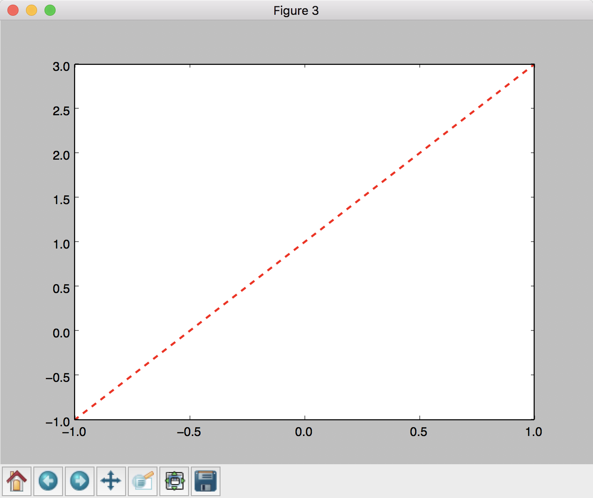
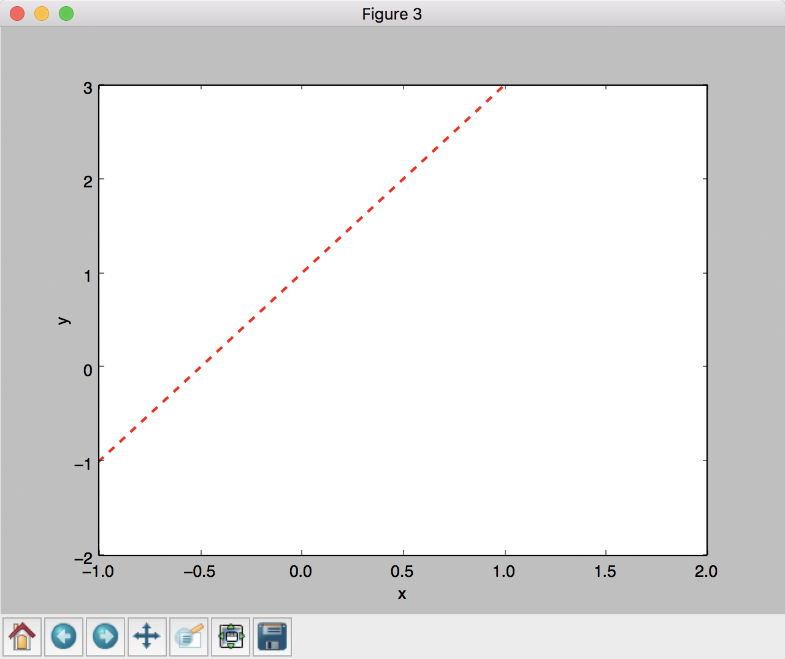
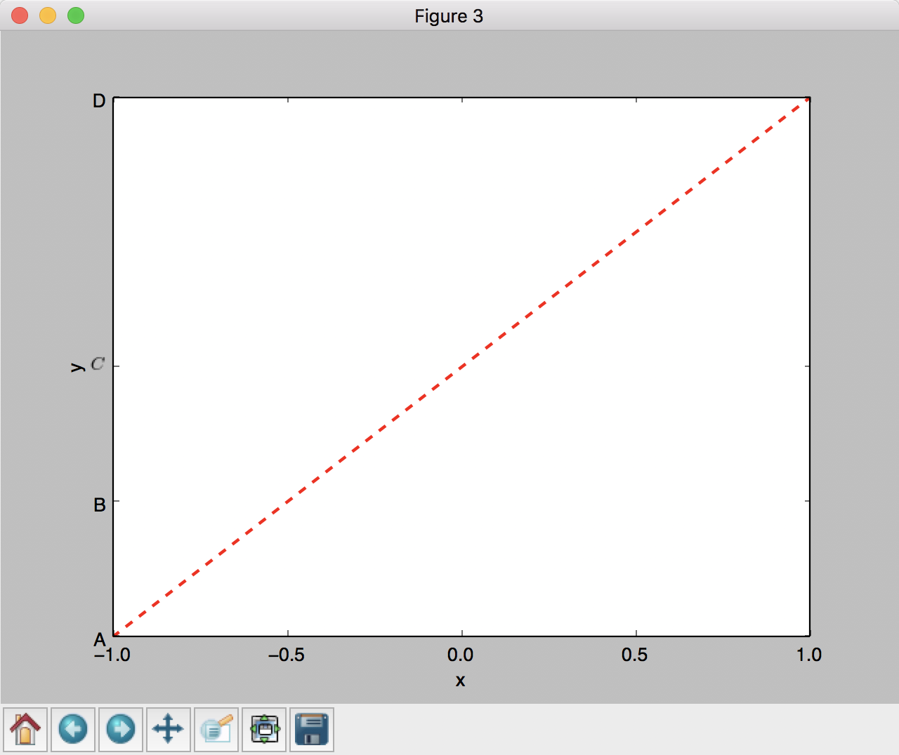

# 基本使用

## 直线



```py
import matplotlib.pyplot as plt
import numpy as np


def draw_line_1():
    x = np.linspace(-1, 1, 50)  # 一维数组, 将[-1, 1] 分成50份, 返回np.array
    y = 2 * x + 1  # y坐标点

    plt.figure(num=3)  # 定义一个图像窗口, 序号是3
    # plt.plot(x, y)  # 画曲线
    plt.plot(x, y, color="red", linewidth=2.0, linestyle='--')
    plt.show()
```

设置 x, y 坐标的名称和范围:



```py
    x = np.linspace(-1, 1, 50)  # 将[-1, 1] 分成50份, 返回np.array
    y = 2 * x + 1  # y坐标点

    plt.figure(num=3)  # 定义一个图像窗口
    # plt.plot(x, y)  # 画曲线
    plt.plot(x, y, color="red", linewidth=2.0, linestyle='--')
    # 设置 x, y 坐标的范围
    plt.xlim((-1, 2))
    plt.ylim((-2, 3))
    # 设置 x, y 坐标的名称
    plt.xlabel('x')
    plt.ylabel('y')
```

自定义 x, y 轴刻度:



```py
    x = np.linspace(-1, 1, 50)  # 将[-1, 1] 分成50份, 返回np.array
    y = 2 * x + 1  # y坐标点

    plt.figure(num=3)  # 定义一个图像窗口
    plt.plot(x, y, color="red", linewidth=2.0, linestyle='--')
    # 自定义 x, y 轴刻度
    x_ticks = np.linspace(-1, 1, 5)
    plt.xticks(x_ticks)
    plt.yticks([-1, 0, 1, 3], ['A', 'B', '$C$', 'D'])  # $ 可以让文本成斜体

    plt.xlabel('x')
    plt.ylabel('y')
    plt.show()
```


# 散点图

