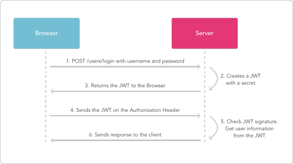
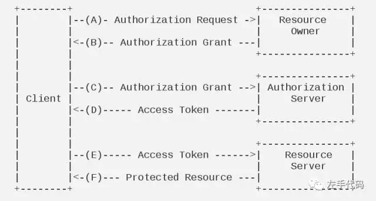
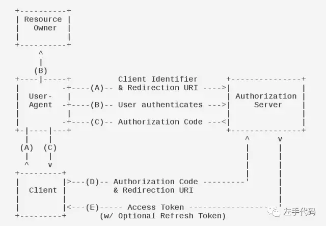
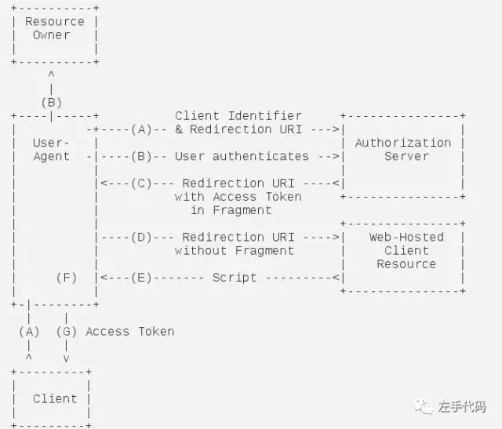
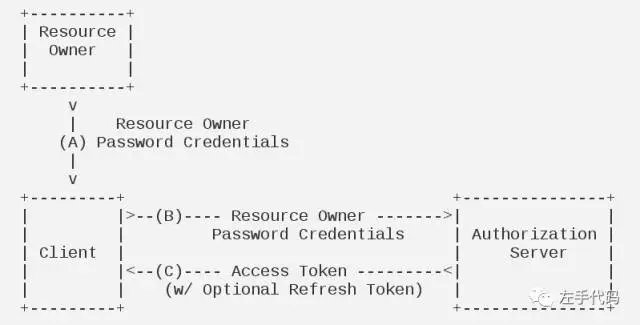

<!-- TOC -->

- [JWT](#jwt)
    - [优点](#优点)
    - [工作原理](#工作原理)
    - [JWT 组成](#jwt-组成)

<!-- /TOC -->

# JWT

* Json Web Token
* [原文](https://zhuanlan.zhihu.com/p/27370773?hmsr=toutiao.io&utm_medium=toutiao.io&utm_source=toutiao.io)

## 优点

* 体积小, 传输快.
* 传输方式多样, header, body, url...
* 严谨的结构化, 在 payload 中包含与用户相关的验证信息, 如可访问的路由, 过期时间等, 服务器端不需要查表验证.
* 跨域验证, 单点登录.
* 易于CDN, 任何节点都可以验证.

## 工作原理




## JWT 组成

```js
// Header
{
  "alg": "HS256",
  "typ": "JWT"
}

// Payload
{
  // reserved claims
  "iss": "a.com",
  "exp": "1d",
  // public claims
  "http://a.com": true,
  // private claims
  "company": "A",
  "awesome": true
}

// $Signature
HS256(Base64(Header) + "." + Base64(Payload), secretKey)

// JWT
JWT = Base64(Header) + "." + Base64(Payload) + "." + $Signature
```

**注意: JWT中 header 和 payload 是明文传输, 不要带有敏感信息.**

服务端收到 JWT 后会 decode 出 header 和 payload, 并用服务端保存的私钥验证 signature 是否合法.

私钥只有服务器端保存, 所以客户端无法构造 JWT.


# OAuth

OAuth 是用于授权的开发标准，可以让用户给第三方应用授权来访问用户在某个网站上的资源，而不需要向第三方应用提供密码等敏感信息。

使用 token 来代替密码等信息。


## 抽象验证流程



- Client               : 第三方应用程序。
- Resource owner       : 资源所有者，即用户。
- Authorization server ：认证服务器，服务提供商专门用来处理认证的服务器。
- Resource server      : 资源服务器，服务提供商存放用户生成的资源的服务器，它和认证服务器，可以是同一台服务器，也可以是不同的服务器。


大致的流程是这样的：
- A: 第三方应用向用户申请授权。
- B: 用户同意授权。
- C: 第三方应用带着用户的授权向某网站的认证服务器申请令牌。
- D: 认证服务器对第三方应用进行认证，并发放令牌。
- E: 第三方应用使用令牌访问资源服务器获取资源。
- F: 资源服务器返回受保护的资源。


## 授权模式


### 授权码模式

授权码模式是功能最完整，流程最严密的授权模式。



- A: 第三方应用需要授权，跳到授权页面。授权页面把客户端标识和需要跳转的uri等信息发给授权服务器。
- B: 授权页面确认用户是否授权。
- C: 如果用户授权，授权服务器就重定向到uri地址，并返回一个授权码。
- D: 第三方应用通过授权码向授权服务器申请令牌（需要带上ClientId和Secret，ClientId和Secret是通过平台授予）。
- E: 授权服务器返回令牌。

比如跳转到授权页面的 url：

```bash
https://www.example.com/authorize?client_id=1881139527&redirect_uri=http://www.jianshu.com/users/auth/weibo/callback&response_type=code&state=f2d53629dd57f670e56b4ded85e2c8c5ad50514a66b44a4b
```

- https://www.example.com/authorize ：认证服务器
- client_id ：客户端的 client id，用于给认证服务器识别该客户端
- redirect_uri ：获得授权码之后，认证服务器重定向用户代理（比如浏览器）的地址
- response_type ： 表明授权类型，默认是 code，即授权码模式
- state：表示客户端的当前状态，可以指定任意值，认证服务器会原封不动地返回这个值，用于抵御 CSRF 攻击

认证服务器返回授权码并跳转到指定 uri:

```bash
http://www.jianshu.com/users/auth/weibo/callback?code=AUTHORIZATION_CODE
```

第三方应用获取令牌:

```bash
https://www.example.com/v1/oauth/token?client_id=CLIENT_ID&client_secret=CLIENT_SECRET&grant_type=authorization_code&code=AUTHORIZATION_CODE&redirect_url=REDIRECT_URL
```

- https://www.example.com/v1/oauth/token ：获取 access_token 的服务器地址
- clientid ：clientid 用于验证应用程序。
- clientsecret：clientsecret 用于验证应用程序。
- grant_type ：刚刚获得的授权码
- redirect_uri ：重定向URI，和第一步一致

授权服务器返回令牌如下:

```json
{
    "access_token": "ACCESS_TOKEN",
    "token_type": "bearer",
    "expires_in": 2592000,
    "refresh_token": "REFRESH_TOKEN"
}
```

- access_token：访问令牌
- token_type ：令牌类型
- expires_in ：过期时间，单位为秒
- refresh_token： 更新令牌，用来获取下一次的访问令牌


Q: 为什么要先返回授权码再用授权码申请令牌，而不是直接返回令牌？

A: 因为跳转是不安全的，授权码是在跳转时携带的，如果直接返回令牌，而攻击者截获了跳转，那么就相当于获得了授权。而用授权码获取令牌时还需要对第三方应用进行检验，检验通过后才会下发令牌，保证令牌只有第三方应用才能拿到。


### 简化模式

简化模式不通过第三方应用程序的服务器，直接在浏览器中向认证服务器申请令牌，跳过了授权码这个步骤，所有步骤在浏览器中完成，令牌对访问者是可见的，且客户端不需要认证。这种模式一般是用于手机应用，桌面客户端应用程序和运行于浏览器上的 Web 应用程序, 授权令牌会交给用户代理，再由用户代理交给应用程序。如下图:




首先用户访问客户端，客户端将用户导向认证服务器, 并且用户选择同意授权:

```
https://www.example.com/authorize?response_type=token&client_id=CLIENT_ID&redirect_uri=CALLBACK_URL
```

认证服务器将重定向客户端事先指定的 URI，并且在 URI 的 hash 部分包含了访问令牌：

```
https://www.example.com/callback#token=ACCESS_TOKEN
```

浏览器向资源服务器发出请求，其中不包括上一步收到的 hash 值

资源服务器返回一个网页，其中包含的代码可以获取 hash 值中的令牌

浏览器执行上一步获得的脚本并且取出令牌

浏览器将令牌发送给客户端


### 密码模式

用户向第三方应用提供用户名密码，第三方应用使用这些信息，向服务提供商索要授权。在这种模式下，第三方应用不得存储密码。这通常用在用户对第三方应用高度可信的情况下, 一般认证服务器只有在其他授权模式无法执行的情况下，并且第三方应用是由某一个著名公司出品才能考虑使用这种模式。


### 客户端模式

客户端使用自己的名义而不是用户的名义，向服务提供商进行认证。在这种模式下，用户直接向客户端注册，客户端以自己的名义要求服务提供商提供服务，其实并不存在授权。如下图：



对于这种方式，用在访问一些和用户无关的公共接口，比如一些首页数据，这些数据和用户无关，但是又不想任何人都可以调用这个 Api，那么就可以采用这种模式。


# 参考
- [OAuth 2.0 理解](https://mp.weixin.qq.com/s/hzy8gV0eDdumg0TD5mi5cA)
- [OAuth2.0原理和验证流程分析](https://www.jianshu.com/p/d74ce6ca0c33)
- [简述 OAuth 2.0 的运作流程](https://www.barretlee.com/blog/2016/01/10/oauth2-introduce/)
