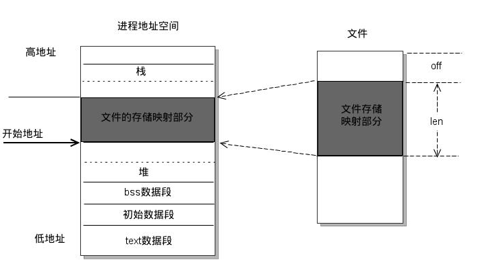

<!-- TOC depthFrom:1 depthTo:6 withLinks:1 updateOnSave:1 orderedList:0 -->

- [IO](#io)
	- [Linux IO 模式](#linux-io-模式)
		- [概念](#概念)
			- [用户空间与内核空间](#用户空间与内核空间)
			- [进程切换](#进程切换)
			- [文件描述符](#文件描述符)
			- [缓存 I/O](#缓存-io)
		- [IO 模式](#io-模式)

<!-- /TOC -->

# IO

## Linux IO 模式

- [Linux IO模式及 select、poll、epoll详解](https://segmentfault.com/a/1190000003063859)

### 概念

#### 用户空间与内核空间

Linux 系统中将最高的 1G 称为内核空间(0xC0000000 -> 0xFFFFFFFF), 将较低的 3G 称为用户空间(0x00000000 -> 0xBFFFFFFF)。

目的: 使用户进程不能直接操作内核, 保证内核的安全。

#### 进程切换

进程切换: 内核挂起正在 CPU 上运行的进程, 并恢复之前挂起的进程。

从一个进程的运行转到另一个进程的运行:
1. 保存处理机上下文，包括程序计数器和其他寄存器。
2. 更新PCB信息。
3. 把进程的PCB移入相应的队列，如就绪、在某事件阻塞等队列。
4. 选择另一个进程执行，并更新其PCB。
5. 更新内存管理的数据结构。
6. 恢复处理机上下文。

#### 文件描述符

文件描述符是一个索引值(形式上是一个非负整数), 指向内核为每个进程所维护的该进程打开文件的记录表。

#### 缓存 I/O

又称标准 I/O. Linux 的缓存 I/O 机制中, 操作系统会将 I/O 的数据缓存在文件系统的页缓存(page cache)中. 也就是说, 数据会先被拷贝到操作系统内核的缓存中, 然后才从操作系统内核的缓存区拷贝到应用程序的地址空间.

### IO 模式

当 read() 时会经历两个阶段:
1. 等待数据准备(等待数据拷贝到内核)
2. 将数据从内核拷贝到进程中.

所以产生了一下五种模式:
- 阻塞 I/O（blocking IO）
- 非阻塞 I/O（nonblocking IO）
- I/O 多路复用（ IO multiplexing）
- 信号驱动 I/O（ signal driven IO）
- 异步 I/O（asynchronous IO）

#### 阻塞io

在linux中，默认情况下所有的socket都是blocking，一个典型的读操作流程大概是这样:

当用户进程调用了recvfrom这个系统调用，kernel就开始了IO的第一个阶段：准备数据（对于网络IO来说，很多时候数据在一开始还没有到达。比如，还没有收到一个完整的UDP包。这个时候kernel就要等待足够的数据到来）。这个过程需要等待，也就是说数据被拷贝到操作系统内核的缓冲区中是需要一个过程的。而在用户进程这边，整个进程会被阻塞（当然，是进程自己选择的阻塞）。当kernel一直等到数据准备好了，它就会将数据从kernel中拷贝到用户内存，然后kernel返回结果，用户进程才解除block的状态，重新运行起来。

所以，blocking IO的特点就是在IO执行的两个阶段都被block了。

#### 非阻塞io

当用户进程发出read操作时，如果kernel中的数据还没有准备好，那么它并不会block用户进程，而是立刻返回一个error。从用户进程角度讲 ，它发起一个read操作后，并不需要等待，而是马上就得到了一个结果。用户进程判断结果是一个error时，它就知道数据还没有准备好，于是它可以再次发送read操作。一旦kernel中的数据准备好了，并且又再次收到了用户进程的system call，那么它马上就将数据拷贝到了用户内存，然后返回。

所以，nonblocking IO的特点是用户进程需要不断的主动询问kernel数据好了没有。

#### io多路复用

IO multiplexing就是我们说的select，poll，epoll，有些地方也称这种IO方式为event driven IO。select/epoll的好处就在于单个process就可以同时处理多个网络连接的IO。它的基本原理就是select，poll，epoll这个function会不断的轮询所负责的所有socket，当某个socket有数据到达了，就通知用户进程。

当用户进程调用了select，那么整个进程会被block，而同时，kernel会“监视”所有select负责的socket，当任何一个socket中的数据准备好了，select就会返回。这个时候用户进程再调用read操作，将数据从kernel拷贝到用户进程。

所以，I/O 多路复用的特点是通过一种机制一个进程能同时等待多个文件描述符，而这些文件描述符（套接字描述符）其中的任意一个进入读就绪状态，select()函数就可以返回。

这个图和blocking IO的图其实并没有太大的不同，事实上，还更差一些。因为这里需要使用两个system call (select 和 recvfrom)，而blocking IO只调用了一个system call (recvfrom)。但是，用select的优势在于它可以同时处理多个connection。

所以，如果处理的连接数不是很高的话，使用select/epoll的web server不一定比使用multi-threading + blocking IO的web server性能更好，可能延迟还更大。select/epoll的优势并不是对于单个连接能处理得更快，而是在于能处理更多的连接。）

在IO multiplexing Model中，实际中，对于每一个socket，一般都设置成为non-blocking，但是，如上图所示，整个用户的process其实是一直被block的。只不过process是被select这个函数block，而不是被socket IO给block。

##### select

##### poll

##### epoll

#### 异步io

用户进程发起read操作之后，立刻就可以开始去做其它的事。而另一方面，从kernel的角度，当它受到一个asynchronous read之后，首先它会立刻返回，所以不会对用户进程产生任何block。然后，**kernel会等待数据准备完成，然后将数据拷贝到用户内存**，当这一切都完成之后，kernel会给用户进程发送一个signal，告诉它read操作完成了。

## mmap

mmap 是一种内存映射文件的方法，将文件或其他对象映射到进程的地址空间，实现文件磁盘地址和进程虚拟地址空间中一段虚拟地址的一一对应关系。进程可以使用指针的方式读写这一段内存，系统会自动回写脏页面到磁盘上。相反，内核空间对这段区域的修改也会反映在用户空间，从而实现不同进程间的文件共享。

由上图可以看出，进程的虚拟地址空间，由多个虚拟内存区域构成。虚拟内存区域是进程的虚拟地址空间中的一个同质区间，即具有同样特性的连续地址范围。上图中所示的text数据段（代码段）、初始数据段、BSS数据段、堆、栈和内存映射，都是一个独立的虚拟内存区域。而为内存映射服务的地址空间处在堆栈之间的空余部分。

映射原理：
1. 在当前进程的虚拟地址空间中，寻找一段空闲的满足要求的连续的虚拟地址。
2. 映射文件物理地址和进程虚拟地址。虚拟地址并没有任何数据关联到内存中。
3. 进程读写虚拟空间时，页表中没有数据，引发缺页异常，将数据从磁盘装入内存中。如果写操作改变了内容，系统会将改动回写到磁盘（并不是同步回写）。

与常规文件操作的区别：
1. 常规的文件读写在磁盘和内存间还有页缓存，比如从磁盘读数据，会先从磁盘读到内核空间中的页缓存中，然后再从页缓存中拷贝到用户空间中（用户空间不能直接访问内核空间）。写操作也需要拷贝两次。
2. mmap 是直接从磁盘拷贝数据到用户空间，只拷贝一次。

# 参考

* [认真分析mmap](https://www.cnblogs.com/huxiao-tee/p/4660352.html)