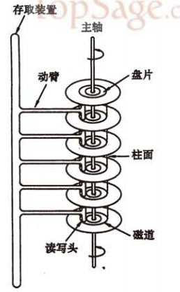
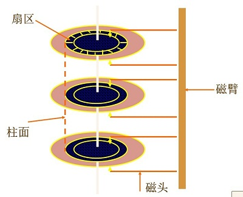
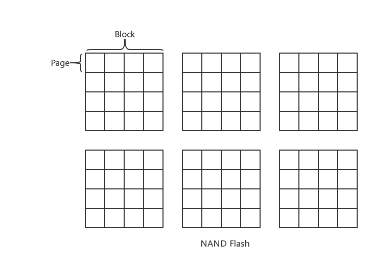
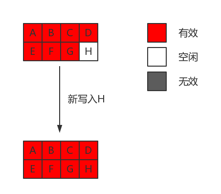
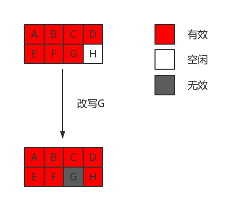
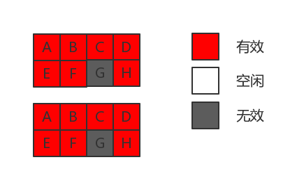

<!-- TOC -->

- [概念](#概念)
- [IO](#io)
    - [Linux IO 模式](#linux-io-模式)
        - [概念](#概念-1)
            - [用户空间与内核空间](#用户空间与内核空间)
            - [进程切换](#进程切换)
            - [文件描述符](#文件描述符)
            - [缓存 I/O](#缓存-io)
        - [IO 模式](#io-模式)
            - [阻塞io](#阻塞io)
            - [非阻塞io](#非阻塞io)
            - [io多路复用](#io多路复用)
                - [select](#select)
                - [poll](#poll)
                - [epoll](#epoll)
            - [异步io](#异步io)
    - [mmap](#mmap)
- [磁盘](#磁盘)
    - [磁盘的读写原理](#磁盘的读写原理)
    - [SSD](#ssd)
        - [over-provisioning 和 garbage-collection](#over-provisioning-和-garbage-collection)
- [文件系统](#文件系统)
    - [软链接与硬链接](#软链接与硬链接)
    - [Linux VFS](#linux-vfs)
- [参考](#参考)

<!-- /TOC -->

# 概念

* IOPS: 用于存储设备性能测试的量测方式，可视为每秒的读写次数。 影响因素：数据块大小，读取和写入的比例等。

# IO

## Linux IO 模式

- [Linux IO模式及 select、poll、epoll详解](https://segmentfault.com/a/1190000003063859)

### 概念

#### 用户空间与内核空间

Linux 系统中将最高的 1G 称为内核空间(0xC0000000 -> 0xFFFFFFFF), 将较低的 3G 称为用户空间(0x00000000 -> 0xBFFFFFFF)。

目的: 使用户进程不能直接操作内核, 保证内核的安全。

#### 进程切换

进程切换: 内核挂起正在 CPU 上运行的进程, 并恢复之前挂起的进程。

从一个进程的运行转到另一个进程的运行:
1. 保存处理机上下文，包括程序计数器和其他寄存器。
2. 更新PCB信息。
3. 把进程的PCB移入相应的队列，如就绪、在某事件阻塞等队列。
4. 选择另一个进程执行，并更新其PCB。
5. 更新内存管理的数据结构。
6. 恢复处理机上下文。

#### 文件描述符

文件描述符是一个索引值(形式上是一个非负整数), 指向内核为每个进程所维护的该进程打开文件的记录表。

#### 缓存 I/O

又称标准 I/O. Linux 的缓存 I/O 机制中, 操作系统会将 I/O 的数据缓存在文件系统的页缓存(page cache)中. 也就是说, 数据会先被拷贝到操作系统内核的缓存中, 然后才从操作系统内核的缓存区拷贝到应用程序的地址空间.

### IO 模式

当 read() 时会经历两个阶段:
1. 等待数据准备(等待数据拷贝到内核)
2. 将数据从内核拷贝到进程中.

所以产生了一下五种模式:
- 阻塞 I/O（blocking IO）
- 非阻塞 I/O（nonblocking IO）
- I/O 多路复用（ IO multiplexing）
- 信号驱动 I/O（ signal driven IO）
- 异步 I/O（asynchronous IO）

#### 阻塞io

在linux中，默认情况下所有的socket都是blocking，一个典型的读操作流程大概是这样:

当用户进程调用了recvfrom这个系统调用，kernel就开始了IO的第一个阶段：准备数据（对于网络IO来说，很多时候数据在一开始还没有到达。比如，还没有收到一个完整的UDP包。这个时候kernel就要等待足够的数据到来）。这个过程需要等待，也就是说数据被拷贝到操作系统内核的缓冲区中是需要一个过程的。而在用户进程这边，整个进程会被阻塞（当然，是进程自己选择的阻塞）。当kernel一直等到数据准备好了，它就会将数据从kernel中拷贝到用户内存，然后kernel返回结果，用户进程才解除block的状态，重新运行起来。

所以，blocking IO的特点就是在IO执行的两个阶段都被block了。

#### 非阻塞io

当用户进程发出read操作时，如果kernel中的数据还没有准备好，那么它并不会block用户进程，而是立刻返回一个error。从用户进程角度讲 ，它发起一个read操作后，并不需要等待，而是马上就得到了一个结果。用户进程判断结果是一个error时，它就知道数据还没有准备好，于是它可以再次发送read操作。一旦kernel中的数据准备好了，并且又再次收到了用户进程的system call，那么它马上就将数据拷贝到了用户内存，然后返回。

所以，nonblocking IO的特点是用户进程需要不断的主动询问kernel数据好了没有。

#### io多路复用

IO multiplexing就是我们说的select，poll，epoll，有些地方也称这种IO方式为event driven IO。select/epoll的好处就在于单个process就可以同时处理多个网络连接的IO。它的基本原理就是select，poll，epoll这个function会不断的轮询所负责的所有socket，当某个socket有数据到达了，就通知用户进程。

当用户进程调用了select，那么整个进程会被block，而同时，kernel会“监视”所有select负责的socket，当任何一个socket中的数据准备好了，select就会返回。这个时候用户进程再调用read操作，将数据从kernel拷贝到用户进程。

所以，I/O 多路复用的特点是通过一种机制一个进程能同时等待多个文件描述符，而这些文件描述符（套接字描述符）其中的任意一个进入读就绪状态，select()函数就可以返回。

这个图和blocking IO的图其实并没有太大的不同，事实上，还更差一些。因为这里需要使用两个system call (select 和 recvfrom)，而blocking IO只调用了一个system call (recvfrom)。但是，用select的优势在于它可以同时处理多个connection。

所以，如果处理的连接数不是很高的话，使用select/epoll的web server不一定比使用multi-threading + blocking IO的web server性能更好，可能延迟还更大。select/epoll的优势并不是对于单个连接能处理得更快，而是在于能处理更多的连接。）

在IO multiplexing Model中，实际中，对于每一个socket，一般都设置成为non-blocking，但是，如上图所示，整个用户的process其实是一直被block的。只不过process是被select这个函数block，而不是被socket IO给block。

##### select

select 会将文件描述符集合从用户空间拷贝到内核空间，然后遍历集合，挨个检查 socket 是否准备好了，如果没有的话就进入睡眠，直到有描述符准备好了，或者超时。然后通过遍历所有描述符来找到准备好了的那个。

缺点：
* 一个进程能监视的文件描述符数量有限制，Linux 上一般是 1024，可修改。
* 文件描述符需要从用户空间拷贝到内核空间。

##### poll

和 select 一样需要遍历文件描述符来获取准备好的那个，也需要拷贝集合到内核空间中。不同的是没有描述符数量的限制。

##### epoll

select 和 poll 当有 IO 事件时并不知道具体是哪个 socket, 只能通过轮询来获知。而 epoll 可以得知具体是哪个 socket 有 IO 事件（每个 socket 都有回调）。

好处：
* 句柄上限是最大可以打开的文件数，1G内存上大概是10w, 可通过 `cat /proc/sys/fs/file-max` 查看。
* 不需要复制集合到内核中，使用 mmap 将内核空间和用户空间映射到一块物理内存中，减少了集合的拷贝。

LT(level triggered) 模式：内核通知某个文件描述符就绪了，如果应用程序不处理的话，下次还会继续通知。

ET(edge-triggered) 模式： 通知某个文件描述符就绪了，如果不处理的话下次就不再通知了。

#### 异步io

用户进程发起read操作之后，立刻就可以开始去做其它的事。而另一方面，从kernel的角度，当它受到一个asynchronous read之后，首先它会立刻返回，所以不会对用户进程产生任何block。然后，**kernel会等待数据准备完成，然后将数据拷贝到用户内存**，当这一切都完成之后，kernel会给用户进程发送一个signal，告诉它read操作完成了。

## mmap

mmap 是一种内存映射文件的方法，将文件或其他对象映射到进程的地址空间，实现文件磁盘地址和进程虚拟地址空间中一段虚拟地址的一一对应关系。进程可以使用指针的方式读写这一段内存，系统会自动回写脏页面到磁盘上。相反，内核空间对这段区域的修改也会反映在用户空间，从而实现不同进程间的文件共享。

由上图可以看出，进程的虚拟地址空间，由多个虚拟内存区域构成。虚拟内存区域是进程的虚拟地址空间中的一个同质区间，即具有同样特性的连续地址范围。上图中所示的text数据段（代码段）、初始数据段、BSS数据段、堆、栈和内存映射，都是一个独立的虚拟内存区域。而为内存映射服务的地址空间处在堆栈之间的空余部分。

映射原理：
1. 在当前进程的虚拟地址空间中，寻找一段空闲的满足要求的连续的虚拟地址。
2. 映射文件物理地址和进程虚拟地址。虚拟地址并没有任何数据关联到内存中。
3. 进程读写虚拟空间时，页表中没有数据，引发缺页异常，将数据从磁盘装入内存中。如果写操作改变了内容，系统会将改动回写到磁盘（并不是同步回写）。

与常规文件操作的区别：
1. 常规的文件读写在磁盘和内存间还有页缓存，比如从磁盘读数据，会先从磁盘读到内核空间中的页缓存中，然后再从页缓存中拷贝到用户空间中（用户空间不能直接访问内核空间）。写操作也需要拷贝两次。
2. mmap 是直接从磁盘拷贝数据到用户空间，只拷贝一次。

# 磁盘

## 磁盘的读写原理

* 在每个盘片的存储面上都有一个磁头。
* 每个磁头同一时刻也必须是同轴的（不过目前已经有多磁头独立技术，可不受此限制）。
* 盘片以每分钟数千转到上万转的速度在高速旋转。

* 硬盘在逻辑上被划分为磁道、柱面以及扇区。
* 磁头靠近主轴接触的表面，即线速度最小的地方，是一个特殊的区域，它不存放任何数据，称为启停区或着陆区（LandingZone），启停区外就是数据区。在最外圈，离主轴最远的地方是“0”磁道，硬盘数据的存放就是从最外圈开始的。
* 硬盘不工作时，磁头停留在启停区，当需要从硬盘读写数据时，磁盘开始旋转。旋转速度达到额定的高速时，磁头就会因盘片旋转产生的气流而抬起， 这时磁头才向盘片存放数据的区域移动。
* 盘面： 每个盘片有两个盘面，一般都可以存储数据。
* 磁道： 磁盘在格式化时被划分成许多同心圆，这些同心圆轨迹叫做磁道（Track）。磁道从外向内从0开始顺序编号。
* 扇区： 磁道被分成一个一个扇区，每个扇区中的数据作为一个单元同时读出或写入。每个扇区包括512个字节的数据和一些其他信息。
* 柱面： 所有盘面上的同一磁道构成一个圆柱，通常称做柱面（Cylinder）。数据的读写是按柱面进行的而不是按盘面，即一个磁道写满数据后，就在同一柱面的下一个盘面来写，一个柱面写满后，才移到下一个扇区开始写数据，读取数据也是这样。因为选取磁头只需通过电子切换即可，而选取柱面则必须通过机械切换。

磁盘读取数据的过程：

当需要从磁盘读取数据时，系统会将数据逻辑地址传给磁盘，磁盘的控制电路按照寻址逻辑将逻辑地址翻译成物理地址，即确定要读的数据在哪个磁道，哪个扇区。为了读取这个扇区的数据，需要将磁头放到这个扇区上方，为了实现这一点：
1. 首先必须找到柱面，即磁头需要移动对准相应磁道，这个过程叫做寻道，所耗费时间叫做寻道时间，
2. 然后目标扇区旋转到磁头下，即磁盘旋转将目标扇区旋转到磁头下。这个过程耗费的时间叫做旋转时间。

即一次访盘请求（读/写）完成过程由三个动作组成：
1. 寻道（时间）：磁头移动定位到指定磁道 
2. 旋转延迟（时间）：等待指定扇区从磁头下旋转经过 
3. 数据传输（时间）：数据在磁盘与内存之间的实际传输

## SSD

SSD 内部一般使用 NAND Flash 来作为存储介质，其逻辑结构如下：

* SSD 中一般有多个 NAND Flash，每个 NAND Flash 包含多个 Block，每个 Block 包含多个 Page。
* 读写是以 page 为单位，即每次读写至少是一个 page(4K 或 8K)。
* 在SSD中，一般会维护一个mapping table，维护逻辑地址到物理地址的映射。每次读写时，可以通过逻辑地址直接查表计算出物理地址，与传统的机械磁盘相比，省去了寻道时间和旋转时间。
* 写入时只能写入空闲的 page, 不能覆盖写原先有内容的 page。
* 擦除数据时只能以 block 为单位擦除。

与 HDD 的主要区别是：
* 定位数据快：HDD 需要经过寻道和旋转，才能定位到要读写的数据块，而 SSD 通过 mapping table 直接计算即可。
* 读取速度块：HDD 的速度取决于旋转速度，而 SSD 只需要加电压读取数据，一般而言，要快于 HDD。

写入 page 的流程：

1. 找到一个空闲 page
2. 把数据写入到空闲 page 中
3. 更新 mapping table

更新 page 的流程：

1. 由于 SSD 不能覆盖写，因此，先找到一个空闲页 H
2. 读取 page G 中的数据到 SSD 内部的 buffer 中，把更新的字节更新到 buffer
3. 把 buffer 中的数据写入到 H
4. 更新 mapping table 中 G 页，置为无效页
5. 更新 mapping table 中 H 页，添加映射关系

### over-provisioning 和 garbage-collection

over-provisioning 是指 SSD 实际的存储空间比可写入的空间要大，比如，一块可用容量为 120G 的 SSD，实际空间可能有 128G。

如上图所示，假设系统中就两个 block，最终还剩下两个无效的 page，此时，要写入一个新 page，根据 NAND 原理，必须要先对两个无效的 page 擦除才能用于写入。此时，就需要用到 SSD 提供的额外空间，才能用 garbage-collection 方法整理出可用空间。

garbage collection 的整理流程如上图所示：
* 首先，从 over-provisoning 的空间中，找到一个空闲的 block
* 把 Block0 的 ABCDEFH 和 Block1 的 A 复制到空闲 block
* 擦除 Block 0
* 把 Block1 的 BCDEFH 复制到 Block0，此时 Block0 就有两个空闲 page 了
* 擦除 BLock1

SSD 的 garbage-collection 会带来两个问题：
* SSD 的寿命减少，NAND Flash 中每个原件都有擦写次数限制，超过一定擦写次数后，就只能读取不能写入了
* 写放大问题，即内部真正写入的数据量大于用户请求写入的数据量

解决方案： SSD 控制器会记录每个 block 的写入次数，通过一定的算法来均衡每个 block 的写入。

# 文件系统

## 软链接与硬链接

为解决文件的共享使用，Linux 系统引入了两种链接：硬链接 (hard link) 与软链接（又称符号链接，即 soft link 或 symbolic link）。链接为 Linux 系统解决了文件的共享使用，还带来了隐藏文件路径、增加权限安全及节省存储等好处。

硬链接：若一个 inode 号对应多个文件名，则称这些文件为硬链接。硬链接就是同一个文件使用了多个别名。
* 文件有相同的 inode 及 data block；
* 只能对已存在的文件进行创建；
* 不能交叉文件系统进行硬链接的创建；(inode 号仅在各文件系统下是唯一的，当 Linux 挂载多个文件系统后将出现 inode 号重复的现象，因此硬链接创建时不可跨文件系统)
* 不能对目录进行创建，只可对文件创建；
* 删除一个硬链接文件并不影响其他有相同 inode 号的文件。

软链接：若文件用户数据块中存放的内容是另一文件的路径名的指向，则该文件就是软连接。软链接就是一个普通文件，只是数据块内容有点特殊。
* 软链接有自己的文件属性及权限等；
* 可对不存在的文件或目录创建软链接；
* 软链接可交叉文件系统；
* 软链接可对文件或目录创建；
* 创建软链接时，链接计数 `i_nlink` 不会增加；
* 删除软链接并不影响被指向的文件，但若被指向的原文件被删除，则相关软连接被称为死链接（即 dangling link，若被指向路径文件被重新创建，死链接可恢复为正常的软链接）。

## Linux VFS

VFS(Virtual File System, 虚拟文件系统)。

open()系统调用的过程如下：

1. 查看 system-wide open-file table（系统打开文件表）中是否有该文件，即查看该文件是否已经被其他进程打开了
2. 如果存在，那么该进程会在自己的 per-process open-file table（进程打开文件表）中，建立一个项目，指向 system-wide open-file table 中的该文件
3. 如果不存在，则需要根据 file name 在 directory 中查找该 file，通常 directory 中的部分内容在 cache 中，这样可以加快搜索速度。
4. 一旦文件被找到，那么 FCB(file control block)文件控制块会被复制到 system-wide open-file table 中，该表不仅仅保存 FCB，而且记录每个文件被多少个进程打开
5. 接下来，在 per-process open-file table（进程打开文件表）中，建立一个 entry，指向进程打开文件表中该项目

当进程close()一个文件时：

1. 该进程的 per-process open-flle table 中的对应项会被删除，系统打开表中的该文件计数器会减1
2. 如果系统打开表中的计算为0，那么删除该文件项

--------------------
# 参考

* [认真分析mmap](https://www.cnblogs.com/huxiao-tee/p/4660352.html)
* [磁盘的读写原理](http://www.cnblogs.com/xmphoenix/p/3879022.html)
* [程序员需要知道的SSD基本原理](http://oserror.com/backend/ssd-principle/)