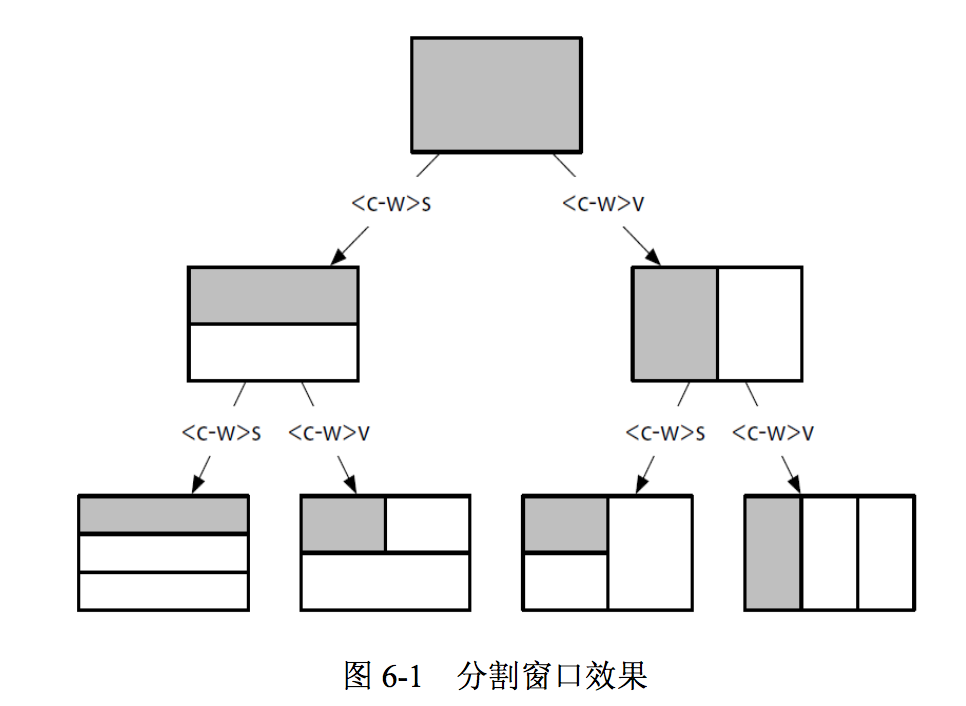

<!-- TOC depthFrom:1 depthTo:6 withLinks:1 updateOnSave:1 orderedList:0 -->

- [基础](#基础)
	- [Jump](#jump)
- [文件操作](#文件操作)
	- [切分窗口](#切分窗口)
		- [分隔窗口](#分隔窗口)
		- [窗口间切换](#窗口间切换)
		- [关闭窗口](#关闭窗口)
		- [改变窗口大小](#改变窗口大小)
- [移动光标](#移动光标)
	- [f到指定字符](#f到指定字符)
	- [滚动](#滚动)
- [编辑](#编辑)
	- [多列编辑](#多列编辑)
		- [行首插入](#行首插入)
		- [编辑行中的一列单词](#编辑行中的一列单词)
		- [在行尾追加](#在行尾追加)
	- [按tab缩进](#按tab缩进)
	- [在行尾追加](#在行尾追加)
	- [复制粘贴](#复制粘贴)
	- [替换](#替换)
	- [剪切/删除](#剪切删除)
	- [撤销](#撤销)
	- [重复上次命令](#重复上次命令)
	- [算术运算](#算术运算)
	- [在字符前后添加空格](#在字符前后添加空格)
- [选择](#选择)
	- [可选模式](#可选模式)
	- [代码缩进](#代码缩进)
	- [按列编辑](#按列编辑)
- [命令行模式](#命令行模式)
	- [用行号作地址](#用行号作地址)
	- [指定范围](#指定范围)
		- [在高亮选区上执行命令](#在高亮选区上执行命令)
		- [用模式指定范围](#用模式指定范围)
		- [使用偏移修正范围](#使用偏移修正范围)
- [寄存器](#寄存器)
	- [复制再删除再粘贴](#复制再删除再粘贴)
	- [指定寄存器](#指定寄存器)
	- [系统粘贴板](#系统粘贴板)
	- [插入模式下粘贴寄存器的内容](#插入模式下粘贴寄存器的内容)
	- [表达式寄存器](#表达式寄存器)
- [搜索 search](#搜索-search)
- [命令行下用vim编辑](#命令行下用vim编辑)
- [匹配括号](#匹配括号)
- [设置](#设置)
	- [配置](#配置)
		- [快捷键映射](#快捷键映射)
	- [插件](#插件)
		- [vundle](#vundle)
		- [NERD Tree](#nerd-tree)
- [书签](#书签)
- [排序](#排序)
- [终端](#终端)
	- [在终端中使用vim](#在终端中使用vim)
- [宏](#宏)
	- [示例: 在末尾加分号](#示例-在末尾加分号)
	- [示例: 从1到100,每行加1](#示例-从1到100每行加1)
- [其他](#其他)
	- [输入非常见字符](#输入非常见字符)
- [参考](#参考)

<!-- /TOC -->

# 安装

## 安装


## 更新

使用 macvim 中的 vim: `alias vim='/Applications/MacVim.app/Contents/bin/vim'`


# 基础

* 自带教程 `vimtutor`
* `:version` 展示vim的所有相关信息
* `Esc` 和 `<C-[>` 的作用相同, 都是进入普通模式.
* 在插入模式下按 `<C-o>` 可以进入插入-普通模式, 可以执行一次命令然后自动进入插入模式, 比如 `<C-o>db` 在插入模式下删除前面的单词.

## Jump

- `C-]`: 跳到 tag 里, `C-o` 或 `C-t` 跳回来。


# 文件操作

* 打开文件 `vim [filename]`（文件名包含空格时在前面加上`\`）
* 打开多个文件: `vim *.txt`, `vim a.txt b.txt`。
* 写入文件 `:w`，写入并离开`:wq`
* 离开`:q`, `:q!`表示强制离开，不保存修改内容。
* 撤销所有改动回到最初的文件`:e!`

## 切分窗口

### 分隔窗口



* `<C-w>s` 水平切割，两个窗口上下排列。
* `<C-w>v` 垂直切割，两个窗口左右排列。
* 可以多次执行。
* `:edit {filename}` 打开另一个文件。
* `:sp[lit] {file}` 水平切分当前窗口，并在新窗口中载入{file}。
* `:vsp[lit] {file}` 垂直切分当前窗口，并在新窗口中载入{file}

### 窗口间切换
* `<C-w>w` 循环切换。
* `<C-w>h` 切换到左边窗口。
* `<C-w>l` 切换到右边窗口。
* `<C-w>j` 切换到下边窗口。
* `<C-w>k` 切换到上边窗口。

### 关闭窗口
* `:clo[se]` 或 `<C-w>c` 关闭活动窗口。
* `:on[ly]` 或 `<C-w>o` 关闭除活动窗口外的其他窗口。

### 改变窗口大小
* `<C-w>=` 所有窗口等宽等高。
* `<C-w>_` 最大化活动窗口的高度。
* `<C-w>|` 最大化活动窗口的宽度。
* `[N]<C-w>_` 活动窗口的高度设为N行。
* `[N]<C-w>|` 活动窗口的宽度设为N行。


# 移动光标

* 上下左右 `k j h l`，在前面添加数字跳多个，比如`4h`
* 移动到行首`0`，移动到行尾`$`
* 移动到下一个单词或者标点符号`w`，移动到下一个单词忽略标点符号`W`，前面可加数字。
* 移动到上一个单词或者标点符号`b`，移动到下一个单词忽略标点符号`B`，前面可加数字。
* 移动到特定行`G`，比如最后一行`G`，第一行`1G`，第23行`23G`，也可以使用`:行号`
* 移动到单词尾 `e`
* `ta` 跳到下一个a前面一个字符, `Ta` 跳到前一个a后面一个字符上.

## f到指定字符
* `f{char}`: `fa` 跳到下一个a上, `Fa` 跳到前一个a上. 只能在当前行查找.
* `;` 会重复查找上次f查找的字符.
* `,` 会向前查找上次f查找的字符.


## 滚动

- 向上滚动半屏 `ctrl + d`
- 向上滚动全屏 `ctrl + f`
- 向下滚动半屏 `ctrl + u`
- 向下滚动全屏 `ctrl + b`
- 向上滚动一行 `ctrl + e`
- 向下滚动一行 `ctrl + y`

# 编辑

* `i`表示插入(光标前), `I` 在行首插入。
* `a`表示追加(光标后), `A` 在行尾追加(相当于`$a`).
* `c`表示更改, `c`与移动命令配合使用，比如`cw`修改后面的一个单词，如果光标在单词中间那就是半个单词，`c2b`修改前面2个单词，`c$`修改光标到结尾的字符，可使用大写`C`代替，`c0`修改光标到开头的字符，`cc`修改一整行。
* `s`也可以只修改一个字符，但会进入编辑模式，而`2s`会修改光标及光标后一个字符共2个字符。`S`会替换整行内容，不管光标在哪，而`C`只能替换光标后的内容。
* `y`表示复制, `p`表示粘贴。
* 只覆盖一个字符`r`, 不进入编辑模式。`R`覆盖字符，最多覆盖一整行。
* `J` 合并当前行和下一行，中间添加一个空格。 `nJ` 合并 n 行。
* 在当前位置下面创建一行并进入编辑模式 `o`, 在上面则是 `O`。 前面可加数字参数，不过需要按 ESC。
* 更改大小写`~`, `3~`
* 删除文本（`dw`删除单词，`dd`删除一行，`dw`会删到下一个单词为止，包括空格，不想删除空格就用`de`, `dE`包括标点在内的单词结尾），向前删除`db`，删到开头或结尾`d0或d$`, `D`删除光标到末尾的字符(不进入插入模式)。
* 删除一个字符。删除光标所在字符`x`，删除光标前的字符`X`
* 删除到指定字符: `df<字符>`.

## 示例

- 插入 5 个星号`*****`: `5i*ESC`
- 插入 5 个星号和减号的组合`*-*-*-*-*-`: `5i*-ESC`(insert 模式下输入什么就重复什么)
- 输入 5 个空行: `5oESC`
- 将 || 替换成 &&: `2r&`(替换第一个 | 然后重复 2 次)


## 多列编辑

### 行首插入

1. 光标在第一行行首
2. 按 `ctrl + v`
3. 按 `shift + i`
4. 写入要添加的内容
5. 按 `escape` 两次


### 编辑行中的一列单词

```
hello world 你好
hello world 你好
hello world 你好
```

想将 world 修改成 golang:
1. 光标定位到 world 的第一个字母.
2. 按 `<C-v>2j` 选中这一列的 w, 按 `e` 选中这一列的 world.
3. 按 `c` 删除 world 并进入编辑模式, 写上 golang 按 `<Esc>`.


### 在行尾追加

```js
var foo = 1
var bar = 'a'
var foobar = foo + bar
```

想在每行末尾添加 `;`:
1. 光标在第一行末尾 1 的位置.
2. 按 `<C-v>2j` 选中这3列, 按 `$` 会将区域扩展到每行的行尾, 这样就选中了一个不规则的区域.
3. 按 `A;` 在末尾添加 `;`, 按 `<Esc>` 退出.


## 按tab缩进

- `>>` 光标所在行右移一个tab
- `<<` 光标所在行左移一个tab
- `n>>` 光标所在行后n行(包括当前行)右移一个tab
- `:m,n>` 从第m行到第n行右移一个tab
- `:m,n>>` 从第m行到第n行右移两个tab

## 在行尾追加

* 选中需要添加的行, 执行 `:normal A;` 将在行尾添加字符 `;`.
* 全文添加使用 `:%normal A;`.
* 先用 `A` 在行尾添加分号, 移动到下一行, 使用 `.` 重复命令添加分号.


## 复制粘贴

- 复制前面一个单词 `vby`(v进入可视化模式，b光标前一个单词，y复制)
- 复制当前行 `yy`, 或者 `Y`
- 复制当前行及以后n行 `nyy`
- 粘贴到光标后面 `p`
- 粘贴到光标前面 `P`
- 粘贴时取消缩进: `:set paste`, 还原: `:set nopaste`.
- 复制到指定字符: `yf<字符>`(`yfo`从当前光标复制到o字符)
- 复制到指定字符前: `yt<字符>`(`yto`从当前光标复制到o之前的字符)


## 替换

- 替换光标下的一个字符 `r`
- 替换从光标开始的字符 `R`
- 替换当前行第一个匹配的 `:s/abc/def`
- 替换当前行所有匹配的 `:s/abc/def/g`
- 替换当前行到末尾每行第一个匹配的 `.,$s/abc/def`（每行所有匹配的加 `g`）
- 替换第n行到末尾每行第一个匹配的 `n,$s/abc/def` (每行所有匹配的加 `g`)
- 替换所有行第一个匹配的 `%s/abc/def`(每行所有匹配的加 `g`)
- 带确认替换，后面加c(confirm) `s/abc/def/gc`
- 替换 `\n` 字符为换行符 `s/\\n/^M/` (^M 是 ctrl + v + m)


## 剪切/删除

- 剪切任意文本 `vd`(在可视化模式下,d表示剪切,y表示复制)
- 剪切一行 `dd`(`3dd` 剪切当前行及之后的行共3行)
- 剪切光标到行尾 `d$`
- 剪切光标到行首 `d^`
- 剪切光标前的单词 `db`
- 剪切光标后的单词 `dw`
- 删除一个字符 `dl`.
- 删除一段 `dap`.
- 剪切一个字符并进入编辑模式 `s`
- 剪切一个字符 `x`
- 删除当前光标所在单词 `daw`
- `d2w` 和 `2dw` 和 `dw.`(重复命令) 都是删除后面两个单词.


## 撤销

`u`, `Ctrl-R` 重做一次撤销操作。


## 重复上次命令
* `.` 重复上次执行的修改(比如`x`,`dd`,插入模式下执行的所有修改).

## 算术运算
* `ctrl + a` 将当前光标处的数字加1.如果当前光标处不是数字,向后查找直到行尾.
* `ctrl + x` 执行减1操作.
* `10 + ctrl + a` 加10
* 以 0 开头的数字 vim 会把它当成八进制处理, 所以 007 上执行 `ctrl + a` 得到的是 010 而不是 008.


## 在字符前后添加空格
比如有文本 `var foo = "method("+arg1+","+arg2+")";`, 我们想在 `+` 前后添加空格, 可以先使用 `f+` 跳到 `+` 的位置, 然后按 `s` 删除 `+`, 输入 ` + `, 这样就修改好了一处, 之后使用 `;` 跳到下一个 `+` 的位置, 使用 `.` 重复修改.


# 选择
* 从光标处到指定字符: `f<字符>`.
* 从光标处到指定字符前: `t<字符>`.

## 可选模式
* `v` 面向字符的可选模式.
* `V` 面向行的可选模式.
* `<C-v>` 面向块的可选模式.
* `gv` 重选上次的高亮选区.
* `o` 在进入可选模式后按 `o` 可以修改开始位置.

## 代码缩进
假如想缩进两行, 按 `Vj` 选中这两行, 执行 `>` 可向右缩进一个 tab, 如果想再缩进一个 tab, 按 `.` 就可以.
或者按 `2>` 也可以达到同样的效果.

## 按列编辑
```
abc   abc
abc   abc
abc   abc
abc   abc
abc   abc
```

比如像将上面的文本编辑成下面这样的:

```
abc|abc
-------
abc|abc
abc|abc
abc|abc
abc|abc
```

步骤如下:
1. 将光标定位到第一个空格处.
2. 按 `<C-v>` 进入面向块的可选模式, 按 `4j` 选中这一列, 按 `x` 删除空格, 再按 `.` 再删除一列空格.
3. 按 `gv` 再次选中一列空格, 按 `r|` 将这一列空格替换成 `|`.
4. 再第一行按 `yyp` 复制一行.
5. 按 `V` 选中这一行, 按 `r-` 全部替换成 `-`.


# 命令行模式

## 用行号作地址
* `:3` 跳转到第3行.
* `:print`, `:p` 打印光标所在行的内容.
* `:3p` 移动到第3行并且打印.
* `:3d` 删除第3行的内容.


## 指定范围
* `:2,5p` 打印2-5行的内容, 光标停在第5行.
* `:.,$p` 打印当前行到文件末尾的内容.
* `:$p` 打印文件中所有行.

### 在高亮选区上执行命令
在可选模式下选中几行内容, 比如 `VG` 选中当前行到末尾行, 然后按 `:`, 在命令行上会预先填充一个范围 `:'<,'>`, 其中 `'<` 表示高亮选区开始行, `'>` 表示高亮选区结束行, 打印高亮选区可以 `:'<,'>p`, 在高亮选区上替换文本可以 `:'<,'>s/a/b/`.

### 用模式指定范围
* `:/<html>/,/<\/html>/p` 开始行匹配 `<html>` 标签, 结束行匹配 `</html>`, 从光标所在行开始搜索.

### 使用偏移修正范围
* `:.,.+3p` 打印当前行以及之后的3行.
* `:/<html>/+1,/<\/html>/-1p` 打印 html 标签之内的行, 不包含 html 标签对.


# 寄存器
* 复制的内容只会被保存在寄存器"0.
* 删除的内容被压到"1, 原来"1的内容压到"2, 以此类推, "9的内容会被删除.
* 剪切的内容在 `"`.
* `"-` 短删除寄存器, 如 `d`, `d2h` 这种删除的内容不含换行符的话会被放到这个寄存器中.
* `".` 保存上次插入模式下的文字,比如i进入插入模式后写下的文字都保存在这里.
* 未命名寄存器 `"` 保存最近一次复制或删除操作内容，无论是否指定寄存器.
* 黑洞寄存器 `"_`, 如果删除的内容放到这里, 那么其他寄存器都不受影响, 粘贴时没法从这里粘贴.
* 查看所有寄存器 `:reg`, 在后面加上寄存器名称则可以查看其内容, 比如 `:reg 0`.

## 复制再删除再粘贴
问题: 复制时默认放到 `"` 和 `"0` 寄存器, 删除时会用删除的内容覆盖 `"` 寄存器, 粘贴时没法粘贴复制的内容.

* 先用 `y` 复制, 然后选中删除的内容执行 `"_d` 将其放到黑洞寄存器(或者删除单词 `"_dw`), 之后再用 `p` 粘贴回来.
* 复制删除照旧, 此时复制的内容在"0, 删除的内容在`"`, 粘贴时使用 `"0p`(指定寄存器粘贴).
* 先复制内容, 然后选中要删除的内容, 直接粘贴(`vwp`).

## 指定寄存器
* 在复制y或删除d命令前加上寄存器名称, 比如 `"c3yy` 将3行复制到寄存器"c中, 粘贴时使用 `"cp`.
* 寄存器的名称大小写都是同一个寄存器,只是行为不同, 大写的名称复制或删除时会追加到原来的内容之后, 比如 `"Cdd`, 粘贴时还是使用小写的.
* 在命令行中指定寄存器, 比如 `:2,4y a` 将2-4行复制到寄存器a中, `:'<,'>d A` 将选中内容删除并追加到寄存器a中. `:pu! a` 将寄存器a的内容粘贴到当前行之前.


## 系统粘贴板

在 `.vimrc` 中配置：

```
vmap "+y :w !pbcopy<CR><CR>
nmap "+p :r !pbpaste<CR><CR>
```

- 从vim复制到系统粘贴板: `"+y`
- 从系统粘贴板复制到vim: `"+p`


## 插入模式下粘贴寄存器的内容
* `<C-r>1` 粘贴寄存器1的内容.


## 表达式寄存器
* 在插入模式下访问表达式寄存器: `<C-r>=`.
* 插入模式下执行 `<C-r>=3*5` 然后按回车, 光标所在位置就会出现 15 的计算结果.


# 搜索 search

- 自光标位置向下搜索 `/pattern`
- 自光标位置向上搜索 `?pattern`
- 继续同方向搜索 `n`
- 继续反方向搜索 `N`
- 高亮显示搜索结果 `:set hlsearch`, 反之 `:set nohlsearch`, 高亮后取消高亮 `:noh`
- 大小写不敏感 `:set ignorecase`, 反之 `:set noignorecase`
- 如果搜索词全小写则大小写不敏感，如果有一个大写的则精确匹配 `:set noignorecase` + `:set smartcase`
- `?\Cword` 命令就只匹配单词word, `\c` 则执行忽略大小写的查询
- 搜索到末尾时不循环查找 `:set nowrapscan`, 反之 `:set wrapscan`
- 搜索光标所在单词，向下 `shift + *`, 向上 `shift + #`


# 命令行下用vim编辑

`ctrl+x, ctrl+e`


# 匹配括号

```basic
%
```


# 设置

## 配置

```bash
" 设置字体, 空格前需要加\, linux 中使用set guifont=Monospace\ 14(字号前有空格)
set guifont=M+\ 2m:h18
" 显示行号
set nu " 或者 set number
" 开启语法高亮
syntax on
" 搜索
set hlsearch   " 高亮显示搜索结果，反之 nohlsearch, 临时取消高亮:noh(:nohlsearch)
set incsearch  " 搜索时每输入一个字符都匹配一次
set ignorecase " 忽略大小写(缩写 set ic)
set smartcase  " 小写能匹配大写,大写不匹配小写
set wrapscan   " 循环查找
" 缩进
set tabstop=4     " 设置 tab 长度为4，默认8
set shiftwidth=4  " 设置 > 命令移动4格
set softtabstop=4 " 按退格键时可以一次删除4格
set autoindent    " 自动缩进(缩写 set ai, 反操作 set noai)
set shiftwidth=4  " 缩进4个空格, 和自动缩进一起缩写为 set ai sw=4
" set paste       " 关闭所有自动缩进，粘贴代码时有用，反操作 set nopaste
" 不可见字符
" set invlist " 显示不可见字符.(^I 表示tab, $ 表示回车, 反操作 set nolist)
" 换行
" set wrap " 自动换行显示，反操作 set nowrap
" 状态栏
set ruler        " 标尺信息，显示光标的坐标
set laststatus=2 " 显示状态栏，默认1（不显示状态栏）
" 在状态栏显示的信息
" %F: 当前文件名。 %m: 当前文件修改状态。      %r: 当前文件是否只读。
" %Y: 文件类型。   %b: 光标处字符的ASCII码值。 %B: 光标处字符的十六进制值。
" %l: 行号。       %c: 列号。                  %p: 当前行所占百分比。
" %L: 文件总行数。 %%: %号。
set statusline=%F%m%r\ %Y\ ASCII=%b(0x%B)\ LINE=%l,%c(%L,%p%%)

"" 插件配置

" nerdtree 树形目录插件
nmap <F5> :NERDTreeToggle<CR> " 在 normal 模式下切换目录
```


### 快捷键映射

- nmap, imap, vmap 定义映射仅在 normal, insert, visual 模式下有效。

**遵循默认操作**

`nmap dd O<esc>jddk` 表示在上一行插入空行，返回到 normal 模式，下移一行，删除这一行，上移一行。但是实际执行时会无限刷出空行，因为后面中也出现了 dd 命令。

解决方法是使用 noremap 让后面的命令保持默认操作，上面的命令重写为 `noremap dd O<esc>jddk`，对应的，其他模式下可以使用 nnoremap, inoremap, vnoremap。


**leader键**

vim 中大量的按键已经被占用了，配置时总是受限，所以我们可以设置一个不常用的按键为 leader 键，这样就可以避免冲突。

设置 `,` 为 leader 键: `let mapleader=","`，使用时 `nnoremap <leader>dd O<esc>jddk`，然后就可以使用 `,dd` 来调用了。


## 插件

### vundle

- 安装 vundle: `git clone https://github.com/VundleVim/Vundle.vim.git ~/.vim/bundle/Vundle.vim`, 参考 github 完成剩余安装。
- `Plugin '<path>'`: path 的几种形式:
    - 官方的(在 github.com/vim-scripts 中的)插件, 可以直接写插件名。比如 `github.com/vim-scripts/L9` 直接写 `Plugin 'L9'`。
    - github 上除官方之外的, 需要写用户名和插件名。 比如 `Plugin 'tpope/vim-fugitive'`。还有需要传入参数的, 例如 github.com/rstacruz/sparkup 仓库中，Vim插件在该仓库的vim文件夹中，这时的格式为：`Plugin 'rstacruz/sparkup', {'rtp': 'vim/'}`。这一功能也可以用来安装不同版本的同一插件，例如`Plugin 'ascenator/L9', {'name': 'newL9'}'`。
    - 不在 github 上的需要写全路径: `Plugin 'git://git.wincent.com/command-t.git'`, `Plugin 'file:///home/gmarik/path/to/plugin'`。


常用命令:
- `:PluginList` "列出列表中的插件
- `:PluginInstall` "安装插件
- `:PluginInstall!` "更新插件
- `:PluginUpdate` "更新插件
- `:PluginSearch foo` "查找名中含有foo的插件
- `:PluginSearch! foo` "查找前清除本地缓存
- `:PluginClean` "清理不在列表中的插件
- `:PluginClean!` "清理时不需用户同意

如果你发现有些插件不再需要了，只需要在插件列表中删除它，然后重启Vim，输入 `:PluginClean`，Vundle就会帮我们删除它。


### NERD Tree

- 树形目录插件, [github](https://github.com/scrooloose/nerdtree)

配置:

```
" nerdtree 树形目录插件
nmap <F5> :NERDTreeToggle<CR> " 在 normal 模式下切换目录
```

快捷键:
- `hjkl`: 移动光标。
- `o`   : 在当前标签内打开文件，光标移动到打开的文件。
- `go`  : 在当前标签内打开文件，光标留在目录树。
- `O`   : 递归地打开目录。
- `t`   : 在新标签页中打开文件。
- `T`   : 在新标签页中打开文件，光标留在目录树
- `s`   : 在当前标签页水平分隔窗口打开文件，左右两个窗口。
- `gs`  : 在当前标签页水平分隔窗口打开文件，左右两个窗口，光标留在目录树。
- `i`   : 在当前标签页垂直分隔窗口打开文件，上下两个窗口。
- `gi`  : 在当前标签页垂直分隔窗口打开文件，上下两个窗口，光标留在目录树。
- `x`   : 折叠父目录。
- `X`   : 递归地折叠所有子目录。
- `p`   : 到上层目录。
- `P`   : 到根目录。
- `K`   : 到同目录第一个节点。
- `J`   : 到同目录最后一个节点。
- `e`   : 编辑目录。


### YouCompleteMe

- 自动补全插件, [github](https://github.com/Valloric/YouCompleteMe)

配置:

```
" 自动补全插件
Plugin 'Valloric/YouCompleteMe'
```


# 书签

```
ma        - 创建一个书签a
`a        –跳转到书签a的精确位置（行和列）
'a        – 调整到书签a所在行的起始位置
:marks    — 显示所有的书签；
:marks a  – 显示名称为a书签的详细信息；
`.        – 跳转到最后一次执行改变的精确位置（行和列）。
'.        – 跳转到最后一次执行改变的行起始位置。
```


# 排序

在可视模式下选中要排序的行, 输入 `:sort` 就可以进行排序了.


# 终端

## 在终端中使用vim

* `set -o vi` 进入 vi 编辑模式
* `set -o emacs` 进入 emacs 模式(默认)
* [可以使用的命令](http://www.catonmat.net/download/bash-vi-editing-mode-cheat-sheet.txt)


# 宏
* normal模式下输入 `qa` 开始录制宏, 命令被保存在寄存器a中, normal模式下输入 `q` 结束录制.
* `@a` 播放寄存器a中的宏, `3@a` 播放3次.

## 示例: 在末尾加分号
* `qf` 开始录制宏, 保存在寄存器 f 中.
* `$a;<ESC>j` 最后按 q 结束录制.
* `3@f` 播放宏.


## 示例: 从1到100,每行加1
* 在第一行输入1.
* `qmyyp<ctrl>aq` yyp 复制粘贴, `ctrl+a` 加1
* `98@m`


# 其他
* 显示字符的编码: `ga`.

## 输入非常见字符
二合字母, 用两个字母表示非常见字符, 比如在插入模式下 `<C-k><<` 输入的是 `«`, 可以使用 `:digraphs` 或者 `:h digraph-table` 进行查看所有字符.


# 参考
* [Vim 复制粘贴探秘](http://www.cnblogs.com/jianyungsun/archive/2011/03/19/1988855.html)
* [vim寄存器使用详解](http://www.cnblogs.com/chenyadong/archive/2011/07/11/2103249.html)
* [Vim 寄存器](http://www.cnblogs.com/richardlee/articles/2479376.html)
* [每日一Vim（23）宏---Record、Play](http://liuzhijun.iteye.com/blog/1844845)
* [从零开始配置你的个性化Vim](https://saul-mirone.github.io/2017/06/20/vim-config/)
