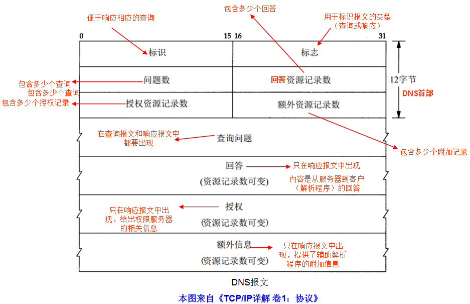
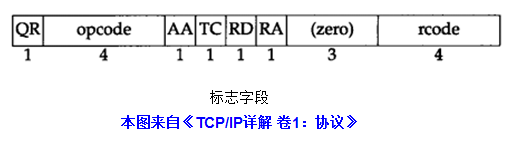
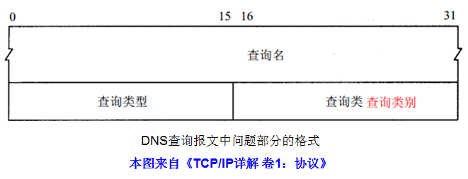
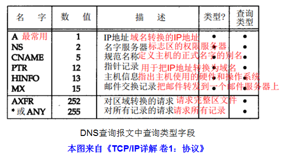
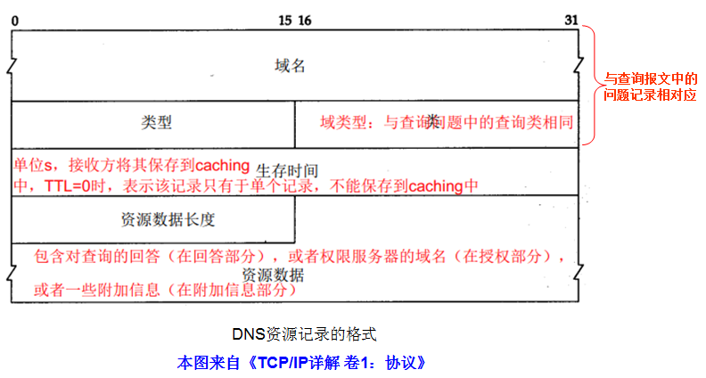

<!-- TOC -->

- [概念](#概念)
- [缩写](#缩写)
- [类型](#类型)
- [DNS 协议](#dns-协议)
    - [标志](#标志)
    - [查询问题](#查询问题)
    - [响应中的资源记录 RR](#响应中的资源记录-rr)
- [查看 local DNS](#查看-local-dns)
- [高速缓存](#高速缓存)
- [浏览器中的 DNS](#浏览器中的-dns)
- [EDNS](#edns)
    - [dig](#dig)
- [bind](#bind)
    - [安装](#安装)
        - [Mac](#mac)
        - [docker](#docker)
        - [ubuntu](#ubuntu)
    - [配置](#配置)
        - [options](#options)
    - [rndc](#rndc)
    - [Caching or Forwarding DNS Server on Ubuntu 14.04](#caching-or-forwarding-dns-server-on-ubuntu-1404)
        - [Caching DNS Server](#caching-dns-server)
        - [Forwarding DNS Server](#forwarding-dns-server)
        - [Install Bind on the DNS Server](#install-bind-on-the-dns-server)
        - [Configure as a Caching DNS Server](#configure-as-a-caching-dns-server)
        - [Configure as a Forwarding DNS Server](#configure-as-a-forwarding-dns-server)
        - [Test your Configuration and Restart Bind](#test-your-configuration-and-restart-bind)
- [参考](#参考)

<!-- /TOC -->

# 概念
* 权威DNS: 解析特定域名, 对不负责的域名不参与解析.
* 递归DNS: 接受任意域名的解析并缓存结果, 比如谷歌的8.8.8.8, 还有114.114.114.114.
* 转发DNS: 把递归DNS的结果转发给用户, 比如路由器里的DNS(一般是192.168.1.1).

DNS服务器分为：
* master（主DNS服务器）：拥有区域数据的文件，并对整个区域数据进行管理。
* slave(从服务器或叫辅助服务器）：拥有主DNS服力器的区域文件的副 本，辅助主DNS服务器对客户端进行解析，当主DNS服务器坏了后，可以完全接替主服务器的工作。
* forward:将任何查询请求都转发给其他服务器。起到一个代理的作用。
* cache:缓存服务器。
* hint：根DNS internet服务器集。

# 缩写

* `RR`: Resource Record

# 类型

* `A`: IP地址。
* `MX`: 邮件交换
* `NS`: 名字服务器。说明一个域的授权名字服务器。
* `CNAME`: 规范名字(canonical name)，表示一个域名，有规范名字的域名也叫做别名。
* `HINFO`: 主机信息，包括主机CPU和操作系统。

# DNS 协议

DNS报文，无论是请求报文还是应答报文都是统一格式：



* 标识：客户端设置的序列号，用来匹配应答的。

## 标志



- `QR`：定义报文类型，QR=0表示查询报文,1表示响应报文。
- `opcode`: 定义查询或响应的类型，0表示标准的，1表示反向的，2表示服务器状态请求。
- `AA(Authoritative answer)`：授权回答，只用于响应报文。1表示该域名服务器是该区域的授权服务器；
- `TC(Truncated)`: 可截断的，使用UDP服务时，若响应报文的总长度超过512B，则只返回前512B，并把该字段置1，客户端重新使用TCP发送查询。
- `RD(Recursion Desired)`: 期望递归，0表示DNS客户进程希望迭代查询，1表示DNS客户希望递归查询；
- `RA(Recursion Available)`:递归可用，只用于响应报文。若域名服务器支持递归，则该服务器便在响应报文中将 RA=1。
- `(zero)`：保留字段，必须为0.
- `rcode`: 表示在响应中的差错状态，只有权限服务器才能做出该判断。具体如下：
    - 0(NOERROR)：无差错
    - 1(FORMERR)：格式差错，DNS 服务器不理解更新请求。
    - 2(SERVFAIL)：问题出在域名服务器上,DNS 服务器遇到内部错误，如转发超时。
    - 3(NXDOMAIN)：名字差错，应该存在的名称不存在。
    - 4(NOTIMP)：查询类型不支持
    - 5(REFUSED)：DNS 服务器将拒绝执行更新
    - 6~15：保留

## 查询问题



* 查询名：包含域名的可变长度字段，每个域以计数开头，最后一个字符为0（零）,每个字符占1B。如：www.baidu.com可以这样记录：3www5baidu3com0；
* 查询类型：每一个问题的查询有一个类型，响应也有一个类型。

    

    其中最常用的查询是A类型和PTR类型：A类型就是域名到IP地址，PTR查询就是IP地址到域名。

* 查询类：定义了使用DNS的特定协议，1表示因特网。


## 响应中的资源记录 RR

响应报文中的三种资源记录（回答、授权、附加）均采用相同的格式，如下图所示：



- 生存时间：以s为单位，定义了此回答的有效期（一般为2天）。在这段有效期内，客户长须可以将此回答保存在caching中，当TTL设置为0表示该资源记录只能用于本次回答，而不能存放在caching中；
- 资源数据长度：用于记录后面资源数据的长度；
- 资源数据：包含对查询的回答（在回答部分），或者权限服务器的域名（在授权部分），或者一些附加信息（在附加信息部分）。这个字段的格式和内容取决于类型字段的值。它可以是下述之一：
    - a.数值  这个数以八位组为单位，例如IPv4是4个八位组的整数倍；
    - b.域名   记录域名由两种方法，方法一就是查询报文中所提到的如:3www5baidu3com0，方法二是采用指针的方法，因为一个回答报文中可能同时包含多种资源记录RR，而对于每一种资源记录RR，都会重复域名部分，为了节约空间，在后面的RR（非第一个RR）的域名部分，我们采用偏移指针的方式。偏移指针（占用16位）指的是偏离DNS响应报文首部最开始的位置（以字节为单位）且以11开头，偏移值范围为0~63B。例如偏离首部最开始部分12B可以记录为：1100 0000 0000 1100。
        Notice:当在响应报文中出现域名重复时，DNS要求用偏移指针来代替域名，DNS定义了2B的偏移指针，格式“11+偏移长度”，最高位固定为11，从而实现压缩。
    - c.字符串 字符串用1B的长度字段紧跟着一串长度的字符。长度字段并不像域名长度哪有受限。字符串可以多打255个字符（包括长度字段）


# 查看 local DNS

查看文件 `/etc/resolv.conf`。


# 高速缓存

* 为了告知DNS客户程序这个响应是来自caching，而不是一个授权的信息源，这个服务器要把响应标记为未授权的。（dig 中的 AUTHORITY ?）


# 浏览器中的 DNS

```
chrome://net-internals/#dns
```


# EDNS
* 在已有的DNS协议基础上增加一些字段.
* OPT: 伪资源记录, 不包含任何DNS数据, 不能被缓存, 不能被转发, 不能存储在zone文件中. 放在 Additional data 区域中.
* 每个DNS协议中只能有一个OPT.

## dig

```
dig @ns1.google.com google.com +subnet=208.67.222.0/24
dig @ns1.google.com google.com +client=208.67.222.0/24
```


# bind
* [官网](https://www.isc.org)

## 安装

### Mac
* [参考](https://gist.github.com/mpaskalev/207ac091495ef648e269)

1. `brew install bind`, 安装到 `/usr/local/Cellar/bind/9.11.2`.

### docker
* [](https://hub.docker.com/r/sameersbn/bind/)

```shell
docker run --name bind -d --restart=always \
  --publish 53:53/tcp --publish 53:53/udp --publish 10000:10000/tcp \
  --volume /srv/docker/bind:/data \
  sameersbn/bind:9.9.5-20170626
```

后台管理在 `https://localhost:10000`, 用户名 `root`, 密码 `password`, 可以在 run 时通过环境变量指定自己的密码: `--env ROOT_PASSWORD=secretpassword`


### ubuntu
下载源码并解压, 执行 `./configure`, `make`, `make install`

在 `/etc/bind` 中生成各种配置文件:
1. 生成 rndc.conf: `rndc-confgen > ./rndc.conf`
2. 生成 named.conf: `tail -10 rndc.conf | head -9 | sed s/#\ //g > named.conf`
3. 在 named.conf 中填写剩下的配置.
4. 测试: `named-checkconf /etc/bind/named.conf`
5. 启动: `named -c /etc/bind/named.conf &`
6. 测试rndc: `rndc -k /etc/bind/rndc.key status`


## 配置

### options
* `directory`: 指定DNS区域文件存放目录.
* `allow-query { localhost; 192.168.1.100; };`: 定义允许哪些主机可以查询本地的DNS服务
* `recursion yes;`: 定义是否允许DNS服务器做递归查询


## rndc

```
reload                                 重新装入配置文件和区域
reload zone [class [view]]      重新装入单个区域
refresh zone [class [view]]     安排区域的立即维护
reconfig                              仅重新装入配置文件和新区域
stats                                   将服务器统计信息写入统计文件中
querylog                              切换查询日志
dumpdb                              将高速缓存转储到转储文件 (named_dump.db)
stop                                   将暂挂更新保存到主文件并停止服务器
halt                                    停止服务器，但不保存暂挂更新
trace                                  将调试级别增加一级
trace level                           更改调试级别
notrace                              将调试级别设置为 0
flush                                  刷新服务器的所有高速缓存
flush [view]                        为某一视图刷新服务器的高速缓存
status                                显示服务器的状态
restart                               重新启动服务器（尚未实现）
```

* 刷新特定域名下的缓存 `rndc flushname domain`.
* 查看query log: `rndc querylog`, `tail -f /var/log/messages`, 关闭就再执行一次`rndc querylog`, 查看是否开启`rndc status`.


## Caching or Forwarding DNS Server on Ubuntu 14.04
* [链接](https://www.digitalocean.com/community/tutorials/how-to-configure-bind-as-a-caching-or-forwarding-dns-server-on-ubuntu-14-04)

两台机器, 一台(192.0.2.1)作为DNS Server, 一台(192.0.2.100)作为Client.

### Caching DNS Server
处理递归查询和从其他服务器上拉取DNS数据.

当得到客户端的答案是, 会将答案返回给客户端, 同时也会自己缓存一份, 缓存时间依据记录的TTL值.

### Forwarding DNS Server
从client的角度来看, forwarding DNS server和caching server是很相似的, 但是机制和工作负载是完全不同的.

它本身不做递归查询, 只是将请求转发给外部的resolving server, 然后缓存住查询结果.

### Install Bind on the DNS Server
```shell
sudo apt-get update
sudo apt-get install bind9 bind9utils bind9-doc
```

### Configure as a Caching DNS Server
客户端发起查询请求后, 服务器将递归地从其他DNS服务器上寻找答案. 这意味着它将查询每个相关联的DNS服务器知道找到完整的响应.

在 `/etc/bind` 下有一个主配置文件 `named.conf`, 它简单地导入 `named.conf.options`, `named.conf.local`, `named.conf.default-zones`文件.
我们只需要修改 `named.conf.options` 文件即可:

```
options {
        directory "/var/cache/bind";

        dnssec-validation auto;

        auth-nxdomain no;    # conform to RFC1035
        listen-on-v6 { any; };
};
```

第一步是建立一个访问控制列表(ACL).

我们不想让DNS服务被邪恶的用户滥用, 有一种被称为 DNS amplification attack 的攻击可能会导致服务器参与到拒绝服务攻击中.

DNS amplification attack: 找到可以递归查询的公共DNS服务, 模拟受害者的IP地址发送一个会向DNS服务器返回大量响应的查询. DNS服务器响应一个小的请求, 大量的荷载指向了受害者的服务器, 从而放大了攻击者的可用带宽.

为了避免我们的服务被用于邪恶的目的, 我们将配置我们信任的IP列表.

在 `option` 块上面, 我们创建一个新的块 `acl`:

```
acl goodclients {
};

options {
    . . .
```

在这个块中列举出允许使用这个DNS的IP. 由于我们的服务端和客户端都在同一个 /24 子网内, 所以我们将访问限制在这个网段内.

```
acl goodclients {
    192.0.2.0/24;
    localhost;
    localnets;
};

options {
    . . .
```

在 `options` 模块内设置允许goodclients访问:

```
options {
    directory "/var/cache/bind";

    recursion yes;
    allow-query { goodclients; };
    . . .
```

开启了 recursion, 并设置可以访问的组. 我们还可以使用 `allow-recursion` 参数来限制可以使用递归服务的组.

如果 `allow-recursion` 没有设置, Bind 会使用 `allow-query-cache` 列表, 然后是 `allow-query` 列表, 最后 `localnets` 和 `localhost`.


### Configure as a Forwarding DNS Server

`named.conf.options` 看起来像下面这样子:

```
acl goodclients {
        192.0.2.0/24;
        localhost;
        localnets;
};

options {
        directory "/var/cache/bind";

        recursion yes;
        allow-query { goodclients; };

        dnssec-validation auto;

        auth-nxdomain no;    # conform to RFC1035
        listen-on-v6 { any; };
};
```

我们将改变配置, 这样服务器将不会尝试自己去做递归查询了.

我们不将 recursion 改为 no, forwarding server 仍然提供递归服务. 取而代之的是我们需要建立一个缓存服务列表, 这样可以将我们的请求转发过去.

我们在 `options` 里添加 `forwarders` 块, 里面列举我们想要转发请求到哪些服务器, 这里使用了谷歌的公共服务器:

```
. . .
options {
        directory "/var/cache/bind";

        recursion yes;
        allow-query { goodclients; };

        forwarders {
                8.8.8.8;
                8.8.4.4;
        };
        . . .
```

之后, 我们将 `forward` 设置为 only, 因为服务器将转发所有请求, 不应该自己解析请求.

```
acl goodclients {
        192.0.2.0/24;
        localhost;
        localnets;
};

options {
        directory "/var/cache/bind";

        recursion yes;
        allow-query { goodclients; };

        forwarders {
                8.8.8.8;
                8.8.4.4;
        };
        forward only;

        dnssec-validation auto;

        auth-nxdomain no;    # conform to RFC1035
        listen-on-v6 { any; };
};
```

最后需要改变的是 `dnssec` 参数, 现在的配置取决于被转发的DNS服务的配置, 你可能在日志中看到下面的错误:

```
Jun 25 15:03:29 cache named[2512]: error (chase DS servers) resolving 'in-addr.arpa/DS/IN': 8.8.8.8#53
Jun 25 15:03:29 cache named[2512]: error (no valid DS) resolving '111.111.111.111.in-addr.arpa/PTR/IN': 8.8.4.4#53
```

为了避免这个, 将 `dnssec-validation` 设置成 yes, 开启 `dnssec`:

```
. . .
forward only;

dnssec-enable yes;
dnssec-validation yes;

auth-nxdomain no;    # conform to RFC1035
. . .
```

### Test your Configuration and Restart Bind

```
sudo named-checkconf
```

如果没有错误, 将什么也不打印.


# 参考

* 《TCP/IP详解 卷1:协议》
* [DNS协议](http://blog.csdn.net/jxh_123/article/details/26055215)
* [DNS 协议](https://technet.microsoft.com/zh-cn/library/dd197470(v=ws.10).aspx)
* [部署DNS域名解析服务器—BIND Server](https://my.oschina.net/ososchina/blog/704470)
* [rndc query log](https://blog.sleeplessbeastie.eu/2011/02/27/how-to-enable-query-logging-in-bind/)
