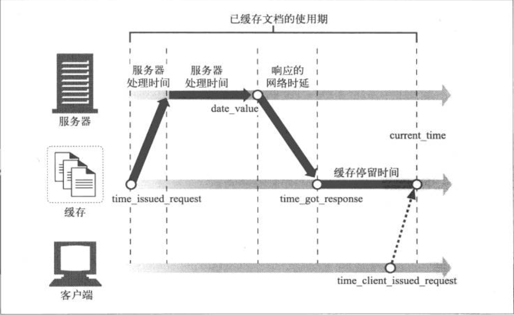

<!-- TOC -->

- [HSTS](#hsts)
- [range](#range)
    - [Range](#range)
    - [Content-Range](#content-range)
    - [If-Range](#if-range)
- [文档过期](#文档过期)
    - [Cache-Control](#cache-control)
- [HTTPS](#https)
    - [生成公钥和密钥](#生成公钥和密钥)
    - [原理](#原理)
- [编码](#编码)
    - [Content-Encoding 和 Accept-Encoding](#content-encoding-和-accept-encoding)
    - [Vary](#vary)
- [下载](#下载)
    - [Content-Disposition](#content-disposition)
- [参考](#参考)

<!-- /TOC -->

# HSTS
* [wiki](https://zh.wikipedia.org/wiki/HTTP%E4%B8%A5%E6%A0%BC%E4%BC%A0%E8%BE%93%E5%AE%89%E5%85%A8)

HTTP严格传输安全（英语：HTTP Strict Transport Security，缩写：HSTS）是一套由互联网工程任务组发布的互联网安全策略机制。网站可以选择使用HSTS策略，来让浏览器强制使用HTTPS与网站进行通信，以减少会话劫持风险.

HSTS的作用是强制客户端（如浏览器）使用HTTPS与服务器创建连接。服务器开启HSTS的方法是，当客户端通过HTTPS发出请求时，在服务器返回的超文本传输协议响应头中包含 `Strict-Transport-Security` 字段。非加密传输时设置的HSTS字段无效。

比如，`https://example.com/` 的响应头含有 `Strict-Transport-Security: max-age=31536000; includeSubDomains`。这意味着两点：
1. 在接下来的一年（即31536000秒）中，浏览器只要向example.com或其子域名发送HTTP请求时，必须采用HTTPS来发起连接。比如，用户点击超链接或在地址栏输入 http://www.example.com/ ，浏览器应当自动将 http 转写成 https，然后直接向 https://www.example.com/ 发送请求。
2. 在接下来的一年中，如果 example.com 服务器发送的TLS证书无效，用户不能忽略浏览器警告继续访问网站。

# range

## Range

```http
GET /test.rar HTTP/1.1
Connection: close
Host: 127.0.0.1
Range: bytes=0-801
```

`Range: bytes=first-byte-pos "=" [last-byte-pos]`
* `first-byte-pos` 从0开始.
* `last-byte-pos` 可以省略.
* 闭区间, 包含 `first`, 也包含 `last`.

示例:
* 表示头500个字节: `bytes=0-499`
* 表示第二个500字节: `bytes=500-999`
* 表示最后500个字节: `bytes=-500`
* 表示500字节以后的范围: `bytes=500-`
* 第一个和最后一个字节: `bytes=0-0,-1`
* 同时指定几个范围: `bytes=500-600,601-999`

## Content-Range

响应体中的 Content-Range: `Content-Range: bytes 0-500/1000`
* `0-500` 表示当前下载的501个字节.
* `1000` 表示文件的总大小.

## If-Range
* [If-Range MDN](https://developer.mozilla.org/zh-CN/docs/Web/HTTP/Headers/If-Range)
* 当条件满足时 Range 头才起作用.
* 可以用 `Last-Modified` 或者 `ETag` 作为验证, 但不能同时使用.

```
If-Range: <星期>, <日> <月> <年> <时>:<分>:<秒> GMT
If-Range: <etag>
```


# 文档过期

HTTP 协议中关于日期的 header:
* `Date: Tue, 15 Nov 1994 08:12:31 GMT`: 发送文档的时间.
* `Cache-Control: max-age=250`: 指定文档的生存时间, 单位秒.
* `Expires: Fri, 05 Jul 2002, 05:00:00 GMT`: 指定过期时间.
* `If-Modified-Since: <Date>`: 请求时带上, 当文档在指定日期之后被修改了则返回新文档, 否则返回 304, 可以与 `Last-Modified` 配合使用.(注意: 有些服务器只是比对Date的字符串而不解析时间)
* `If-None-Match: "v2.6", "v2.7"`: 在请求头中带上, 当文档的标签不匹配时, 使用 `ETag` 返回新的标签.
* `Age: 12`: 这个对象在代理缓存中存在的时间，以秒为单位. 经过代理时, Age 累加文档在代理中停留的时间. 但有的设备可能无法识别 Age.

```
文档是否足够新鲜 = $age < $freshness_lifetime
```
* `$age` 表示副本的使用期, 从文档发出去后老去的时间
* `$freshness_lifetime`: 副本的新鲜生存期

使用期的计算:
```perl
// 表面使用期 = 得到文档的时间 - Date头的时间, 这要求所有计算机的时钟同步. 表面使用期就是到达本地缓存时经过了多久了.
$apparent_age = max(0, $time_got_response - $Date_header_value);
// Date 有时钟同步的问题, 这里使用 Age 就行纠错, Age 是经过响应链各设备时停留的时间, 可能比实际值小.
$corrected_apparent_age = max($apparent_age, $Age_header_value);
// 响应时延 = 得到响应的时延 - 发出去请求的时延, 请求到达服务器又回来的时延, 这包括在网络传输中的时延, 可能会使文档比实际值老.
$response_delay_estimate = $time_got_response - $time_issued_request;
$age_when_document_arrived_at_our_cache = $corrected_apparent_age + $response_delay_estimate;
// 在本地缓存中存在的时间.
$how_long_copy_has_been_in_our_cache = $current_time - $time_got_response;

// 响应的总使用期 = 到达缓存时已过去了多长时间 + 文档在本地缓存中已经过去的时间
$age = $age_when_document_arrived_at_our_cache + $how_long_copy_has_been_in_our_cache;
```




新鲜生存期的计算:
* 分为服务器和客户端限制, 服务器限制就是服务器希望文档被缓存多久, 客户端限制比如是否接受已经过期的缓存等.
* 服务器新鲜度限制的计算:
```perl
$heuristic = 0; # 0 表示不需要经过最小值最大值修正
if (MaxAge 头被设置) {
    $server_freshness_limit = $Max_Age_value;
} else if (Expires 头被设置) {
    $server_freshness_limit = $Expires_value - $Date_value;
} else if (LastModified 头被设置) {
    $time_since_last_modify = max(0, $Date_value - $Last_Modified_value);
    $server_freshness_limit = int($time_since_last_modify * $lm_factor); # 取一段时间
    $heuristic = 1;
} else {
    $server_freshness_limit = $default_cache_min_lifetime;
    $heuristic = 1; # 这个也不需要进行纠正了呀???
}

if ($heuristic) {
    if ($server_freshness_limit > $default_cache_max_lifetime) {
        $server_freshness_limit = $default_cache_max_lifetime;
    }
    if ($server_freshness_limit < $default_cache_min_lifetime) {
        $server_freshness_limit = $default_cache_min_lifetime;
    }
}
return $server_freshness_limit;
```

客户端新鲜度限制的计算:
```perl
$age_limit = server_freshness_limit(); # 上面计算的
if (设置了 MaxStale 头) {
    if ($Max_Stale_value == $INT_MAX) {
        $age_limit = $INT_MAX;
    } else {
        $age_limit = server_freshness_limit() + $Max_Stale_value;
    }
}
if (设置了 MinFresh 头) {
    $age_limit = min($age_limit, server_freshness_limit() - $Min_Fresh_value);
}
if (设置了 MaxAge 头) {
    $age_limit = min($age_limit, $Max_Age_value);
}
```


## Cache-Control

- [](https://developer.mozilla.org/zh-CN/docs/Web/HTTP/Headers/Cache-Control)

客户端可以在HTTP请求中使用的标准 Cache-Control 指令:

```
Cache-Control: max-age=<seconds>
Cache-Control: max-stale[=<seconds>]
Cache-Control: min-fresh=<seconds>
Cache-control: no-cache
Cache-control: no-store
Cache-control: no-transform
Cache-control: only-if-cached
```

服务器可以在响应中使用的标准 Cache-Control 指令:

```
Cache-control: must-revalidate
Cache-control: no-cache
Cache-control: no-store
Cache-control: no-transform
Cache-control: public
Cache-control: private
Cache-control: proxy-revalidate
Cache-Control: max-age=<seconds>
Cache-control: s-maxage=<seconds>
```

可缓存性:
- public: 表明响应可以被任何对象（包括：发送请求的客户端，代理服务器，等等）缓存。
- private: 表明响应只能被单个用户缓存，不能作为共享缓存（即代理服务器不能缓存它）。
- no-cache: 强制所有缓存了该响应的缓存用户，在使用已存储的缓存数据前，发送带验证器的请求到原始服务器.
- only-if-cached: 表明客户端只接受已缓存的响应，并且不要向原始服务器检查是否有更新的拷贝.

到期:
- `max-age=<seconds>`: 设置缓存存储的最大周期，超过这个时间缓存被认为过期(单位秒)。与Expires相反，时间是相对于请求的时间。
- `s-maxage=<seconds>`: 覆盖 max-age 或者 Expires 头，但是仅适用于共享缓存(比如各个代理)，并且私有缓存中它被忽略。
- `max-stale[=<seconds>]`: 表明客户端愿意接收一个已经过期的资源。 可选的设置一个时间(单位秒)，表示响应不能超过的过时时间。
- `min-fresh=<seconds>`: 表示客户端希望在指定的时间内获取最新的响应。
- `stale-while-revalidate=<seconds>`: ...
- `stale-if-error=<seconds>`: ...

重新验证和重新加载:
- must-revalidate: 缓存必须在使用之前验证旧资源的状态，并且不可使用过期资源。
- proxy-revalidate: 与must-revalidate作用相同，但它仅适用于共享缓存（例如代理），并被私有缓存忽略。
- immutable: 表示响应正文不会随时间而改变。资源（如果未过期）在服务器上不发生改变，因此客户端不应发送重新验证请求头（例如If-None-Match或If-Modified-Since）来检查更新，即使用户显式地刷新页面。在Firefox中，immutable只能被用在 https:// transactions. 有关更多信息，请参阅[这里](http://bitsup.blogspot.de/2016/05/cache-control-immutable.html)

其他:
- no-store: 缓存不应存储有关客户端请求或服务器响应的任何内容。
- no-transform: 不得对资源进行转换或转变。Content-Encoding, Content-Range, Content-Type等HTTP头不能由代理修改。例如，非透明代理可以对图像格式进行转换，以便节省缓存空间或者减少缓慢链路上的流量。 no-transform指令不允许这样做。

示例:

- 禁止缓存: `Cache-Control: no-cache, no-store, must-revalidate`
- 缓存静态资源: `Cache-Control:public, max-age=31536000`


# HTTPS

## 生成公钥和密钥

```shell
$openssl genrsa -out server.key 2048
$openssl req -new -x509 -key server.key -out server.crt -days 365 # 2
```

* 2048 是密钥的长度, 单位是 bit.
* 私钥中包含了公钥的信息, 可以根据私钥生成公钥: `$openssl rsa -in server.key -out server.key.public`
* 上面第二个命令是根据私钥直接生成自签发的数字证书.


## 原理

HTTPS利用的是对称与非对称加密算法结合的方式. 对称加密的密钥管理复杂, 非对称加密处理性能低, 资源占用高.

HTTPS 服务器在连接建立中(ssl shaking握手协议), 会将自身的公钥发送给客户端, 客户端和服务端采用非对称加密的通道协商之后的对话需要用到的对称加密的密钥(对话密钥), 协商完成后, 后续的通信则使用对称加密.

服务端怎样安全的传输自己的公钥呢? 使用携带公钥信息的数字证书. 数字证书由 CA(Certification Authority, 证书授权机构) 颁发.


# 编码

## Content-Encoding 和 Accept-Encoding

> https://imququ.com/post/content-encoding-header-in-http.html

Accept-Encoding 和 Content-Encoding 是 HTTP 中用来对「采用何种编码格式传输正文」进行协定的一对头部字段。它的工作原理是这样：浏览器发送请求时，通过 Accept-Encoding 带上自己支持的内容编码格式列表；服务端从中挑选一种用来对正文进行编码，并通过 Content-Encoding 响应头指明选定的格式；浏览器拿到响应正文后，依据 Content-Encoding 进行解压。当然，服务端也可以返回未压缩的正文，但这种情况不允许返回 Content-Encoding。这个过程就是 HTTP 的内容编码机制。

`Content-Encoding` 可取值: `gzip`, `compress`, `deflate`, `br`, `identity`, 除了 `identity` 表示原始数据(未经压缩)外其他都是压缩或编码算法. 可能会指定多种压缩算法.


## Vary

> https://imququ.com/post/vary-header-in-http.html

由于客户端和服务端之间可能存在一个或多个中间实体（如缓存服务器），而缓存服务最基本的要求是给用户返回正确的文档。如果服务端根据不同 User-Agent 返回不同内容，而缓存服务器把 IE6 用户的响应缓存下来，并返回给使用其他浏览器的用户，肯定会出问题 。

所以 HTTP 协议规定，如果服务端提供的内容取决于 User-Agent 这样「常规 Accept 协商字段之外」的请求头字段，那么响应头中必须包含 Vary 字段，且 Vary 的内容必须包含 User-Agent。同理，如果服务端同时使用请求头中 User-Agent 和 Cookie 这两个字段来生成内容，那么响应中的 Vary 字段看上去应该是这样的：

```
Vary: User-Agent, Cookie
```

也就是说 Vary 字段用于列出一个响应字段列表，告诉缓存服务器遇到同一个 URL 对应着不同版本文档的情况时，如何缓存和筛选合适的版本。


# 下载

## Content-Disposition

`Content-Disposition` 消息头指示回复的内容该以何种形式展示，是以内联的形式（即网页或者页面的一部分），还是以附件的形式下载并保存到本地。


**触发"保存为"对话框**

```
200 OK
Content-Type: text/html; charset=utf-8
Content-Disposition: attachment; filename="cool.html"
Content-Length: 22

<HTML>Save me!</HTML>
```


# 参考
* [HTTP头字段 wiki](https://zh.wikipedia.org/wiki/HTTP%E5%A4%B4%E5%AD%97%E6%AE%B5)
