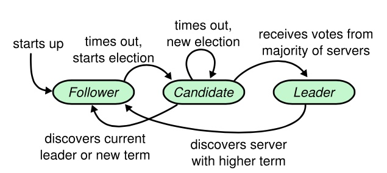
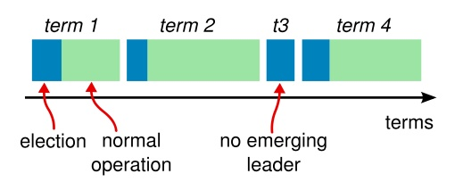

<!-- TOC -->

- [分布式事务](#分布式事务)
- [raft](#raft)
    - [raft 基础](#raft-基础)
    - [领导人选举](#领导人选举)
    - [日志复制](#日志复制)
    - [日志压缩](#日志压缩)
- [参考](#参考)

<!-- /TOC -->

# 分布式事务

# raft

Raft 是一种用来管理日志复制的一致性算法。一致性算法允许一组机器像一个整体一样工作，即使其中的一些机器出了错误也能正常工作。

## raft 基础

在任意的时间，每一个服务器一定会处于以下三种状态中的一个：领导人、候选人、追随者。在正常情况下，只有一个服务器是领导人，剩下的服务器是追随者。追随者们是被动的：他们不会发送任何请求，只是响应来自领导人和候选人的请求。领导人来处理所有来自客户端的请求（如果一个客户端与追随者进行通信，追随者会将信息发送给领导人）。候选人是用来选取一个新的领导人的。

追随者只响应其他服务器的请求。如果追随者没有收到任何消息，它会成为一个候选人并且开始一次选举。收到大多数服务器投票的候选人会成为新的领导人。领导人在它们宕机之前会一直保持领导人的状态。

时间被分为一个个的任期（term），任期是单调增加的，每一个任期的开始都是领导人选举。在成功选举之后，一个领导人会在任期内管理整个集群。如果选举失败，该任期就会因为没有领导人而结束。

Raft 中的服务器通过远程过程调用（RPC）来通信，基本的 Raft 一致性算法仅需要 2 种 RPC。RequestVote RPC 是候选人在选举过程中触发的，AppendEntries RPC 是领导人触发的，为的是复制日志条目和提供一种心跳（heartbeat）机制（不带条目）。

## 领导人选举

服务器启动时会初始化为追随者，在一个周期内没有收到心跳时（选举超时 election timeout），会任务没有可用的领导人，那么就会自增当前任期并且转变为候选人。候选人给自己投票并且给其他机器发送 RequestVote RPC，直到下面3中情况出现：
1. 收到大多数投票，候选人赢得选举成为领导人。
2. 另一台机器赢得选举。
3. 都没有赢得选举。

一个任期内一个候选人最多给一个候选人投票，按照先到先服务原则。

成为领导人后会向其他机器发送心跳来维护自己的领导人地位。

如果候选人在等待选票时收到自称领导人的心跳，如果它的任期比候选人的任期大或相等，那么就认为领导人合法，并转换为追随者；如果任期小，则拒绝，并保持候选人状态。

如果都没有赢得选举，那么在选举超时后自增任期号并重新发起选举。选举超时的时间是在一个固定间隔内(150ms-300ms)随机选出来的。

选举限制： 如果一个候选人没有包含所有已提交的日志，当它被选为领导人后就会造成已提交的日志被删除，这是不允许的。为了避免这种情况，在选举时，如果候选人的已提交的日志的索引小，则不会为它投票。

## 日志复制

领导人开始接受客户端的请求，每个请求都包含一个需要被复制状态机执行的命令。领导人把这条命令作为新的日志条目加入到它的日志中去，然后并行的向其他服务器发起 AppendEntries RPC ，要求其它服务器复制这个条目。当这个条目被安全的复制之后，领导人会将这个条目应用到它的状态机中并且会向客户端返回执行结果。如果追随者崩溃了或者运行缓慢或者是网络丢包了，领导人会无限的重试 AppendEntries RPC（甚至在它向客户端响应之后）直到所有的追随者最终存储了所有的日志条目。

领导人跟踪记录它所知道的被提交条目的最大索引值，并且这个索引值会包含在之后的 AppendEntries RPC 中（包括心跳 heartbeat 中），为的是让其他服务器都知道这条条目已经提交。一旦一个追随者知道了一个日志条目已经被提交，它会将该条目应用至本地的状态机（按照日志顺序）。

每个日志条目包含任期号、整数索引(在日志中的位置)。

为了使得追随者的日志同自己的一致，领导人需要找到追随者同它的日志一致的地方，然后删除追随者在该位置之后的条目，然后将自己在该位置之后的条目发送给追随者。这些操作都在 AppendEntries RPC 进行一致性检查时完成。领导人给每一个追随者维护了一个nextIndex，它表示领导人将要发送给该追随者的下一条日志条目的索引。当一个领导人开始掌权时，它会将nextIndex初始化为它的最新的日志条目索引数+1。如果一个追随者的日志和领导者的不一致，AppendEntries 一致性检查会在下一次 AppendEntries RPC 时返回失败。在失败之后，领导人会将nextIndex递减然后重试 AppendEntries RPC。最终nextIndex会达到一个领导人和追随者日志一致的地方。这时，AppendEntries 会返回成功，追随者中冲突的日志条目都被移除了，并且添加所缺少的上了领导人的日志条目。一旦 AppendEntries 返回成功，追随者和领导人的日志就一致了，这样的状态会保持到该任期结束。（也可以让追随者返回自己存储的最大的索引，这样就不需要递减了）

## 日志压缩

快照（snapshot）是最简单的压缩方式。在快照中，全部的当前系统状态都被写入到快照中，存储到持久化的存储中，然后在那个时刻之前的全部日志都可以被丢弃。

当 leader 需要发给某个 follower 的 log entry 被丢弃了(因为 leader 做了 snapshot)，leader 会将 snapshot 发给落后太多的 follower。或者当新加进一台机器时，也会发送 snapshot 给它。

# 参考

* [Raft 一致性算法论文译文](http://blog.luoyuanhang.com/2017/02/02/raft-paper-in-zh-CN/index.html)