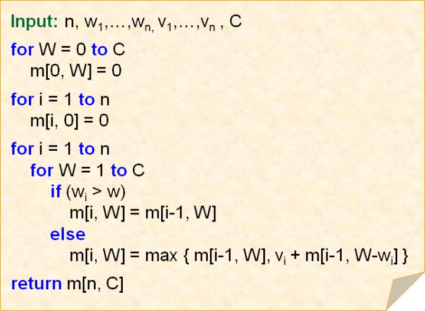
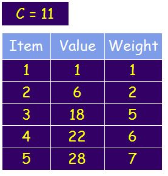
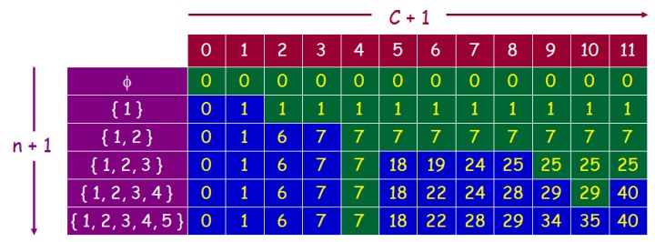
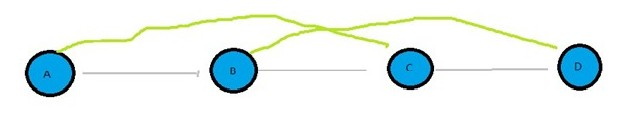
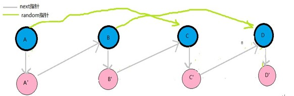
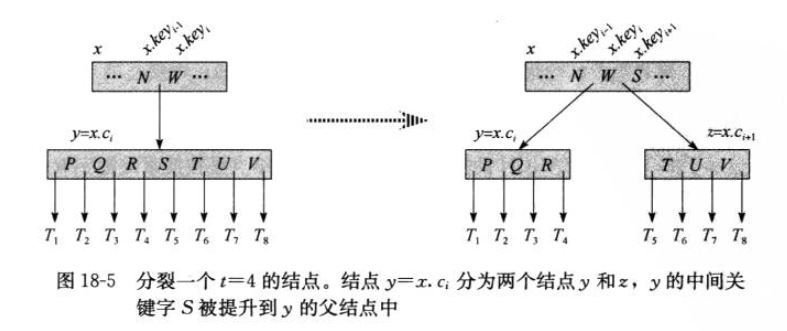
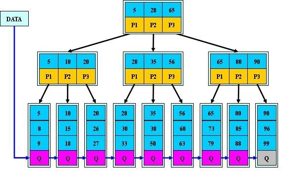

<!-- TOC -->

- [分治策略](#分治策略)
    - [最大子数组](#最大子数组)
- [动态规划](#动态规划)
    - [0-1 背包问题](#0-1-背包问题)
    - [分数背包问题](#分数背包问题)
- [贪心算法](#贪心算法)
    - [活动选择问题](#活动选择问题)
- [链表](#链表)
    - [复制带有random指针的单链表](#复制带有random指针的单链表)
- [树](#树)
    - [B 树](#b-树)
        - [分裂B树中的节点](#分裂b树中的节点)
        - [插入关键字](#插入关键字)
        - [删除关键字](#删除关键字)
    - [B+ 树](#b-树)
        - [与 B 树异同](#与-b-树异同)
    - [B* 树](#b-树)
        - [与 B+ 树的区别](#与-b-树的区别)
        - [分裂](#分裂)
- [图](#图)
    - [拓扑排序](#拓扑排序)
        - [Kahn 算法](#kahn-算法)
        - [基于深度优先遍历](#基于深度优先遍历)
- [其他](#其他)
    - [25匹马取前5名](#25匹马取前5名)
    - [二进制数中1的个数](#二进制数中1的个数)

<!-- /TOC -->


# 分治策略

## 最大子数组

问题：数组中有正有负，求子数组中和最大的那个。

**分治策略**

假设数组为 A[low, high], mid 是中点。最大子数组可能存在的位置包括：
* 完全在 A[low, mid] 中。
* 完全在 A[mid+1, high] 中。
* 跨越 mid。

前两种情况递归求解，第3种情况可以直接求出最大子数组，这样可以得到3个最大值，选出其中最大的那个就可以了。

**线性时间算法**

```java
/*
最优方法，时间复杂度O（n）
和最大的子序列的第一个元素肯定是正数
因为元素有正有负，因此子序列的最大和一定大于0
*/
int MaxSubSum3(int *arr,int len)
{
	int i;
	int MaxSum = 0;
	int CurSum = 0;
	for(i=0;i<len;i++)
	{
		CurSum += arr[i];
		if(CurSum > MaxSum)
			MaxSum = CurSum;
		//如果累加和出现小于0的情况，
		//则和最大的子序列肯定不可能包含前面的元素，
		//这时将累加和置0，从下个元素重新开始累加
		if(CurSum < 0)
			CurSum = 0;
	}
	return MaxSum;
}
```


# 动态规划

## 0-1 背包问题

问题：有 n 个商品，第 i 件重 w[i], 价值 v[i], 从中选择最多 W 重的物品，怎么选能使价值最多？

思路：

考虑第 i 个物品，无外乎两种可能：选，或者不选。

* 不选的话，背包的容量不变，变为问题 `P(i-1, W)`;
* 选的话，背包的容量变小，变为问题 `P(i-1, W-w[i])`


如果某件物品的重量超过了总重量 W, 那么就不能选它。否则从选和不选两种情况中选择价值最大的那种情况。

算法：



举例：



总总量为 11，共 5 件物品。



行是物品重量，列是选择的物品。

还原出取了哪些物品： 从右下角第 5 行开始，总价值是 40，第 4 行也是 40，说明没有取物品。第 3 行是 25，取了物品 4，物品 4 价值 22，所以到第 3 行为止选了 40-22=18 的价值。再向上推发现第 3 件物品就是 18，所以最后选择的物品是 {3, 4}。


参考：
* [0-1背包问题的动态规划算法](https://zhuanlan.zhihu.com/p/30959069)


## 分数背包问题

问题：与 0-1 背包问题一样，但是每件物品可以拿走一部分。

思路：计算每件物品单位重量的价值 v[i]/w[i]。每次拿都是拿单位价值最高的物品，全部拿完后再拿剩下的物品中单位价值最高的，直到重量达到上限。


# 贪心算法

## 活动选择问题

活动有开始时间和结束时间，两个活动的时间不重叠则任务是兼容的。要求找到最大兼容活动集。

**动态规划解法**

假设 S[i,j] 是整个活动集，如果最优解中包含活动 a[k], 那么剩下就需要在 S[i,k] 和 S[k,j] 中找，即在 a[k] 开始之前就已经结束的活动中 和 在 a[k] 结束后才开始的活动中查找。然后在递归的在这两个活动集中查找最大兼容活动集。 这是假设包含活动 a[k]，还需要假设 S[i,j] 中的每个活动都被选中。

优化： 备忘录和自底向上。

**贪心算法**

先选择 a[1], 然后选择在 a[1] 结束后才开始的活动，一直选择下去。

就是总是选择兼容的最早结束的活动。(活动都是按照结束时间排序的，所以保持兼容的最早开始的也就是最早结束的)。


# 链表

## 复制带有random指针的单链表



链表中除了有 next 指针外还有 random 指针，复制的时候也要复制 random 指针的指向。

**使用 hash 表**

用 hash 表记录原节点的地址到新节点地址的映射。先遍历一遍，设置好 next, random 不用设置。再遍历一遍，根据 random 的地址从 hash 表中查找到新节点的地址。

时间复杂度为 O(2n)。

**修改原链表的指针**



复制时将 A.next 指向 A'， 将 A'.next 指向 B。其他节点类似。 random 指针不用改动。

如果 A.random 指向的是 C， 那么 A'.random 就应该指向 C', 即 `A'.random = A.random.next`。

最后还需要将 next 的指向恢复好。

时间复杂度 O(2n), 空间复杂度 O(1)。

参考：
* [复制带有random指针的单链表](https://blog.csdn.net/u013709270/article/details/53667321)


# 树

## B 树

性质：
* n 个关键字， n+1 个子节点。
* 叶节点具有相同的高度。
* 度数为 t 表示节点最少有 t 个孩子，最多有 2t 个孩子。
* m 阶表示最少 m/2 个孩子，最多 m 个孩子。


### 分裂B树中的节点



1. 分配一个新节点 z.
2. 转移 y 中一半的 key 和 child 到 z 中。
3. 将 z 插入到 x.child 中.
4. 将 y 的中间关键字插入到 x.keys 中。


### 插入关键字

沿根节点向下遍历，如果根节点是满的(有 t 个孩子)，则将根节点分裂，此时树的高度增加了。

在向下遍历的过程中，如果遇到一个满的节点，则将该节点分裂，直到遇到一个叶子节点，然后将关键字插入到叶子节点适当的位置上。

遇到满节点就直接分裂是为了避免插入时父节点也满了，这时就需要向上回溯处理了。


### 删除关键字

1. 如果 k 在叶子节点中，则从叶子节点中删除它。
2. 如果 k 在非叶子结点 x 中，如果 k 相邻关键字的子节点中的孩子数多(至少 t+1 个)，则从它们中提上来一个到 x 中。如果都不多则将他们合并。
3. 如果 k 不在 x 中，接下来要递归处理 x.c[i]，如果 x.c[i] 只有 t 个孩子，那么需要从 x.c[i] 的兄弟节点中借一个到 x 中，并将 x 中的一个关键字降至 x.c[i]，这样 x.c[i] 就有 t+1 个孩子了。如果兄弟节点中都没有，则将 x.c[i] 和其中一个兄弟节点合并。


## B+ 树



### 与 B 树异同

* B+ 树中叶子节点包含了所以关键字，而 B 树中叶子节点什么都没有。
* B+ 树中非叶子结点包含子树中最大或最小的关键字，所以 t 个关键字对应的是 t 个子节点。
* B+ 树中叶子节点相互串联，可以遍历所有叶子节点。 而 B 树不能。

为什么 B+ 树比 B 树更适合文件索引和数据库索引？
* B+ 树可以遍历所有索引，实现基于范围的查询，而 B 树这方面效率比较低。
* B+ 树非叶子结点仅包含关键字信息，占用空间小，读取磁盘的次数少。
* B+ 树查询时都需要查到叶子节点，查询效率更加稳定。


## B* 树


### 与 B+ 树的区别

* 非叶子结点也有指向兄弟节点的指针。
* 关键字个数至少为 2/3 m。

### 分裂

B 树节点满时需要分裂， 将一半的数据分到新节点中，然后在父节点中增加新的关键字， 只影响满节点和父节点。

B* 树节点满时， 如果兄弟节点不满则将数据移到兄弟节点中，如果兄弟节点满了，则添加新节点，并复制 1/3 的数据到新节点中。

所以 B* 树分配新节点的概率比 B+ 树要低。


# 图

## 拓扑排序

### Kahn 算法

```
L ← Empty list that will contain the sorted elements
S ← Set of all nodes with no incoming edges
while S is non-empty do
    remove a node n from S
    insert n into L
    foreach node m with an edge e from n to m do
        remove edge e from the graph
        if m has no other incoming edges then
            insert m into S
if graph has edges then
    return error (graph has at least one cycle)
else 
    return L (a topologically sorted order)
```

先将没有入度的节点放到 S 中，遍历 S 中的节点，如果连接到了 m 并且 m 入度为 0， 则将 m 放到 S 中。

如果有环可以检测出来。


### 基于深度优先遍历

```
L ← Empty list that will contain the sorted nodes
S ← Set of all nodes with no outgoing edges
for each node n in S do
    visit(n) 

function visit(node n)
    if n has not been visited yet then
        mark n as visited
        for each node m with an edge from m to n do
            visit(m)
        add n to L
```

深度优先遍历树，遍历完后当前节点的出度就变为 0 了，放入队列中。

要求不能成环。


# 其他

## 25匹马取前5名

* https://blog.csdn.net/chen825919148/article/details/8053980


## 二进制数中1的个数

**循环移位**

每次循环判断最右边一位是不是1，然后右移一位。

```c
int BitCount(unsigned int n) 
{
    unsigned int c =0 ; // 计数器
    while (n >0)
    {
        if((n &1) ==1) // 当前位是1
            ++c ; // 计数器加1
        n >>=1 ; // 移位
    }
    return c ;
}
```

**快速法**

每次循环都清除掉最右边的1，循环次数只与1个个数相关。

```c
int BitCount2(unsigned int n)
{
    unsigned int c =0 ;
    for (c =0; n; ++c)
    {
        n &= (n -1) ; // 清除最低位的1
    }
    return c ;
}
```

为什么 `n &= (n – 1)` 能清除最右边的1呢？因为从二进制的角度讲，n 相当于在 n-1 的最低位加上1。举个例子，8（1000）= 7（0111）+ 1（0001），所以8 & 7 = （1000）&（0111）= 0（0000），清除了8最右边的1（其实就是最高位的1，因为8的二进制中只有一个1）。再比如7（0111）= 6（0110）+ 1（0001），所以7 & 6 = （0111）&（0110）= 6（0110），清除了7的二进制表示中最右边的1（也就是最低位的1）。

**建表法**

```c
int BitCount3(unsigned int n) 
{ 
    // 建表
    unsigned char BitsSetTable256[256] = {0} ; 

    // 初始化表 
    for (int i =0; i <256; i++) 
    { 
        BitsSetTable256[i] = (i &1) + BitsSetTable256[i /2]; 
    } 

    unsigned int c =0 ; 

    // 查表
    unsigned char* p = (unsigned char*) &n ; 

    c = BitsSetTable256[p[0]] + 
        BitsSetTable256[p[1]] + 
        BitsSetTable256[p[2]] + 
        BitsSetTable256[p[3]]; 

    return c ; 
}
```

先说一下填表的原理，根据奇偶性来分析，对于任意一个正整数n

1.如果它是偶数，那么n的二进制中1的个数与n/2中1的个数是相同的，比如4和2的二进制中都有一个1，6和3的二进制中都有两个1。为啥？因为n是由n/2左移一位而来，而移位并不会增加1的个数。

2.如果n是奇数，那么n的二进制中1的个数是n/2中1的个数+1，比如7的二进制中有三个1，7/2 = 3的二进制中有两个1。为啥？因为当n是奇数时，n相当于n/2左移一位再加1。

再说一下查表的原理

对于任意一个32位无符号整数，将其分割为4部分，每部分8bit，对于这四个部分分别求出1的个数，再累加起来即可。而8bit对应2^8 = 256种01组合方式，这也是为什么表的大小为256的原因。


**平行算法**

```c
int BitCount4(unsigned int n) 
{ 
    n = (n &0x55555555) + ((n >>1) &0x55555555) ; 
    n = (n &0x33333333) + ((n >>2) &0x33333333) ; 
    n = (n &0x0f0f0f0f) + ((n >>4) &0x0f0f0f0f) ; 
    n = (n &0x00ff00ff) + ((n >>8) &0x00ff00ff) ; 
    n = (n &0x0000ffff) + ((n >>16) &0x0000ffff) ; 

    return n ; 
}
```

先将n写成二进制形式，然后相邻位相加，重复这个过程，直到只剩下一位。


参考：
* [算法-求二进制数中1的个数](http://www.cnblogs.com/graphics/archive/2010/06/21/1752421.html)